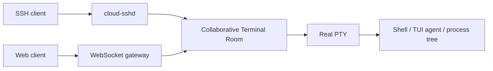

# Cloud SSH

Cloud SSH is a Rust runtime for collaborative terminal rooms.

It keeps classic SSH as a first-class local experience while moving terminal session state onto a server-side room. Browser clients attach to the same room through a web terminal. The room projects one real PTY to many clients.



## Core Model

- The PTY is single-writer and stateful.
- The room is multi-client and collaborative.
- Each client owns an independent view.
- SSH is a client adapter, not the product boundary.
- Web is a client adapter, not a separate runtime.
- Room state may use Yjs-compatible CRDT semantics through Yrs.
- Terminal input is never CRDT-merged; it is serialized into one ordered byte stream.

## Workspace

- `cloud-ssh-core`: shared IDs and terminal room model types.
- `cloud-ssh-server`: initial server binary and future adapter host.

## Run From Source

```bash
make run
```

Current output is a placeholder while the runtime is being scaffolded.

## Documentation

- [Overview](docs/index.md)
- [Architecture](docs/architecture.md)
- [Development](docs/development.md)
- [Specs](spec/)

Architecture and product decisions live in [spec/](spec/). User-facing guides live in [docs/](docs/).

## Validation

```bash
make fmt-check
make check
make test
```

Full local gate:

```bash
make ci
```

## License

Cloud SSH is distributed under the BSD 3-Clause License. See [LICENSE](LICENSE).
