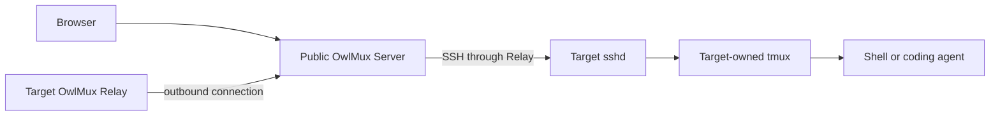

# OwlMux

OwlMux is a planned self-hosted terminal roaming gateway built on SSH and tmux.
Target tmux owns every session, pane PTY, scrollback buffer, and child process.
OwlMux will provide a graphical Web client and an outbound Relay so users can
reconnect without moving session ownership to the public Server.

> **Foundation status:** the repository currently contains two placeholder Rust
> binaries, a placeholder React page, PostgreSQL/Redis development infrastructure,
> VitePress documentation, Docker packaging, and CI. Authentication,
> organizations, machine enrollment, Relay transport, SSH, and tmux integration
> are specified but not implemented.


```mermaid
flowchart LR
    browser["Browser"] --> server["Public OwlMux Server"]
    relay["Target OwlMux Relay"] -->|"outbound connection"| server
    server -->|"SSH through Relay"| sshd["Target sshd"]
    sshd --> tmux["Target-owned tmux"]
    tmux --> process["Shell or coding agent"]
```

## Product boundary

- One self-hosted deployment contains one public Server and any number of Relays.
- OwlAuth mode supports multiple users; API-key mode supports one built-in owner.
- OwlMux owns organizations, memberships, machine registration, and access.
- Every active organization member can access every organization machine.
- PostgreSQL is durable product authority; Redis is disposable cache and
  rate-limit infrastructure.
- Relay forwards SSH bytes to enrolled loopback sshd and never owns tmux or a
  process.
- Browser, Server, Relay, database, cache, and network failure may interrupt an
  attachment but must not terminate target tmux.

The normative design is under [`spec/`](spec/README.md).

## Repository layout

- `crates/owlmux-server` — public Server foundation;
- `crates/owlmux-relay` — target-side outbound Relay foundation;
- `apps/web` — React and Vite placeholder application;
- `dev` — PostgreSQL and Redis Compose infrastructure;
- `docs` — VitePress documentation and Cloudflare Workers configuration;
- `spec` — accepted target product and architecture specifications.

## Development

Prerequisites are stable Rust, Node.js 24, pnpm 11.20.0, and Docker with Compose
v2.

```bash
make install
make check
make test
make build
```

Run the placeholder Server:

```bash
make dev
```

Then open `http://127.0.0.1:8080`. Only `/health`, `/ready`, and the placeholder
Web application are implemented.

Start development infrastructure when needed:

```bash
make dev-up
make dev-status
make dev-down
```

Build and smoke-test the production image:

```bash
make docker-build
```

## Documentation

- [Documentation site](https://owlmux-docs.owlfoundry.org)
- [Getting started](docs/guide/getting-started.md)
- [Architecture](docs/guide/architecture.md)
- [Authentication and organizations](docs/guide/authentication.md)
- [Relay and roaming](docs/guide/relay.md)
- [Security](docs/guide/security.md)
- [Specifications](spec/README.md)

## License

OwlMux is distributed under the BSD 3-Clause License. See [LICENSE](LICENSE).
