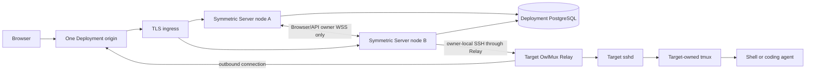

# OwlMux

OwlMux is a planned self-hosted terminal roaming gateway built on SSH and target-owned tmux. Target tmux owns every session, pane PTY, scrollback buffer, and child process. OwlMux will provide a graphical Web client and an outbound Relay so users can reconnect without moving session ownership to public Server nodes.

> **Foundation status:** the repository currently contains two placeholder Rust binaries, a placeholder React page, PostgreSQL development infrastructure, VitePress documentation, Docker packaging, and CI. Deployment API-key access, cluster membership/ownership, Machine management, Relay transport, SSH, and tmux integration are specified but not implemented.


```mermaid
flowchart LR
    browser["Browser"] --> origin["One Deployment origin"]
    relay["Target OwlMux Relay"] -->|"outbound connection"| origin
    origin --> ingress["TLS ingress"]
    ingress --> nodeA["Symmetric Server node A"]
    ingress --> nodeB["Symmetric Server node B"]
    nodeA --> postgres[("Deployment PostgreSQL")]
    nodeB --> postgres
    nodeA <-->|"Browser/API owner WSS only"| nodeB
    nodeB -->|"owner-local SSH through Relay"| relay
    relay --> sshd["Target sshd"]
    sshd --> tmux["Target-owned tmux"]
    tmux --> process["Shell or coding agent"]
```

## Product boundary

- One self-hosted Deployment contains one public origin, one private PostgreSQL database, one Deployment API key, and one or more symmetric `owlmux-server` nodes.
- Each node is one Tokio multi-threaded process that can use its assigned host cores. Horizontal scale adds symmetric nodes from the exact same Server artifact and Deployment-critical configuration; OwlMux does not split Gateway and Worker binaries.
- The API key grants complete Deployment access; Deployment is the sole human/API trust and authorization boundary.
- Browser holds the API key only in page memory, sends Bearer on every protected HTTP request, and authenticates an attachment WebSocket with one bounded first frame. Reload requires re-entry; an ordinary unchanged-key node restart may reuse only a still-open page-memory candidate.
- PostgreSQL is the only durable product authority and stores low-churn node leases plus actual Machine-owner epochs. Terminal bytes, projections, Browser writer state, and live sockets remain outside PostgreSQL.
- The public load balancer places each new Relay connection using ordinary connection-level policy. Its accepting/authenticating Server incarnation alone may claim the Machine and keeps the Relay tunnel plus all Machine-affine state local. OwlMux promises no even distribution and has no placement hash, candidate ranking, or rebalance.
- Browser and Machine-affine API traffic may enter any node and use at most one internal owner WSS hop. Destination challenge plus cluster HMAC carries only verified context; one-shot API control uses the same WSS mode, and Relay/enrollment is never proxied.
- Node lease fencing uses Linux `CLOCK_BOOTTIME`, one conservative Deployment-wide safety margin, and direct pre-I/O deadline checks. Startup validates only clock availability and `0 < safety margin < lease TTL`; operators keep PostgreSQL forward adjustment and bounded local overhead within that margin and never resume the same process snapshot. Node drain/failure closes OwlMux connections only, and a new ingress may claim after old owner release/lease expiry. A valid unreachable owner returns `owner_unreachable` until the operator fences that node and waits for lease expiry. No live state migrates or replays.
- Clustered mode uses one distinct `OWLMUX_CLUSTER_KEY` plus internal TLS/WSS. It does not add Redis, a message queue, scheduler/rebalance service, terminal broker, or distributed writer lock.
- PostgreSQL HA/failover/backup/restore is operator-owned. OwlMux assumes one configured endpoint exposes a linearizable single-writer non-rollback history that preserves acknowledged commits; it does not repair history rollback.
- The initial Relay protocol accepts one exact version with no negotiation or compatibility manifest; policy for older versions is deferred until a second protocol version exists. Server nodes always require one exact build/configuration.
- Separate Deployments remain independent trust domains with separate origins, databases, secrets, membership, resources, and live state. OwlMux provides no cross-Deployment routing, migration, failover, or global view.
- Relay forwards SSH bytes to enrolled loopback sshd and never owns tmux, a process, or target SSH authorization stores.
- Browser, Server node, Relay, PostgreSQL, and network failure may interrupt an attachment but must not terminate target tmux.
- Deployment initialization generates one default Ed25519 key pair; the API-key holder may generate, rename, reset, rotate by replacement, and rebind Deployment credentials. OwlMux accepts no private-key upload or alternate SSH key algorithm. Target administrators exclusively install and remove public keys through external operational tooling; OwlMux and Relay never mutate `authorized_keys` or equivalent authorization stores.
- The target administrator installs and operates tmux. The target design uses tmux 3.2a as its minimum, performs bounded runtime capability probes, maintains a small known-bad denylist, and uses representative CI evidence rather than a package allowlist or Cartesian profile manifest; OwlMux detects incompatibility but never installs, upgrades, downgrades, configures, patches, or repairs tmux.

The normative design is under [`spec/`](spec/README.md).

## Repository layout

- `crates/owlmux-server` — symmetric public/internal Server-node foundation;
- `crates/owlmux-relay` — target-side outbound Relay foundation;
- `apps/web` — React and Vite placeholder application;
- `dev` — PostgreSQL Compose infrastructure;
- `docs` — VitePress documentation and Cloudflare Workers configuration;
- `spec` — accepted target product and architecture specifications.

## Development

Prerequisites are stable Rust, Node.js 24, pnpm 11.20.0, and Docker with Compose v2.

```bash
make install
make check
make test
make build
```

Run the placeholder Server:

```bash
make dev
```

Then open `http://127.0.0.1:8080`. Only `/health`, `/ready`, and the placeholder Web application are implemented.

Start development infrastructure when needed:

```bash
make dev-up
make dev-status
make dev-down
```

Build and smoke-test the production image:

```bash
make docker-build
```

## Documentation

- [Documentation site](https://owlmux-docs.owlfoundry.org)
- [Getting started](docs/guide/getting-started.md)
- [Architecture](docs/guide/architecture.md)
- [Deployment access and credentials](docs/guide/authentication.md)
- [Relay and roaming](docs/guide/relay.md)
- [Security](docs/guide/security.md)
- [Specifications](spec/README.md)

## License

OwlMux is distributed under the BSD 3-Clause License. See [LICENSE](LICENSE).
