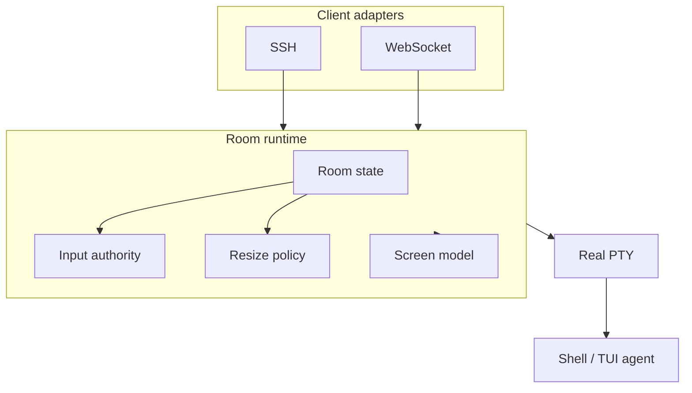

# Architecture

Cloud SSH is built around one object: the collaborative terminal room.

## Layers

- `RealPty`: one process tree, one input stream, one output stream, one canonical size.
- `Room`: collaboration policy, event log, screen snapshots, input authority, resize policy.
- `ClientView`: per-client viewport, scroll state, render mode, and local overlay state.

## Protocol Boundary

Cloud SSH terminates SSH and WebSocket connections. Adapters normalize client events into room commands. The room decides whether to write input to the PTY, resize the PTY, or only update a client view.

This is not a transparent SSH proxy. It is a terminal protocol gateway over a collaborative room.

## CRDT Boundary

Room metadata can use Yjs-compatible CRDT semantics through Yrs:

- presence;
- view metadata;
- annotations;
- bookmarks;
- permission state;
- authority state projection.

Terminal input and output stay outside the CRDT document:

- accepted input is serialized into the PTY;
- output is stored in append-only logs and snapshots;
- screen state is projected to each client.
