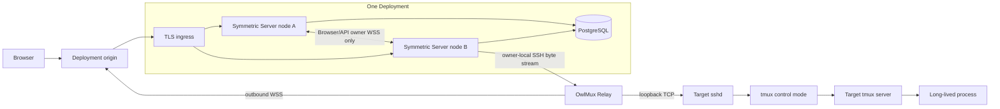

# Architecture

::: info Current scope
The pre-release single-node and clustered profiles implement complete Machine/Relay lifecycle control, credential rebind, interactive tmux projection, owner-local Browser writer coordination, symmetric node membership, one-hop internal owner WSS, safe durable audit and metrics, and repeatable recovery evidence. Release qualification is complete for the documented Linux x86_64, tmux, login-shell, Browser, local/remote-owner, dependency-audit, and production-image profiles. Version `0.0.1` was the initial tag-driven evaluation release. Version `0.0.2` added Server and Relay crates.io source packages. Version `0.0.3` is the current evaluation release and adds the qualified terminal-first Web shell, bounded page-memory workspaces, and automatic visible-writer resize; no production-supported release or broader platform coverage is claimed.
:::

## One durable terminal owner

OwlMux is based on a single decision: the interactive session belongs to tmux on the target machine.

- target tmux owns sessions, windows, panes, PTYs, scrollback, layout, and child processes;
- target sshd owns host identity and Unix-account authentication;
- PostgreSQL owns durable Deployment identity, Machines, encrypted credentials, Relay trust, and audit;
- one fenced Server owner process keeps each Machine's live OwlMux route, SSH/tmux clients, projection, writer coordination, and queues;
- the browser owns rendering and local interaction state.

An OwlMux attachment can always be replaced. A tmux session cannot be recreated from Server metadata and is never killed because OwlMux loses a node, route, database, or other dependency.

## One symmetric Server binary, one or more nodes

`owlmux-server` remains one modular-monolith Rust binary. A Deployment runs one or more symmetric nodes from the exact same Server build and Deployment-critical configuration:

- each node is one Tokio multi-threaded process and may use the CPU cores assigned to it;
- every node may serve Web assets, accept protected HTTP, Browser WebSocket, and Relay ingress, access PostgreSQL, and own Machine-affine work;
- ingress and owner are roles for an individual connection, not permanent Gateway and Worker services;
- the one-node profile takes the same owner path locally without an internal network hop;
- adding nodes increases Deployment capacity without adding another product service or terminal-state store.

OwlMux does not add a scheduler service, Gateway/Worker split, Redis, message queue, virtual-bucket coordinator, terminal broker, distributed writer lock, or replicated terminal state.

## Relay ingress becomes the actual owner

The public load balancer distributes connections using an ordinary policy such as least-connections or round-robin. The Server incarnation that accepts and authenticates a Relay is the only node allowed to claim that Machine in PostgreSQL. A successful claim verifies and references that incarnation's valid database-time node lease, then records the Machine route revision, Relay connection identity, and a monotonically increasing connection epoch. There is no per-Machine owner lease or renewal.

The owner keeps the accepted Relay tunnel, logical streams, OpenSSH/tmux children, projection, current Browser writer attachment pointer, queues, backpressure, and diagnostics in that same process. Relay traffic is never forwarded to another Server. If a valid owner exists, a reconnect at another ingress receives a bounded `temporarily_unavailable` result with capped retry-after; it may claim only after safe owner release or lease expiry.

Adding a node affects only later load-balancer traffic. OwlMux has no placement hash or node-ranking policy, balance guarantee, automatic/manual rebalance, migration API, weights, or buckets. Operators that care about cold-start distribution should make intended nodes ready before opening the origin. All Browser attachments still reach the one current owner, so writer coordination remains one owner-local pointer. Native tmux clients are outside that coordination.

## Public ingress and one owner WSS hop

Browser and Relay always use one Deployment origin. They never discover, select, or pin a Server node. Ordinary load-balancer stickiness can reduce an extra hop but is not required for correctness.

Any node may accept a connection and completes its external authentication first:

- protected HTTP verifies Bearer before resource or owner lookup;
- Browser WebSocket accepts only one bounded API-key first frame under a short deadline;
- Relay enrollment accepts only the one-use token first frame before setup;
- active Relay tunnel ingress verifies its Machine-bound signature transcript.

Relay enrollment and tunnel connections remain on the node that accepted them. Only an authenticated Browser connection or typed Machine-affine API operation may route to a remote owner, using at most one direct, bounded, backpressured WSS connection. The destination sends a fresh one-use challenge; ingress returns one cluster-HMAC response containing only verified context. One-shot API control uses typed request/result/close over the same WSS mode; there is no separate internal HTTPS challenge mode.

The owner WSS hop is non-durable and carries no raw API key or Relay/enrollment/SSH/encryption credential. Once semantic Browser/API bytes may have been accepted, a broken hop closes the external operation. OwlMux never transparently retries, duplicates, stores, or replays it.

If a valid owner remains leased but cannot be reached over WSS, ingress returns `owner_unreachable`. OwlMux does not evict or bypass it remotely. The deployment operator fences/stops/isolates that owner node, waits for lease expiry, and retries.

## Leases and failure fencing

Each process start receives a fresh node incarnation. PostgreSQL grants and renews a database-time node lease with TTL `L`. Server samples Linux `CLOCK_BOOTTIME` as `b0` before the request and, after an exact success, sets `local_hard_deadline = b0 + L - S` using one conservative Deployment-wide safety margin `S`. The pre-request sample includes request delay; `S` covers the supported PostgreSQL forward adjustment plus bounded local clock-read, scheduling, dispatch, and fence overhead. Startup validates only clock availability and `0 < S < L`; the operator keeps the platform within that documented margin:

1. every acceptance and target dispatch reads `CLOCK_BOOTTIME` and checks the deadline directly; Tokio timers are wakeups, not authority;
2. at the deadline, the node becomes unready and irreversibly fences that process incarnation, ignores late renewal responses, rejects input and mutations, closes every owned Relay, Browser, SSH, and tmux client, and requires a fresh incarnation to restart;
3. another node may claim an affected Machine only after PostgreSQL itself observes the old lease as invalid;
4. the new claim receives a higher Machine connection epoch, invalidating every earlier internal stream, Attachment epoch, writer pointer, and result.

Host suspend/container freeze requires the elapsed clock to advance across it. Operators must never resume, clone, or live-migrate the same process snapshot or frozen-clock incarnation; terminate it and start a fresh process before I/O. Startup cannot prove future platform behavior. This may create a short availability gap, but it prevents two nodes from both accepting new OwlMux dispatch as valid owner. Target sshd/tmux does not understand OwlMux epochs, so input or a mutation already dispatched while the old owner was valid may still resolve late. OwlMux treats that outcome as ambiguous, hydrates current target state at the new owner, and never replays or automatically compensates it. No fencing action touches target tmux.

A controlled drain marks the node unready, then for each owner closes the dispatch barrier, rejects writes, fences routes/children/writers/queues/results, and only then CAS-releases ownership in bounded rate-limited batches. An access-invalidating Machine mutation similarly closes the exact owner barrier while retaining the old durable owner claim, commits the exact owner/route revision change, and releases the old claim only on a known abort; this prevents Relay reconnect from reclaiming the old revision between fencing and commit. Relays and Browsers reconnect through the unchanged Deployment origin. No live socket or parser state is transferred.

## Relay and target boundary

Relay runs on a target machine and will:

- enroll once with a Server-issued one-use token sent alone in the first bounded enrollment frame;
- hold one target-side Ed25519 Machine key;
- make one authenticated outbound connection to the Deployment origin;
- forward bounded streams only to its enrolled loopback sshd endpoint;
- reconnect after ingress/owner loss without inspecting or cleaning up tmux.

The initial Relay protocol accepts one exact version and has no negotiation or compatibility manifest. Policy for older versions is deferred until a second protocol version exists. Serving Server nodes always require one exact build/configuration.

Relay is not an Agent runtime. It cannot start a shell, create a PTY, execute a tmux command, manage process lifetime, or modify target accounts, sshd configuration, `authorized_keys`, `AuthorizedKeysCommand`, or another authorization store.

## Selection and reconnection

Opening a saved Host creates one bounded page-memory workspace tab for its underlying Machine and first uses a fresh bounded owner-local SSH probe to validate the target entry boundary and list tmux sessions. It then closes the probe and waits at an explicit session chooser. OwlMux does not automatically attach even when one session exists. Internal management-page navigation preserves tabs and connections; closing one tab disposes only its Attachment.

Selecting an observed session opens another fresh verified SSH boundary and atomically starts its control client read-only with `ignore-size`. Under the owner-local dispatch barrier, the current writer is promoted with tmux's dedicated read-only toggle, removed from `ignore-size`, resized, and then hydrated; other clients remain observers. Server captures bounded current cells for every visible pane in that session's target-current window and atomically installs the Browser projection. The current closed operations also support bounded-name session creation, session refresh, observed window/pane selection, writer resize, and literal input to the observed active pane.

Deployment initialization generates one default Ed25519 key pair. The current profile lets the API-key holder generate another credential, rename it, select or reset the default, rotate by replacement, explicitly rebind an active Machine for future SSH children, and retire an unreferenced non-default credential. OwlMux accepts no private-key upload or alternate key algorithm. Every Server node shares one fixed encryption key and derives public metadata from generated keys. Target administrators exclusively install and remove public keys through external operational tooling. Enrollment independently proves exact-key authentication after readiness confirmation in Relay CLI on the original enrollment connection; OwlMux and Relay never mutate or reconcile target authorization stores.

The target administrator installs and operates tmux. The current interactive path parses the configured client and any running-server version, enforces the tmux 3.2a minimum/known-bad policy, and qualifies the control and mutation behavior it uses before accepting a workspace. Release qualification runs the complete Relay-backed Browser path across Ubuntu 22.04 tmux 3.2a, Debian 12 tmux 3.3a under `dash`, Debian 13 tmux 3.5a, and checksum-pinned upstream tmux 3.7b. This representative matrix does not claim every package, shell, operating system, architecture, or newer tmux release. Server detects a missing, old, denied, inaccessible, or behavior-incompatible tmux and presents bounded guidance, but Server and Relay never invoke a package manager or install, upgrade, downgrade, configure, patch, or repair target tmux.

Among Browser attachments for one Machine connection epoch and socket incarnation, including multiple same-page tabs, the owner stores one pointer to the attachment allowed to send pane input, target resize, session creation, and the small typed mutation set. The UI calls a free claim **Take control**, an occupied claim **Take over**, and the holder **You have control**. Other attachments use read-only, `ignore-size` tmux clients so their attach/detach/viewport changes do not affect shared target geometry. The UI has no rows/columns form: only the current visible ready writer derives target size from its pane viewport and xterm cell size, then sends bounded, debounced, deduplicated resize intent. Hidden and observer tabs never participate. When no writer exists, the first serialized claim wins; explicit takeover orders old/new client flags, pointer replacement, writer resize, authoritative layout, and fresh capture before input. Every write must arrive on that exact authenticated connection with current Machine/attachment epochs. There is no writer TTL, renewal, generation, or separate token. Native tmux clients remain unrestricted.

After a Browser, owner-WSS, owner, or network failure, OwlMux repeats fresh origin authentication, owner resolution, discovery, and the chooser. `temporarily_unavailable` may retry only when no valid owner-side mutation was dispatched, within a bounded budget and Server-capped `retry_after`. A valid-but-unreachable owner instead returns `owner_unreachable` and requires operator action. OwlMux never automatically selects a remembered session or restores/replays writer authority, input, or mutations. Rehydration is a bounded current-cell snapshot followed by later live events, not a checkpoint. Continuity comes from the target process remaining inside tmux.

## Storage does not own terminal state

PostgreSQL stores product control state, encrypted SSH credentials, low-churn node leases, and Machine-owner epochs. It never stores terminal input/output, pane history, projection, Browser writer state, socket buffers, or a stream-resume cursor. There is no per-Relay database heartbeat and no database write per terminal frame.

The Browser has no Server-issued session: it keeps the Deployment API key and at most 16 workspace tabs only in page memory, sends Bearer on each protected HTTP request, and authenticates each attachment WebSocket in its first bounded frame. Internal SPA navigation preserves that page memory. Reload, logout, page close, navigation away, or authentication failure requires key re-entry and clears every tab. An unchanged-key node restart may let a still-open page try fresh authentication; coordinated key replacement makes the old candidate fail and clear. None of these events affects target tmux.

PostgreSQL HA, failover, backup, and restore are operator responsibilities. OwlMux assumes its configured endpoint exposes one linearizable single-writer non-rollback history and preserves acknowledged commits; it neither validates topology nor repairs rollback. Before an operator restore, stop/isolate every Server and restart only fresh incarnations. If history loses acknowledged commits, one-use, revocation, lease/epoch, and credential guarantees are unsupported. Database state never restores target tmux or live OwlMux state.

Separate Deployments remain independent trust domains and may also be used for external sharding. They share no origin, database, secret, membership, owner registry, resource, routing, migration, failover, or continuity.

## Normative design

See the normative [system context](https://github.com/owlfoundry/owlmux/blob/main/spec/01-system-context-and-goals.md), [component boundaries](https://github.com/owlfoundry/owlmux/blob/main/spec/02-domain-and-component-boundaries.md), [storage and ownership design](https://github.com/owlfoundry/owlmux/blob/main/spec/06-storage-consistency-and-private-key-encryption.md), and [SSH/tmux attachment design](https://github.com/owlfoundry/owlmux/blob/main/spec/04-ssh-tmux-attachment-and-roaming.md).
