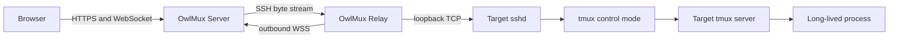

# Architecture

::: warning Target design
The architecture below is accepted product direction. The current repository is
only the foundation described in [Getting started](getting-started.md).
:::

## One durable owner

OwlMux is based on a single decision: the interactive session belongs to tmux on
the target machine.

- tmux owns sessions, windows, panes, PTYs, scrollback, layout, and child
  processes;
- target sshd owns host identity and Unix-account authentication;
- OwlMux Server owns Web access, organization authorization, SSH client
  attachments, tmux control translation, and live projection;
- OwlMux Relay owns an outbound byte route to target sshd;
- PostgreSQL owns OwlMux users, organizations, machines, credentials, sessions,
  and audit;
- Redis owns disposable rate-limit and cache state;
- the browser owns rendering and local interaction state.

An OwlMux attachment can always be replaced. A tmux session cannot be recreated
from Server metadata and is never killed because OwlMux loses a dependency.

## Two runtime components

### OwlMux Server

The public Server will provide:

- embedded React application, API, and WebSocket attachment endpoint;
- OwlAuth or deployment API-key authentication;
- organization and machine authorization;
- machine registration and Relay enrollment;
- protected per-machine SSH credentials;
- OpenSSH and tmux control-mode client processes;
- outbound Relay stream routing.

### OwlMux Relay

Relay runs on a target machine and will:

- enroll once with a user-created one-use token;
- hold one target-side Ed25519 machine key;
- make one authenticated outbound connection to Server;
- forward bounded streams only to its enrolled loopback sshd endpoint;
- reconnect without inspecting or cleaning up tmux.

Relay is not an Agent runtime. It cannot start a shell, create a PTY, execute a
tmux command, or manage process lifetime.

## Reconnection

After a browser or network failure, Server opens a fresh SSH connection and a
fresh tmux control client. It queries target sessions, windows, panes, layouts,
and bounded scrollback, then atomically replaces the browser projection.

There is no central terminal journal or process-resume protocol. Continuity comes
from the target process remaining inside tmux.

## Storage does not own terminal state

PostgreSQL stores product control state and encrypted SSH credentials. Redis
stores disposable cache and admission state. Neither stores terminal input,
output, pane history, tmux projection, or process state.

Restoring the OwlMux database may restore reachability metadata and credentials;
it never claims that a target tmux process was restored.

## Normative design

See the [system architecture](https://github.com/owlfoundry/owlmux/blob/main/spec/02-system-architecture.md),
[tmux control contract](https://github.com/owlfoundry/owlmux/blob/main/spec/03-tmux-control-and-roaming.md),
and [delivery plan](https://github.com/owlfoundry/owlmux/blob/main/spec/08-delivery-plan.md).
