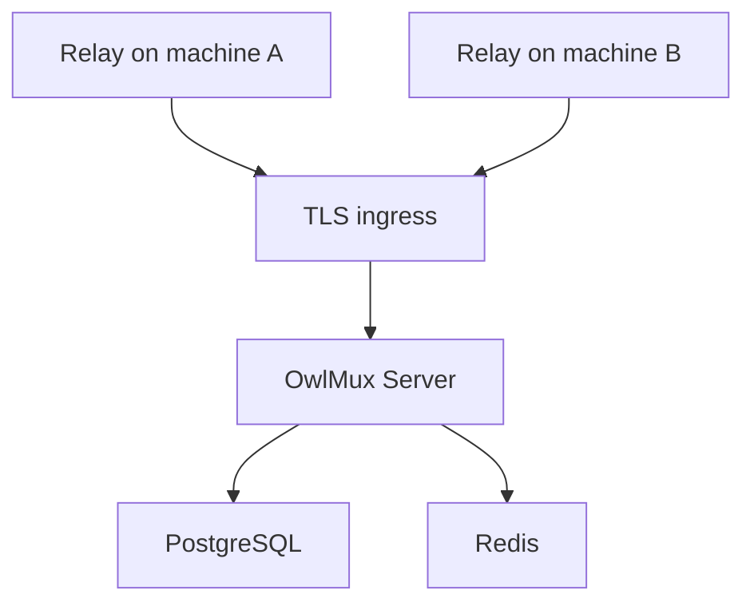

# Deployment

## Current foundation

The current production image runs only the placeholder `owlmux-server`:

- one unprivileged process;
- embedded placeholder Web assets;
- `/health` and `/ready`;
- no database connection, authentication, Relay, SSH, or tmux behavior.

Build and smoke-test it with:

```bash
make docker-build
```

The default listener is `0.0.0.0:8080` in the image. Production TLS belongs at a
trusted reverse proxy. Do not expose this foundation as a functional terminal
service.

## Development infrastructure

`dev/compose.yml` provides PostgreSQL and Redis for future product blocks:

```bash
make dev-up
make dev-status
make dev-down
```

The services bind only to loopback development ports. Their default development
credentials are not production settings.

## Target deployment shape

Once implemented, one standalone deployment will contain:



PostgreSQL will be durable authority. Redis will be disposable cache and
rate-limit infrastructure. Server will remain one process; the initial design has
no distributed live Relay/session coordination.

## Configuration status

`OWLMUX_ADDR` and `OWLMUX_WEB_DIR` are the only implemented OwlMux-specific
Server environment variables. The standard `RUST_LOG` filter controls structured
logging. Authentication, PostgreSQL, Redis, OwlAuth, secret root, machine, and
Relay configuration names remain target design until their implementation block
lands.

Read [Getting started](getting-started.md) for current commands and the normative
[delivery plan](https://github.com/owlfoundry/owlmux/blob/main/spec/08-delivery-plan.md)
for future gates.
