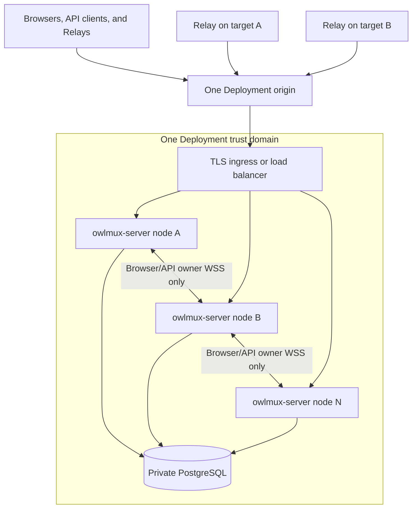

# Deployment

## Current foundation

The current production image runs only the placeholder `owlmux-server`:

- one unprivileged process;
- embedded placeholder Web assets;
- `/health` and `/ready`;
- no database connection, authentication, Server membership/ownership, internal cluster listener, Relay, SSH, or tmux behavior.

Build and smoke-test it with:

```bash
make docker-build
```

The default listener is `0.0.0.0:8080` in the image. Production TLS belongs at a trusted reverse proxy. Do not expose this foundation as a functional terminal service.

## Development infrastructure

`dev/compose.yml` provides PostgreSQL for future product blocks:

```bash
make dev-up
make dev-status
make dev-down
```

The services bind only to loopback development ports. Their default development credentials are not production settings. The foundation Server does not connect to PostgreSQL yet.

## Target Deployment shape

Once implemented, one Deployment will run one or more symmetric Server nodes against one private PostgreSQL database:



Every node runs the exact same Server image, build, Deployment-critical configuration, and capabilities. Each process uses Tokio's multi-threaded runtime across its assigned CPU budget. A one-node installation takes the local-owner fast path; adding equivalent nodes supplies horizontal scale without a Gateway/Worker split.

PostgreSQL is the only durable product authority and stores low-churn node leases plus actual Machine-owner epochs. It does not carry terminal payload. Each current owner process holds its Machine Relay tunnels, SSH/tmux clients, projections, Browser writer coordination, and bounded queues locally.

The public load balancer distributes new Relay connections using ordinary connection-level policy. The accepting/authenticating Server incarnation is the only node allowed to claim that Machine and keeps all Relay/Machine-affine live state local. OwlMux promises no even distribution and has no placement hash, candidate ranking, automatic/manual rebalance, or live migration.

A non-owner Browser or Machine-affine API ingress may open at most one bounded internal owner WSS hop. One-shot API control uses the same WSS challenge mode; Relay/enrollment and raw public credentials never cross it. Stickiness is optional and clients always use the same Deployment origin.

The design deliberately has no Redis, message queue, scheduler service, terminal broker, virtual-bucket table, distributed writer lock, or replicated terminal state.

## Deployment profiles

### Single-node profile

The single-node profile uses the same membership/owner/connection-epoch model but may omit the internal listener, cluster key, and internal TLS configuration. Every owner is local. It is suitable when one Tokio process and one host provide enough capacity.

### Clustered profile

The clustered profile additionally requires:

- a random authority-bearing incarnation on every process start plus an optional diagnostic display name;
- one internal WSS-over-TLS endpoint per node reachable only by Deployment nodes;
- one distinct shared `OWLMUX_CLUSTER_KEY`;
- an internal certificate/trust policy;
- one coherent Deployment configuration epoch/proof, persistent exact `server_build_id`, schema/public/internal generation, and exact initial Relay protocol version;
- load-balancer routing to healthy/ready public nodes;
- bounded node lease, Browser/API owner-WSS, owner, drain, and reconnect budgets.

`OWLMUX_CLUSTER_KEY` is canonical unpadded base64url for exactly 32 random bytes. It authenticates internal configuration proofs and fresh Browser/API owner-WSS hops only. It never substitutes for the Deployment API key, Relay identity, SSH credential, or SSH encryption key, and it never permits plaintext internal transport.

## Configuration status

`OWLMUX_ADDR` and `OWLMUX_WEB_DIR` are the only implemented OwlMux-specific Server environment variables. The standard `RUST_LOG` filter controls structured logging.

PostgreSQL, `OWLMUX_API_KEY`, `OWLMUX_CLUSTER_KEY`, `OWLMUX_SSH_KEY_ENCRYPTION_KEY`, Deployment configuration epoch, process incarnation/lease, internal TLS/WSS, private SSH runtime root, Machine, and Relay settings remain target design until their capabilities land.

The target design requires:

- one API key formatted as `owlmux_sk_v1_` plus canonical unpadded base64url for exactly 32 operator-generated random bytes;
- one canonical 32-byte SSH private-key encryption key shared by every node;
- in clustered mode, one separate canonical 32-byte cluster key plus internal TLS identity/trust;
- one coherent security/protocol/configuration proof across all nodes.

None of these keys is stored in PostgreSQL. Secrets never appear in command-line arguments, logs, metrics, diagnostics, registry endpoints, or internal destination-challenge/HMAC transcripts.

## Health, readiness, and fencing

`/health` reports only process/event-loop liveness. `/ready` reports whether that node can safely accept new work.

A node becomes unready when draining, when a required dependency is unavailable, or when its conservative local node-lease deadline arrives. For lease TTL `L`, the initial Linux profile samples `CLOCK_BOOTTIME` as `b0` before registration/renewal and, after an exact success, sets `local_hard_deadline = b0 + L - S` using one Deployment-wide safety margin `S`. The pre-request sample includes request delay; `S` covers the supported PostgreSQL forward adjustment plus bounded local clock-read, scheduling, dispatch, and fence overhead. Every acceptance and target dispatch checks this deadline directly. Startup validates only clock availability and `0 < S < L`, not future platform or database behavior. Ordinary `Instant`, `CLOCK_MONOTONIC`, wall time, and Tokio timers alone are not lease authority. At the deadline the incarnation is irreversibly fenced: it rejects input/mutations, ignores late renewal responses, closes every owned Relay, Browser, SSH, and tmux connection, and must restart fresh rather than return to Serving. Another node may claim those Machines only after PostgreSQL observes the old database-time lease as invalid.

Host suspend/container freeze requires the elapsed clock to advance across it. Operators must never resume, clone, or live-migrate the same process snapshot or frozen-clock incarnation; terminate it and start a fresh incarnation before I/O. This fail-closed gap prevents split OwlMux dispatch authority. Node fencing never signals or destroys target tmux.

## Join, drain, and failure

Joining registers a fresh coherent node incarnation and begins accepting whatever new connections the load balancer sends to it. It does not move or rebalance existing owners and creates no distribution guarantee.

Controlled drain:

1. marks the exact node incarnation `Draining` and unready;
2. excludes it from new owner claims;
3. for each owner, closes the dispatch barrier, rejects writes, and fences routes/children/writers/queues/results in bounded batches;
4. only after local fencing, CAS-releases the exact owner epoch when PostgreSQL is available;
5. lets Relay and Browser reconnect through the unchanged Deployment origin;
6. removes only that node's local OpenSSH runtime files and exits.

A crash cannot transfer live sockets or clean its registry rows. Relays reconnect, owner claims wait for lease expiry, and only the node accepting a later Relay reconnect may obtain a higher Machine connection epoch. Browser reconnects and hydrates from target tmux. No terminal input, output, pending operation, Browser writer state, or projection is replayed.

## API-key and cluster configuration changes

API-key, Server build, and Deployment-critical configuration changes use a controlled all-node cold transition:

1. drain and stop every Server node;
2. wait until no old node lease remains valid;
3. atomically install the new release's embedded `server_build_id` with the Deployment-wide configuration and next explicit epoch under the shared Deployment-row lock;
4. apply compatible schema/protocol changes;
5. keep the public origin gated if distribution matters, start every intended exact-build/config node, then open ingress.

A same-epoch proof mismatch, local embedded `server_build_id` mismatch, stale node, or non-exact Relay protocol fails before Serving. Mixed-build rolling Server upgrade is unsupported. The first implementation has no Relay version negotiation or compatibility manifest; that policy is deferred until a second protocol version exists. There is no dual-key grace or per-node API-key rotation. Target tmux continues throughout.

## PostgreSQL operator contract

PostgreSQL HA, failover, backup, restore, promotion, and replica fencing are deployment-operator responsibilities. OwlMux uses one configured endpoint and assumes it exposes one linearizable single-writer non-rollback history that preserves every acknowledged commit. OwlMux does not discover topology, validate recovery, clear rows to repair a rolled-back history, or orchestrate database failover.

Before an operator restore or history replacement, stop/isolate every Server node and start only fresh process incarnations afterward. This prevents old processes from continuing but does not make rollback safe. If history loses acknowledged commits or revives earlier rows, OwlMux provides no one-use-token, revocation, lease/owner epoch, configuration, audit, or credential-lifecycle guarantee. Treat it as an unsupported Deployment integrity incident.

The operator separately protects the matching SSH encryption key and other startup secrets. Database state never restores target tmux or live OwlMux state. A database copy must not run concurrently as the same Deployment; initialize a separate Deployment independently.

Read [Getting started](getting-started.md) for current commands and the normative [operations and resilience specification](https://github.com/owlfoundry/owlmux/blob/main/spec/08-operations-security-and-resilience.md) for the target Deployment boundary.
