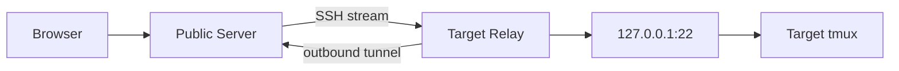

# Relay and roaming

::: warning Target design
Relay enrollment, reverse transport, SSH, tmux control mode, and browser roaming
are not implemented in the current foundation.
:::

## Why Relay exists

A target machine may not have a public address or inbound firewall rule. OwlMux
Relay will open an authenticated outbound WebSocket-over-TLS connection to the
public Server, normally over TCP 443.

Server will open a logical stream through that tunnel to the Relay's enrolled
loopback sshd endpoint. A normal SSH handshake still ends at target sshd, so the
target host key and Unix account remain authoritative.

This is reverse relaying, not P2P NAT hole punching. Traffic remains on the Server
path.

## What Relay will not do

Relay will not:

- start a shell or coding agent;
- create a PTY;
- run tmux commands;
- inspect SSH plaintext;
- forward arbitrary target-network destinations;
- terminate a process when its tunnel expires;
- preserve one SSH byte stream across reconnect.

Tunnel loss closes attachments only. tmux continues on the target.

## Graphical tmux

Server will run a constrained OpenSSH child and enter tmux control mode. It will
translate target sessions, windows, panes, layouts, and output into typed
WebSocket events. The browser will render each pane with xterm.js.

After reconnect, OwlMux will query and hydrate target state again. It will not
replay ambiguous input or rely on a central output journal.

Read the normative [Relay specification](https://github.com/owlfoundry/owlmux/blob/main/spec/05-connectivity-and-relay.md)
and [tmux specification](https://github.com/owlfoundry/owlmux/blob/main/spec/03-tmux-control-and-roaming.md).
