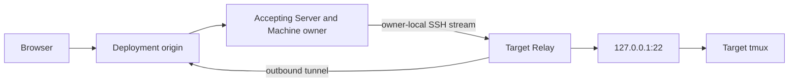

# Relay and roaming

::: info Current scope
The current pre-release profiles implement one-use Relay enrollment, signed reverse transport, accepting-ingress Machine ownership, owner-routed Relay revocation/re-enrollment, constrained OpenSSH, explicit tmux session selection/creation, target-authoritative multi-pane projection, one owner-local Browser writer, and one-hop clustered remote-owner WSS routing. Relay and enrollment always remain on their accepting node.
:::

## Install Relay

Starting with version `0.0.2`, install the target-side binary from crates.io or use the matching portable archive attached to the GitHub release:

```bash
cargo install --locked owlmux-relay
```

## Why Relay exists

A target machine may not have a public address or inbound firewall rule. OwlMux Relay opens an authenticated outbound WebSocket connection to one Deployment origin. Production deployments terminate TLS and normally expose it over TCP 443.

Any Serving Server node may accept that public connection. Ordinary load balancing determines the ingress. After Relay authentication, that exact accepting incarnation is the only node allowed to claim the Machine in PostgreSQL under a new monotonic connection epoch, and it holds the tunnel plus all Machine-affine state locally.

The owner opens logical streams through that tunnel to the Relay's enrolled loopback sshd endpoint. A normal SSH handshake still ends at target sshd, so the target host key and Unix account remain authoritative.



This is reverse relaying, not P2P NAT hole punching. Traffic remains on the Server path. Relay never receives an internal node address or cluster credential.

## Enrollment through any node

Relay enrollment sends the one-use token alone in its first bounded frame to the Deployment origin. The ingress node:

1. allocates only fixed pre-token state;
2. requires the exact initial Relay protocol version;
3. verifies and clears the token candidate;
4. in one transaction locks `DEPLOYMENT` first, rechecks exact configuration/build/protocol, then locks the pending Machine/enrollment and executing Server-incarnation row, rechecks post-lock PostgreSQL time plus the exact Serving lease, atomically consumes the digest, and creates one deadline-bounded `Verifying` attempt;
5. returns the immutable Deployment/Machine IDs so Relay can persist them with its already persisted candidate Relay ID/key before setup;
6. retains bounded setup, fresh challenge, and verified proof state only on that same live connection.

There is no OwlMux node selection, internal enrollment forwarding, token forwarding, persisted coordinator/challenge/proof, or resume on another connection.

The connection accepts exactly one setup frame covering the candidate Relay ID/public key, endpoint, account, host candidates, and exact protocol version. Server returns the selected SSH credential's public metadata separately. After the target administrator confirms readiness in Relay CLI, Server opens one independent proof stream and runs the closed fixed no-tmux `VerifySshAccess` operation; only its exact constant marker followed by clean zero exit proves SSH host/account/key acceptance.

Final activation locks `DEPLOYMENT` first, rechecks exact configuration/build/protocol, then locks the exact attempt, Machine/credential, and executing Server-incarnation row. Under that Deployment lock plus database partial unique constraints, post-lock PostgreSQL current time must show an unexpired attempt, no other active binding for the Relay ID/public key, and an exact Serving, lease-valid, config/build/protocol-current node before the transaction creates the active Relay binding. A query delayed across attempt/node lease expiry, drain, fence, replacement, active-identity conflict, or configuration change cannot activate durable trust. The accepting node then claims itself as current Machine owner before ordinary logical streams open. If activation or owner reporting is ambiguous, Relay closes and reconnects with the IDs/key it persisted before setup; it never replays the enrollment token, setup, or activation blindly.

Known setup/proof/connection failure or attempt expiry returns the Machine to tokenless `Pending` through protected recovery; a new token must be issued explicitly. An expired crash residue may be recovered safely without resurrecting the old token. A Relay ID or Ed25519 public key may appear in at most one active Machine binding; OwlMux does not retain a permanent registry of invalidated Relay identities.

Active re-enrollment first fences the current owner, invalidates the old Relay binding, increments the route revision, and returns the same fixed host/account/socket Machine to tokenless `Pending`; issuing a new one-use token is a following explicit action. It never accepts a changed target identity in place.

## Active tunnel ownership

An active Relay reconnect authenticates its Machine-bound Ed25519 transcript at any ingress node. Ingress clears proof buffers and attempts to claim only its own exact incarnation:

- if no valid owner exists, the claim creates a higher connection epoch and the tunnel stays local;
- if the same owner knows its previous tunnel is closed, it first closes the dispatch barrier and fences all old-epoch local state, then CAS-releases and makes a fresh claim;
- if any other valid owner remains, ingress returns `temporarily_unavailable` with a capped `retry_after` and never proxies, steals, or remotely evicts it.

A valid but unreachable owner is not bypassed. The deployment operator fences/stops/isolates that owner node, waits for PostgreSQL lease expiry, and lets Relay retry. Node join affects only later connections and OwlMux has no rebalance or balance guarantee. Old logical streams, SSH bytes, and pending operations never migrate or replay.

## What Relay does not do

Relay does not:

- start a shell or coding agent;
- create a PTY;
- run tmux commands;
- modify `authorized_keys`, `AuthorizedKeysCommand`, sshd configuration, target accounts, or another target authorization store;
- invoke a package manager or install, upgrade, downgrade, configure, patch, or repair tmux;
- inspect SSH plaintext;
- forward arbitrary target-network destinations;
- choose, know, or request a Server owner;
- accept or use the Deployment API key or cluster key;
- terminate a process when its tunnel or owner lease expires;
- preserve one SSH byte stream across reconnect.

Tunnel, owner-node, or database loss closes OwlMux attachments only. tmux continues on the target.

## Graphical tmux

OwlMux stores the generated Ed25519 Deployment credential selected for the Machine and presents Server-derived public-key metadata. It accepts no private-key upload or alternate key algorithm. The target administrator exclusively owns public-key installation and removal through external operational tooling. Relay never modifies target authorization stores; enrollment only opens a bounded proof path so the accepting Server can verify the exact credential after readiness confirmation.

The current owner runs a constrained OpenSSH child and enters tmux control mode through a closed typed remote-entry renderer. The target administrator must install and operate tmux; OwlMux detects and explains missing or incompatible tmux but never installs or changes it. The minimum target baseline is tmux 3.2a. Server parses the configured client and any running-server version, checks the release-maintained known-bad denylist, and qualifies required control behavior before projection. The Docker E2E uses versioned Node attachment-WebSocket clients and real Chromium acceptance in every CI profile against Ubuntu 22.04 tmux 3.2a, Debian 12 tmux 3.3a with dash, Debian 13 tmux 3.5a, and checksum-pinned upstream tmux 3.7b. The broader target qualification policy also covers qualified shells and additional lifecycle/failure fixtures as those surfaces are delivered. The initial Relay protocol accepts one exact version without negotiation or a compatibility manifest; policy for older versions waits until a second protocol version exists.

The current Machine owner observes the selected session's target-current window and every visible pane in that window. It validates bounded pane IDs, coordinates, dimensions, titles, current commands, and exactly one target-active pane. During hydration it manually pauses delivery for the same tmux control client, rejects unstable metadata, then continues each pane and runs `capture-pane` followed by final terminal metadata as one synchronous command list. The two consecutive guarded responses share one deadline; pane output between capture and metadata makes the cutover unstable, while a stable final cursor/mode observation drives the bootstrap. A complete post-capture topology observation must still match. Server discards only already-covered pre-barrier output, retains bounded post-barrier output, and keeps pumping the control stream while sending one projection epoch as metadata plus binary-safe snapshot chunks. Browser validates the closed protocol and cardinality, then atomically replaces the workspace with one xterm.js instance per pane in the target-authoritative layout at the ready phase; buffered and new output is then split into bounded frames. Layout, pane, window, and session notifications cause a fresh bounded projection epoch, while control backpressure pause requires resynchronization rather than replay.

One route-scoped owner-local pointer identifies the current Browser writer. Claim/takeover, session creation, writer resize, observed window/pane selection, active-pane literal input, and projection hydration serialize through the same bounded dispatch barrier. Every control client atomically attaches read-only with `ignore-size`; a takeover makes the old client `ignore-size` before toggling it read-only, then uses tmux's dedicated read-only toggle to promote the claimant, removes `ignore-size`, resizes, and freshly hydrates it. Notifications observed while the barrier is busy become one coalesced dirty work item whose dispatch wait keeps its queue position while the workspace still handles demotion and close; they are never dropped or mixed across projection generations. Target mutation outcomes are exact success, known failure, or conservative ambiguous. OwlMux never retries or compensates an ambiguous input or mutation.

A Relay route replacement discards owner-local SSH/tmux/writer state and closes the stale route-bound attachment. After a new owner claims a higher connection epoch, a new authenticated attachment resolves that owner and starts at a fresh chooser; OwlMux never migrates the old WebSocket, silently reselects the previous session, or replays output.

In the clustered profile, a non-owner Browser ingress uses at most one bounded internal owner WSS hop. Machine-affine one-shot API requests use the same destination-challenge/HMAC WSS mode; Relay never does. The Browser never selects a node.

After reconnect and only once no valid old owner remains, the accepting Relay node may claim a new Machine epoch and query target state again. It does not rely on a central output journal and never replays ambiguous input.

Read the normative [Relay enrollment and transport specification](https://github.com/owlfoundry/owlmux/blob/main/spec/03-relay-enrollment-and-transport.md) and [SSH/tmux attachment specification](https://github.com/owlfoundry/owlmux/blob/main/spec/04-ssh-tmux-attachment-and-roaming.md).
