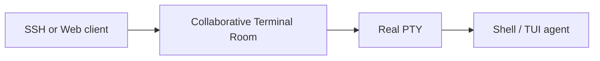

# Cloud SSH

Cloud SSH is a collaborative terminal room runtime. It lets classic SSH clients and browser clients attach to the same server-side terminal workspace.

The room owns collaboration state. The PTY owns the actual process tree.

## Design Principles

- Preserve the classic SSH experience for local terminals.
- Make browser attach a peer view of the same room, not a separate terminal.
- Allow each client to resize, scroll, and inspect through its own view.
- Serialize real PTY input through room authority.
- Keep terminal output in event logs and snapshots, not in CRDT state.

## Learning Path

1. [Development](development.md): run local checks and understand the workspace.
2. [Architecture](architecture.md): review the room, PTY, and client-view model.
3. [Specs](../spec/README.md): inspect product and runtime decisions.
