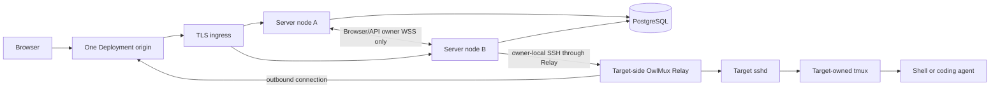

::: warning Foundation status
OwlMux currently provides a clean repository foundation: two placeholder Rust binaries, a placeholder Web page, PostgreSQL development infrastructure, Docker packaging, specifications, and CI. Deployment API-key access, Server-node membership and ownership, Machine registration, Relay transport, SSH, and tmux integration are not implemented yet.
:::

## The durable boundary

```mermaid
flowchart LR
    browser["Browser"] --> origin["One Deployment origin"]
    relay["Target-side OwlMux Relay"] -->|"outbound connection"| origin
    origin --> ingress["TLS ingress"]
    ingress --> nodeA["Server node A"]
    ingress --> nodeB["Server node B"]
    nodeA --> postgres[("PostgreSQL")]
    nodeB --> postgres
    nodeA <-->|"Browser/API owner WSS only"| nodeB
    nodeB -->|"owner-local SSH through Relay"| relay
    relay --> sshd["Target sshd"]
    sshd --> tmux["Target-owned tmux"]
    tmux --> process["Shell or coding agent"]
```

Closing the browser or losing an ingress node, owner node, Relay, database, or network path must affect only OwlMux access. The target tmux session and its process continue independently. A replacement Relay ingress may claim a fresh Machine owner epoch only after no valid owner remains, then observes current tmux state rather than moving or replaying live state. If a valid owner is unreachable, the operator fences that node and waits for lease expiry.

## Read next

- [Getting started](/guide/getting-started) — build and inspect the current foundation.
- [Architecture](/guide/architecture) — understand target-owned tmux, symmetric Server nodes, and fenced Machine ownership.
- [Deployment access and credentials](/guide/authentication) — review the single API key, cluster authentication, integration metadata, and SSH credential model.
- [Relay and roaming](/guide/relay) — understand the planned reverse connection, Relay-ingress ownership, and tmux hydration path.
- [Deployment](/guide/deployment) — compare the current image with the target one-or-more-node topology.
- [Security](/guide/security) — review Deployment, cluster, target, and Browser trust boundaries.

The complete target design is normative under the repository [`spec/`](https://github.com/owlfoundry/owlmux/tree/main/spec).
