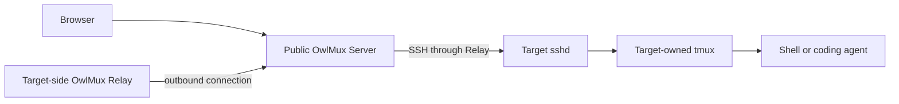

::: warning Foundation status
OwlMux currently provides a clean repository foundation: two placeholder Rust
binaries, a placeholder Web page, PostgreSQL and Redis development infrastructure,
Docker packaging, specifications, and CI. Authentication, organizations, machine
registration, Relay transport, SSH, and tmux integration are not implemented yet.
:::

## The durable boundary

```mermaid
flowchart LR
    browser["Browser"] --> server["Public OwlMux Server"]
    relay["Target-side OwlMux Relay"] -->|"outbound connection"| server
    server -->|"SSH through Relay"| sshd["Target sshd"]
    sshd --> tmux["Target-owned tmux"]
    tmux --> process["Shell or coding agent"]
```

Closing the browser or losing Server/Relay connectivity must affect only the
attachment. The target tmux session and its process continue independently.

## Read next

- [Getting started](/guide/getting-started) — build and inspect the current
  foundation.
- [Architecture](/guide/architecture) — understand target-owned tmux and the
  Server/Relay split.
- [Authentication and organizations](/guide/authentication) — review the accepted
  OwlAuth/API-key and sharing model.
- [Relay and roaming](/guide/relay) — understand the planned reverse connection
  and tmux hydration path.
- [Deployment](/guide/deployment) — current container and infrastructure shape.
- [Security](/guide/security) — trust boundaries that apply now and to planned
  capabilities.

The complete target design is normative under the repository
[`spec/`](https://github.com/owlfoundry/owlmux/tree/main/spec).
