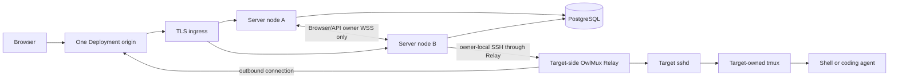

::: info Current scope
The pre-release single-node and clustered profiles are implemented and Docker-qualified: Deployment API-key access, generated encrypted SSH credentials, complete Machine/Relay lifecycle controls, active-Machine credential rebind, signed Relay tunnels, actual owner claims, constrained OpenSSH, explicit tmux session selection/creation, target-authoritative multi-pane xterm.js projection, one owner-local Browser writer, bounded mutations, safe audit/metrics, one-hop internal owner-WSS routing, and cold recovery/rotation evidence. Release qualification covers the documented Linux x86_64, tmux 3.2a/3.3a/3.5a/3.7b, `bash`/`dash`, Chromium, local/remote-owner, dependency-audit, and production-image paths. Version `0.0.1` was the initial CI-published evaluation release. Version `0.0.2` adds Server and Relay crates.io source packages and is the current evaluation release. No version is supported for production terminal access, and no broader platform coverage is claimed.
:::

## Implemented topology and durable boundary

The diagram below shows the implemented clustered topology. The default single-node profile uses the same owner application boundary without internal WSS.

```mermaid
flowchart LR
    browser["Browser"] --> origin["One Deployment origin"]
    relay["Target-side OwlMux Relay"] -->|"outbound connection"| origin
    origin --> ingress["TLS ingress"]
    ingress --> nodeA["Server node A"]
    ingress --> nodeB["Server node B"]
    nodeA --> postgres[("PostgreSQL")]
    nodeB --> postgres
    nodeA <-->|"Browser/API owner WSS only"| nodeB
    nodeB -->|"owner-local SSH through Relay"| relay
    relay --> sshd["Target sshd"]
    sshd --> tmux["Target-owned tmux"]
    tmux --> process["Shell or coding agent"]
```

Closing the browser or losing an ingress node, owner node, Relay, database, or network path must affect only OwlMux access. The target tmux session and its process continue independently. A replacement Relay ingress may claim a fresh Machine owner epoch only after no valid owner remains, then observes current tmux state rather than moving or replaying live state. If a valid owner is unreachable, the operator fences that node and waits for lease expiry.

## Read next

- [Getting started](/guide/getting-started) — run and validate the current single-node and clustered implementation.
- [Architecture](/guide/architecture) — understand target-owned tmux, symmetric Server nodes, and fenced Machine ownership.
- [Deployment access and credentials](/guide/authentication) — review the single API key, cluster authentication, integration metadata, and SSH credential model.
- [Relay and roaming](/guide/relay) — understand enrollment, Relay-ingress ownership, interactive tmux hydration, and remote-owner routing.
- [Deployment](/guide/deployment) — configure the current image for one or more symmetric nodes.
- [Recovery and incident response](/guide/recovery) — rehearse failure, cold rotation, restore, and compromise boundaries.
- [Security](/guide/security) — review Deployment, cluster, target, and Browser trust boundaries.

The complete target design is normative under the repository [`spec/`](https://github.com/owlfoundry/owlmux/tree/main/spec).
