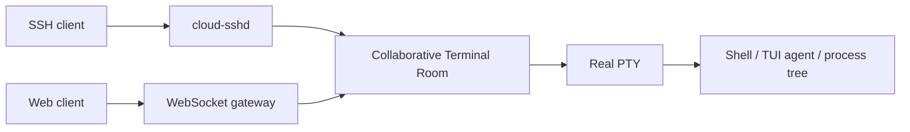
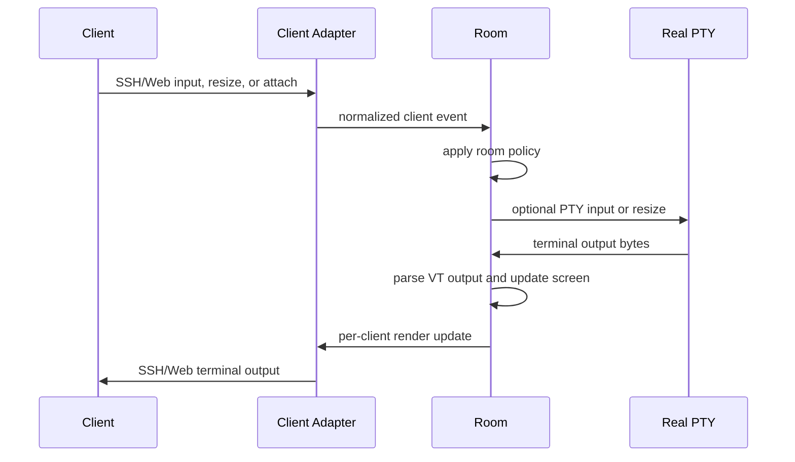

# Collaborative Terminal Room

## Status

Draft

## Product Thesis

Cloud SSH gives classic SSH clients and browser clients access to the same long-lived terminal workspace.

The core product object is a collaborative terminal room. A room owns one real PTY-backed runtime and projects it to many clients. Clients may be local SSH clients, browser terminals, automation tools, or future IDE integrations.

The goal is not to make SSH connections more durable. The goal is to move terminal session state onto the server while preserving the classic local SSH experience.

## Core Model

The model has three layers:

- `RealPty`: the single backend terminal runtime.
- `Room`: the collaborative state and policy boundary.
- `ClientView`: the per-client projection of the room.

## Responsibilities

### RealPty

The real PTY owns:

- one process tree;
- one ordered input byte stream;
- one output byte stream;
- one canonical terminal size at any moment.

The real PTY does not know about users, rooms, permissions, sharing, or web clients.

### Room

The room owns:

- session identity;
- client membership;
- presence;
- input authority;
- resize policy;
- canonical screen state;
- append-only terminal event log;
- scrollback and catch-up state;
- room permissions;
- per-client view metadata.

The room is the collaboration boundary. Conflict resolution applies to room state, not directly to PTY input.

### ClientView

A client view owns:

- transport type, such as SSH or WebSocket;
- local terminal size;
- viewport and scroll position;
- follow/live/inspect mode;
- local overlays;
- read or write intent;
- selected terminal, pane, or tab when the room has multiple surfaces.

Each client may resize, scroll, inspect history, and display overlays independently. Those actions do not necessarily change the real PTY.

## Protocol Boundary

Cloud SSH terminates client protocols and re-projects room state back to clients.

This is a protocol proxy, but not a transparent one. The client-facing SSH/Web protocols and the backend PTY runtime are intentionally decoupled.

## Input Authority

Terminal input is serialized. The room never merges concurrent input streams.

Input authority should behave like focus, not like a manual lock. Users should not need to release control.

Initial policy:

- If no client has authority, the first input claims authority and is forwarded.
- If the same user connects from another device, the focused/input device may immediately claim authority.
- If another user's authority is idle, a new input may claim authority.
- If another user is active, the first competing input is treated as control intent and is not forwarded to the PTY.
- Paste operations hold authority until the paste completes or times out.
- Agent output does not count as human activity.

The room records input authority as room state so clients can render local overlays, status lines, or browser UI without involving the PTY.

## Resize And Viewports

A generic PTY can only have one real size at a time. Full-screen terminal applications such as editors, dashboards, and TUI agents render against that canonical size.

Each client may still have an independent view:

- large clients can show the full canonical canvas with padding or metadata;
- small clients can crop, follow the cursor, or zoom;
- browser clients can pause live follow and inspect scrollback;
- SSH clients can receive a terminal-native projection with local-only status overlays.

Initial resize policy:

- The real PTY size follows the current input authority holder.
- Non-authoritative clients resizing their windows only update their `ClientView`.
- When authority moves to another client, the real PTY may resize to that client's terminal size.
- Room owners may pin the canonical PTY size for stable agent workflows.

Supported room size modes:

- `controller`: the current input authority holder controls the real PTY size.
- `pinned`: the room uses a fixed size, such as `120x40` or `160x48`.
- `latest`: the most recently active writable client controls the real PTY size.
- `largest`: the largest active writable client controls the real PTY size.

The default should be `controller`.

## Event Log And Catch-Up

The room should maintain an append-only event log:

- client attach and detach;
- PTY input;
- PTY output;
- resize events;
- authority changes;
- bookmarks;
- annotations;
- permission changes.

The room should also maintain screen snapshots so new clients can attach quickly without replaying an unbounded log from the beginning.

Catch-up should support:

- current screen snapshot;
- recent scrollback;
- activity since last seen;
- optional terminal replay;
- future structured agent transcript extraction.

## Security Model

The server must not require storing user private SSH keys.

Preferred direction:

- users authenticate to Cloud SSH;
- the room runtime runs server-side;
- target machines may run a lightweight agent that establishes an outbound connection to the control plane;
- SSH certificates or short-lived credentials are preferred over static secrets;
- share links are scoped, time-limited, and permissioned.

Room permissions should distinguish:

- owner;
- controller;
- writable collaborator;
- read-only viewer;
- automation client.

## MVP

The first useful implementation should include:

- `cloud-sshd` accepting normal SSH clients;
- browser terminal over WebSocket;
- one room with one PTY;
- attach and detach without killing the process tree;
- output broadcast to all clients;
- input authority manager;
- controller-based resize policy;
- independent client view size and scrollback;
- append-only event log;
- screen snapshot for fast attach;
- read-only sharing.

## Non-Goals

- Do not CRDT-merge concurrent terminal input.
- Do not depend on a user manually releasing control.
- Do not make SSH the only product interface.
- Do not make browser terminal a separate runtime.
- Do not assume all clients have the same viewport.
- Do not treat `tmux` as the collaboration model.

## Open Questions

- Which VT parser and terminal screen model should be used?
- How much terminal replay should be stored by default?
- Should the first server run user processes directly, through containers, or through machine agents?
- What is the right default pinned size for agent-heavy workflows?

## Follow-Up Specs

- Runtime architecture is detailed in [Rust Runtime Architecture](./002-rust-runtime-architecture.md).
- Room CRDT state and event protocol are detailed in [Room State And Protocol](./003-room-state-and-protocol.md).
