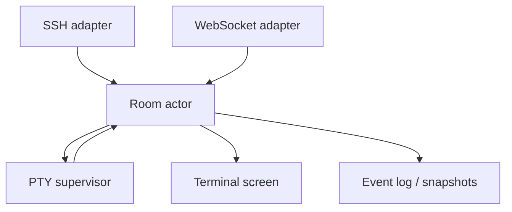

# Rust Runtime Architecture

## Status

Draft

## Decision

Cloud SSH is a Rust workspace. The initial implementation stays small:

- `cloud-ssh-core`: shared model types.
- `cloud-ssh-server`: server binary and future adapter host.

More crates should be added only when ownership boundaries become concrete.

## Runtime Shape

## Core Boundary

The room actor is the single writer for collaboration policy:

- client attach and detach;
- input authority;
- resize policy;
- room metadata;
- screen revision;
- event sequence allocation.

Adapters send normalized commands to the room. They never connect directly to the PTY.

## Candidate Dependencies

These are the current candidates, not required by the initial scaffold:

- `tokio`: async runtime.
- `russh`: SSH server adapter.
- `axum` and `tokio-tungstenite`: HTTP and WebSocket adapter.
- `portable-pty`: local PTY backend.
- `vt100`: first terminal screen model.
- `vte`: lower-level parser if `vt100` is too limiting.
- `yrs`: Yjs-compatible room metadata CRDT.
- `rusqlite`: local metadata and snapshot indexes.

## Data Placement

Yrs should store collaborative room metadata:

- presence;
- permissions;
- client view metadata;
- annotations;
- bookmarks;
- authority projection;
- resize policy.

Yrs should not store high-volume terminal runtime data:

- raw PTY output;
- every input byte;
- screen cell diffs;
- scrollback buffers;
- binary snapshots.

Terminal runtime data belongs in append-only event logs and screen snapshots.

## Initial Phases

1. Rust workspace scaffold with CI, docs, and specs.
2. Local one-room prototype with one PTY and one adapter.
3. Add the second adapter so SSH and Web attach to the same room.
4. Add event log, snapshots, and catch-up.
5. Add Yrs-backed collaborative room metadata.

## Acceptance Gates

- `make fmt-check`
- `make check`
- `make test`
- `git diff --check`
