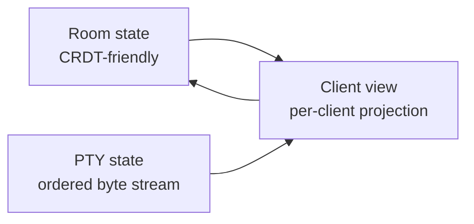
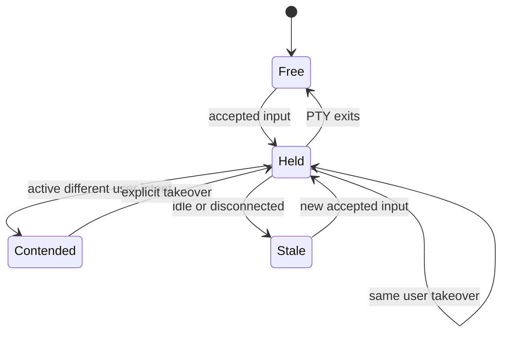

# Room State And Protocol

## Status

Draft

## State Classes

Cloud SSH has three state classes:



## Room State

Room state is collaborative and can use Yrs:

- room metadata;
- membership;
- permissions;
- surfaces;
- client presence;
- client view metadata;
- input authority projection;
- resize policy;
- bookmarks;
- annotations;
- last seen positions.

The room actor remains authoritative. Clients express intent; they do not directly decide authority or PTY resize.

## PTY State

PTY state is not CRDT data:

- one process tree;
- one input byte stream;
- one output byte stream;
- one canonical size;
- one terminal parser state;
- one screen buffer.

Every accepted input is serialized before it reaches the PTY.

## Client View

Each client owns an independent projection:

- local rows and columns;
- viewport mode;
- scroll offset;
- follow cursor flag;
- render mode;
- local overlay state.

Watcher resize updates only the client view. Controller resize may update the real PTY size.

## Event Model

Durable room events should share one envelope:

```rust
pub struct RoomEvent {
    pub room_id: RoomId,
    pub seq: EventSeq,
    pub kind: RoomEventKind,
}
```

Important event kinds:

- `ClientAttached`;
- `ClientDetached`;
- `AuthorityChanged`;
- `InputAccepted`;
- `InputRejected`;
- `PtyOutput`;
- `PtyResizeApplied`;
- `ScreenSnapshotCreated`;
- `PtyExited`.

`PtyOutput` should point to a log segment instead of embedding large byte payloads in metadata.

## Input Authority

Input authority behaves like focus, not like a manual lock.



Rules:

- read-only clients never write PTY input;
- same-holder input is forwarded;
- same-user takeover can be immediate;
- different-user takeover is immediate only when the holder is idle or disconnected;
- active different-user input is treated as intent and is not forwarded;
- rejected input is never echoed into the PTY.

## Resize

The real PTY can have only one canonical size. Each client can still resize its own view.

Initial policies:

- `controller`: authority holder controls the real PTY size.
- `pinned`: room uses a fixed PTY size.

`controller` is the default.

Watcher resize:

```text
client resize -> update ClientView -> re-render projection
```

Controller resize:

```text
client resize -> update ClientView -> apply PTY resize -> render redraw
```

## WebSocket Frames

Initial frame families:

```text
client.attach
client.input
client.resize
client.view.update
client.authority.intent
room.attach.accepted
room.render.ansi
room.state.patch
room.authority.update
room.resize.update
room.error
```

MVP can use JSON control frames and binary terminal payloads. A compact binary encoding can follow once the protocol stabilizes.

## SSH Normalization

SSH clients do not know about room semantics. The SSH adapter maps SSH events into room commands:

```text
pty-req -> initial ClientView size
window-change -> client resize
channel data -> client input
channel close -> detach
```

Local-only room UI, such as watcher status, is rendered by the adapter and never written to the real PTY.

## Invariants

- One real PTY has one ordered input stream.
- Every accepted input has a durable sequence number.
- Rejected input is never written to the PTY.
- Watcher resize never changes the PTY size.
- Terminal output is broadcast through projections.
- Raw terminal output is not stored in Yrs.
- The room actor is the only authority writer.

## Test Plan

- authority transitions;
- resize policy;
- SSH attach/input/output;
- Web attach/input/output;
- two clients watching one PTY;
- same-user resume;
- different-user contention;
- detach without killing PTY;
- snapshot plus event-log catch-up.
