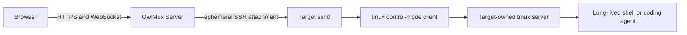

# Product Boundary

## Decision

OwlMux is a self-hosted terminal roaming gateway built on SSH and tmux.

A user starts a shell, coding agent, or other interactive program inside tmux on
a target machine. OwlMux lets that user return from another browser, discover the
same target-owned tmux session, and continue working. OwlMux Relay provides the
primary route: it creates an authenticated outbound connection from the target
to Server, so the target does not need to accept an inbound connection.

OwlMux does not own a terminal session. It is a graphical tmux client and
connectivity layer.

Every deployment is one self-hosted standalone trust domain with one public
`owlmux-server` and any number of user-installed `owlmux-relay` clients. OwlMux
has local organizations as sharing boundaries, but no hosted SaaS control plane,
hosted tenants, billing boundary, or cross-deployment identity.

## Product Promise

The initial product provides:

- a Web-first graphical client for tmux sessions, windows, and panes;
- reconnection from any browser through one reachable OwlMux Server;
- discovery and attachment to tmux sessions that already exist on a target;
- creation and manipulation of tmux resources only as explicit user-issued tmux
  operations;
- a target-initiated Relay route as the primary delivery path;
- a later optional direct SSH route for Server-reachable targets, using the same
  SSH and tmux boundary;
- OwlAuth-backed multi-user authentication when configured;
- a single-user API-key mode when OwlAuth is not configured;
- organization-owned machine registration and one-time Relay enrollment;
- one personal organization created for every newly admitted user;
- target host-key verification and normal SSH user authentication on every route;
- bounded browser, Server, SSH, relay, and tmux protocol handling.

A browser, WebSocket, Server, SSH connection, or relay may disappear and be
replaced without ending a target tmux session. Continuity ends when the tmux
session or its target machine ends, not when OwlMux loses connectivity.

## Durable Object

The durable interactive object is a tmux session on the target machine.

An SSH connection is only an attachment transport. OwlMux does not call an SSH
connection a resumable session and does not promise to preserve it. On reconnect,
OwlMux opens a new SSH connection and a new tmux control client, then rebuilds the
browser projection from target state.

OwlMux may expose user commands that create, rename, switch, detach, or destroy
tmux sessions. These are ordinary tmux client operations executed at the user's
request. They do not make OwlMux the session owner.

## Primary User Journey

01. The operator deploys one OwlMux Server in OwlAuth or API-key mode.
02. Server initializes that mode: API-key mode creates its fixed built-in owner
    and default organization without a user row; the first admission of each
    OwlAuth subject instead creates its local user, personal organization, and
    owner membership in one transaction.
03. An authenticated owner or admin selects an organization they manage and
    creates an organization-owned machine registration.
04. OwlMux reveals one short-lived, one-use Relay enrollment token.
05. The user starts OwlMux Relay on the target machine with that token.
06. Relay generates its machine key, binds the target SSH host identity, installs
    or confirms the generated OwlMux SSH public key for the selected local account,
    and opens an authenticated outbound route to Server.
07. Any active member selects the organization's machine in the Web application.
08. Server establishes SSH through Relay, verifies the enrolled host identity,
    authenticates with the protected per-machine SSH key, and discovers tmux.
09. The user selects an existing tmux session or explicitly creates one.
10. Server starts an ephemeral tmux control client and renders its windows and
    panes in the browser.
11. After any attachment failure, the user reconnects and OwlMux reconstructs the
    workspace from the same target tmux server.

A later direct-SSH route may let a user register an already reachable machine
without Relay, but Relay is the primary first-release route and the durable tmux
ownership is identical.

## Authentication Modes

### OwlAuth mode

OwlAuth authenticates users through its Project Auth protocol. OwlMux is one
registered OwlAuth Application and its backend validates OwlAuth Project access
tokens under the exact Project issuer, audience, Application, signature,
algorithm, type, and time contract.

OwlAuth owns authentication and user identity. OwlMux stores a local user binding
for the exact OwlAuth Project and subject. On first admission it creates that
user's personal organization and owner membership. OwlMux organizations,
memberships, roles, and machine ownership are local product authorization; they
are never inferred from OwlAuth email, organization, provider, or custom claims.

### API-key mode

One high-entropy deployment API key represents one implicit `owner` principal.
OwlMux creates one default organization and owner membership for it. API-key mode
has no additional users, invitations, or multi-user sharing.

CLI and API requests may use the key directly as a Bearer credential. The browser
exchanges it once over TLS for a bounded secure HTTP-only session cookie. The raw
key is not stored in browser storage, echoed by the server, or retained in
application persistence.

The two modes converge on one internal authenticated-principal type. They cannot
be enabled simultaneously in the initial product.

## Resource Model

The initial product has only the resources required for roaming and routing:

- **User**: an exact OwlAuth Project subject or the built-in API-key owner;
- **Organization**: the sharing and machine-ownership boundary;
- **Membership**: one user's active role in one organization;
- **Machine**: one organization-owned registered SSH host identity and route;
- **Relay enrollment**: one short-lived, one-use credential for binding Relay to
  its organization and machine;
- **Relay**: the enrolled target-side client providing an outbound stream route;
- **SSH credential**: one Server-generated per-machine key protected by the
  configured secret-custody provider;
- **Attachment**: one ephemeral browser-to-machine tmux control client;
- **tmux resources**: target-owned sessions, windows, and panes discovered live.

Every admitted OwlAuth user receives one personal organization and owner
membership. Users may also join shared organizations. Every machine belongs to
exactly one organization, all active members may discover and attach to it, and
there is no per-machine ACL. Machine organization is immutable in the first
release and never inferred from presentation metadata.

OwlMux does not persist a shadow copy of tmux sessions, windows, panes, layouts,
PTYs, process trees, output sequence numbers, or terminal generations as domain
resources.

## Trust Boundary

An authorized OwlMux user receives the same effective shell authority as the SSH
account configured for the target. OwlMux does not isolate mutually hostile users
inside one Unix account or tmux server.

The Server can observe terminal input and output while attached and decrypt its
protected per-machine SSH credentials. A compromised Server therefore
compromises every registered machine reachable by those credentials. Relay
transport encryption and at-rest secret custody do not remove that Server trust.

OwlMux is initially a self-hosted tool for a person or a trusted team. OwlAuth
mode adds distinct identities and target authorization, not hostile-workload
isolation.

## Explicit Non-Goals

The initial product does not provide:

- a custom Room, PTY generation, terminal-session runtime, or process supervisor;
- process continuity across target reboot or tmux server loss;
- server-owned terminal journals, replay, snapshots, or canonical parser state;
- target-process leases or cleanup driven by Server connectivity;
- an SSH server endpoint for ordinary OpenSSH clients;
- replacement of target sshd authentication or host identity;
- browser-uploaded SSH private keys;
- arbitrary TCP forwarding through the Relay;
- P2P NAT hole punching, STUN, TURN, ICE, or direct-path negotiation;
- multi-user simultaneous input authority in the first release;
- SFTP, SCP, filesystem browsing, port forwarding, or remote desktop;
- hosted tenant administration, billing, or a SaaS control plane;

The Relay is a reverse relay, not network hole punching in the protocol
sense. Its traffic remains on the Server path.

## Acceptance Criteria

- A process started inside target tmux remains alive after the browser,
  WebSocket, Server SSH client, Server process, or Relay disconnects.
- A later browser connection can discover and attach to that same tmux session.
- Direct and Relay-backed routes terminate SSH at the same target sshd and
  verify the same target host identity.
- The Server reconstructs tmux state from the target after every reconnect and
  never claims continuity from stale local metadata.
- OwlAuth mode accepts only valid tokens for the configured Project and OwlMux
  Application; users discover and attach only to machines in organizations where
  they have an active membership.
- API-key mode exposes exactly one implicit owner and never creates a local
  user-management system.
- Relay loss affects reachability only and never sends a tmux or process
  termination request.
- Documentation calls target tmux, not OwlMux, the session owner.
