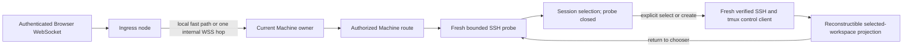
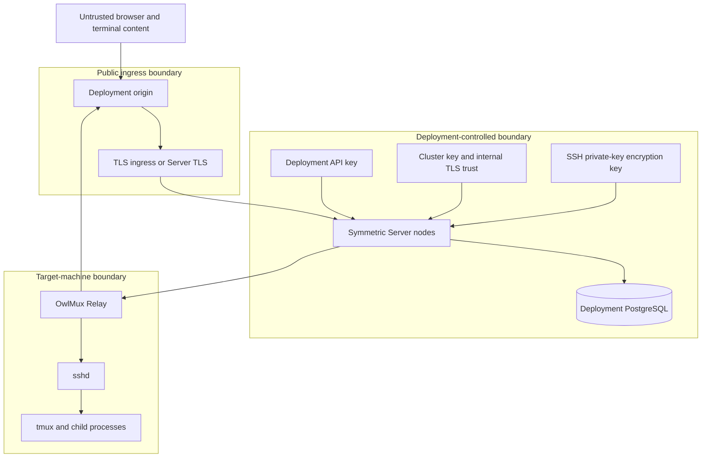

# System context and goals

## 1. Product model

OwlMux is a self-hosted terminal roaming gateway built on SSH and target-owned tmux. It lets a trusted operator use a browser to discover and reattach to work already running inside tmux.

OwlMux is a graphical tmux client and connectivity layer. It is not a terminal runtime, process supervisor, SSH server, durable terminal journal, identity provider, multi-tenant application, or hosted control plane.

Each Deployment is one independent trust domain with:

- one immutable Deployment identity and one public HTTPS/WebSocket origin;
- one or more symmetric `owlmux-server` nodes running the same binary;
- one private PostgreSQL database used only by that Deployment;
- one configured versioned 32-random-byte `OWLMUX_API_KEY`, shared by all nodes, that grants full access to the Deployment;
- one configured SSH private-key encryption key shared by all nodes;
- in clustered mode, one distinct cluster key and an internal TLS trust configuration shared by all nodes;
- any number of target-side `owlmux-relay` processes;
- one Deployment-wide SSH credential registry and Machine registry.

The Deployment is the complete human/API trust and authorization boundary. Anyone holding its API key has complete OwlMux control-plane and attachment authority for every resource in that Deployment; OwlMux does not partition that authority into finer-grained identities or resource grants.

A single-node installation is the local fast path of this same model. A clustered installation adds symmetric Server nodes, ordinary public connection balancing, low-churn PostgreSQL node/owner coordination, and at most one direct internal WSS hop for Browser or Machine-affine API traffic that entered a non-owner node. A Relay connection and enrollment always remain on the public node that accepted them; that exact node becomes the Machine owner. Clustering does not add a Gateway/Worker split, scheduler, second Server binary, Redis, message queue, terminal broker, live-state migration, or replicated terminal state.

Separate Deployments remain mutually independent trust domains. Operators MAY additionally shard Machines across them through external policy. Each Deployment has its own origin, deployment ID, secrets, database, credentials, Machines, Relays, Server membership, and live state. OwlMux provides no cross-Deployment global inventory, routing, migration, failover, or continuity.

## 2. Product goals

OwlMux MUST provide:

01. a Web-first graphical view of target tmux sessions, windows, and panes;
02. attachment to existing tmux work through a normal target SSH login;
03. reconstruction after Browser, Server node, route, SSH, or control-client loss;
04. a target-initiated Relay route for Machines without inbound reachability;
05. Deployment-wide Machine and reusable generated Ed25519 SSH credential management;
06. one configured protected SSH credential and one first-enrollment-confirmed, durably pinned host identity per active Machine;
07. one-or-more-node Server deployment without transferring or durably brokering terminal bytes;
08. fenced ingress-as-owner Machine ownership with safe reconnect after node loss or drain;
09. a small closed tmux action set plus bounded literal pane input;
10. explicit and bounded failure, queue, timeout, fencing, and diagnostic behavior;
11. an explicit operator contract for PostgreSQL durability and recovery without claiming that OwlMux orchestrates database HA or restores target processes.

## 3. Governing invariant

```text
Server node, Relay, PostgreSQL, browser, or network failure
    => OwlMux attachment or reachability loss only
    != target tmux session loss
    != target process cleanup
```

Target tmux alone owns sessions, windows, panes, PTYs, scrollback, layouts, and child-process lifetime. Target sshd owns SSH host identity, Unix-account selection, and public-key authorization. OwlMux owns only its durable Deployment control state, low-churn ownership coordination, and replaceable access paths.

Cluster recovery after owner loss means connection loss followed by Relay/Browser reconnect, a fresh owner claim at the new Relay ingress, a fresh SSH/tmux probe, and a replacement projection. It never means moving a live Relay socket, OpenSSH process, parser, terminal buffer, writer state, or pending operation to another node.

## 4. System context

```mermaid
flowchart LR
    User["Trusted API-key holder"]
    Operator["Deployment operator"]
    Origin["One Deployment origin"]

    subgraph Deployment["One OwlMux Deployment"]
        LB["TLS ingress or load balancer"]
        N1["OwlMux Server node A"]
        N2["OwlMux Server node B"]
        NN["OwlMux Server node N"]
        PG[("Deployment PostgreSQL")]
        LB --> N1
        LB --> N2
        LB --> NN
        N1 --> PG
        N2 --> PG
        NN --> PG
        N1 <-->|"bounded owner WSS hop"| N2
        N2 <-->|"bounded owner WSS hop"| NN
    end

    Browser["Browser application"]
    Relay["OwlMux Relay"]
    SSHD["Target sshd"]
    Tmux["Target tmux server"]
    Work["Shell, coding agent, or process"]

    User --> Browser
    Operator --> Deployment
    Browser -->|"HTTPS and WebSocket"| Origin
    Relay -->|"authenticated outbound tunnel"| Origin
    Origin --> LB
    NN -->|"logical SSH byte stream through owner route"| Relay
    Relay -->|"fixed loopback TCP"| SSHD
    SSHD -->|"authenticated Unix account"| Tmux
    Tmux --> Work
```



Any healthy Serving node MAY receive public HTTP, a Browser WebSocket, or a Relay connection. The public load balancer uses ordinary connection-level balancing such as least-connections or round-robin and thereby determines where each new Relay connection lands; OwlMux makes no distribution guarantee. The accepting node completes external authentication. A Relay or enrollment connection never takes an internal hop: that exact accepting incarnation performs enrollment or claims Machine ownership and keeps the tunnel local. Browser and Machine-affine API ingress may use one authenticated internal owner WSS hop when another node already owns the Machine. External clients always use the Deployment origin and never choose, learn, or depend on Server-node placement.

The SSH handshake ends at target sshd on every route. Relay and the optional Browser/API owner hop forward bounded ordered bytes and cannot replace target host verification or Unix-account authentication.

## 5. Actors

| Actor                | Goal                                                                                                                              | Authority or trust supplied                                                                                                                                         |
| -------------------- | --------------------------------------------------------------------------------------------------------------------------------- | ------------------------------------------------------------------------------------------------------------------------------------------------------------------- |
| API-key holder       | Manage all Deployment resources and continue target work                                                                          | Exact configured Deployment API key                                                                                                                                 |
| Deployment operator  | Install, configure, secure, back up, scale, drain, and upgrade one or more Server nodes                                           | Host, ingress, internal TLS, PostgreSQL, API-key, cluster-key, and SSH private-key-encryption configuration                                                         |
| Target administrator | Install and operate sshd, target accounts, release-qualified tmux, sockets/configuration, and SSH public-key authorization stores | Target host identity, account policy, public-key installation/removal, and target software lifecycle                                                                |
| Relay process        | Make one enrolled target reachable from the Deployment                                                                            | One Machine-bound Relay key and fixed loopback endpoint                                                                                                             |
| Server node          | Accept ingress or own bounded live Machine state while its lease is valid                                                         | One fresh random incarnation, optional display name, exact internal endpoint, shared Deployment configuration, database lease, and clustered-mode internal identity |

A person may hold several operational responsibilities, but OwlMux models only the Deployment-wide API-key authority.

## 6. Core concepts

### 6.1 Durable interactive object

The durable interactive object is a tmux session on the target. Its windows, panes, PTYs, scrollback, layouts, and processes share target tmux lifetime.

An SSH connection is an attachment transport. An external or internal WebSocket is a connection transport. Neither is a resumable OwlMux session. On reconnect, OwlMux creates new transports and reads current target state.

### 6.2 Machine

A Machine is one Deployment-owned registration for a fixed target access scope:

- one target SSH host identity, absent at creation and first-enrollment-confirmed before activation;
- one target Unix account;
- one trusted tmux socket identity.

The account and tmux socket jointly identify the target tmux server exposed by the Machine. One physical target may therefore have multiple Machines for separate accounts or sockets.

A Machine has explicitly replaceable bindings:

- one active Deployment SSH credential;
- one active Relay identity and fixed loopback sshd endpoint.

First activation durably pins the confirmed Ed25519 host key. Changing that target host identity, account, or socket scope creates a new Machine. Replacing the Relay or credential binding retains Machine identity. A Relay ID or Ed25519 public key may appear in at most one active Machine binding. Browser input MUST NOT select or override any fixed scope or binding.

### 6.3 Server node and incarnation

A Server node is one `owlmux-server` process in the Deployment. All nodes run the same public, application, SSH/tmux, Relay, and storage capabilities. There is no permanent Gateway or Worker role.

Every process start generates a cryptographically random authority-bearing `incarnation_id`. PostgreSQL membership binds that exact incarnation to an optional operator-facing display name, internal endpoint, Serving/Draining state, compatibility/configuration proof, and renewable lease deadline. Display names are diagnostics only and may be reused; they never route or authorize work. A restarted process is always a new incarnation.

A node may perform owner-affine work only while its exact incarnation lease remains valid according to a database-time deadline conservatively mapped through Linux `CLOCK_BOOTTIME` and one fixed safety margin. Generic process wall time or a timer callback alone is insufficient. It self-fences before uncertainty or expiry and never assumes that local process liveness equals cluster authority.

### 6.4 Relay ingress and Machine owner

A new Relay connection is placed by the Deployment's ordinary public load balancer. The Server incarnation that accepts and authenticates it is the sole permitted owner claimant. OwlMux has no placement hash, node ranking, internal fallback, scheduler, weight, bucket, or rebalance decision.

The actual Machine owner is the accepting node incarnation recorded by a serialized PostgreSQL claim with a monotonically increasing `connection_epoch`. A claim succeeds only for an authenticated active Relay/Machine binding when no valid owner exists. A valid owner causes a reconnect at another ingress to receive a bounded duplicate/recovering response and retry later; the new ingress never proxies the Relay to that owner. If the same owner knows its old tunnel is closed, it first closes its local dispatch barrier and fences all old-epoch live state, then compare-and-set releases the exact owner before claiming a higher epoch.

The owner process holds all Machine-affine live state:

- the accepted local Relay logical tunnel and stream router;
- internal WSS endpoints for remote Browser connections and typed Machine-affine API requests;
- OpenSSH child processes and node-local private runtime files;
- tmux control clients, parsers, and projections;
- the current Browser writer attachment and ordered dispatcher;
- bounded queues, backpressure, reachability, and attachment diagnostics.

A non-owner Browser/API ingress process holds only bounded external-authentication and one-hop routing state. Every internal WSS connection and high-value operation is bound to the exact source/destination incarnations, Machine ID, route revision, and connection epoch. Stale epochs fail closed.

### 6.5 Connection-lifetime ownership and reconnect

Ownership lasts for the accepted Relay connection while the owner lease remains valid. Node join affects only later public connections; OwlMux neither recalculates nor moves existing owners and provides no automatic or manual rebalance API.

A Draining owner stops accepting new public work and closes each owned connection in a bounded, rate-limited sequence. A failed owner's lease expires. In both cases, Relay reconnects through the Deployment origin and whichever Serving node accepts that new connection may claim a higher connection epoch after the old owner is released or expired. Browser attachments reconnect and hydrate from current target tmux state. If a valid owner remains unreachable from another node, the API returns `owner_unreachable`; the deployment operator fences or isolates that owner, waits for lease expiry, and retries.

### 6.6 SSH credential

An SSH credential is a reusable Deployment-owned generated Ed25519 key pair. Deployment initialization generates one default credential. The API-key holder may generate, rename, reset, rotate by replacement, select a default, retire an unreferenced credential, and explicitly rebind Machines. OwlMux accepts no private-key upload or alternate SSH key algorithm.

Private key material remains encrypted at rest and never reaches Relay or Browser responses. Target administrators alone install and remove public keys on target accounts.

### 6.7 Attachment

An Attachment is an ephemeral chain:



Closing any element closes only that Attachment stage. It MUST NOT destroy a target tmux session, pane, or process. Among OwlMux Browser attachments for the same Machine connection epoch/socket incarnation, the owner keeps one current writer attachment for input, resize, and mutations. Explicit takeover atomically changes that pointer and immediately rejects later writes from the former holder; there is no writer TTL, renewal, or generation protocol. Native tmux clients remain outside that coordination.

### 6.8 Projection

A Projection is the owner Server process's bounded in-memory interpretation of currently observed tmux state. It is scoped to one Machine connection epoch and Attachment epoch, discarded on loss, and replaced after hydration. It is never a durable or replicated source of truth.

### 6.9 Internal owner WSS hop

The internal owner hop is one direct WSS connection for an externally authenticated Browser stream or one typed Machine-affine API request that entered a node other than the current owner. It is bounded, backpressured, non-durable, and connection-scoped. The local-owner path does not use it. Relay enrollment and tunnel connections never use it.

Ingress authenticates the external caller first and clears raw credential material. It opens WSS to the exact owner endpoint, receives a fresh one-use destination challenge, and returns a bounded domain-separated cluster-HMAC transcript containing only the verified connection class and required Deployment/Machine/incarnation/configuration context plus a source nonce. It trusts no sender timestamp and creates no reusable assertion. Raw API keys, enrollment tokens, Relay private proofs, SSH private keys, and encryption keys MUST NOT be forwarded.

One-shot control requests use the same WSS challenge, typed request/result framing, bounds, and close sequence; there is no separate internal HTTPS authentication mode. No terminal bytes pass through PostgreSQL, audit, a message queue, or a store-and-forward broker. Once semantic live bytes may have been accepted, WSS-hop failure closes the connection and delegates recovery to the external client's normal reconnect; OwlMux never transparently retries or replays the stream.

## 7. Primary user journey

```mermaid
sequenceDiagram
    actor User as API-key holder
    participant Web as Browser
    participant Ingress as Ingress Server node
    participant DB as PostgreSQL registry
    participant Owner as Machine owner node
    participant Relay as Target Relay
    participant SSHD as Target sshd
    participant Tmux as Target tmux

    User->>Web: Enter Deployment API key and open OwlMux
    Web->>Web: Verify and save key for this origin; enter Workspaces shell
    Web->>Web: Choose one saved Host
    Web->>Web: Create one bounded page-memory workspace tab
    Web->>Ingress: Open WebSocket for its Machine ID at Deployment origin
    Ingress->>Ingress: Verify exact Origin and first auth frame
    Ingress->>DB: Resolve current Machine owner after auth
    DB-->>Ingress: Owner node, incarnation, and connection epoch
    alt Ingress is owner
        Ingress->>Owner: Local fast path
    else Another node owns Machine
        Ingress->>Owner: WSS to exact registered owner
        Owner-->>Ingress: Fresh one-use challenge
        Ingress->>Owner: Bounded cluster-HMAC response and verified context
    end
    Owner->>Owner: Verify node lease, owner record, epoch, lifecycle, and budgets
    Owner->>Relay: Open fresh bounded logical stream
    Relay->>SSHD: Fixed loopback TCP
    Owner->>SSHD: Constrained SSH probe over route
    SSHD->>Tmux: List sessions without creation or attachment
    Tmux-->>Owner: Bounded metadata, possibly empty
    Owner-->>Web: Session-selection state; probe closed
    User->>Web: Explicitly select or create a session
    Owner->>SSHD: Fresh verified SSH and exact tmux control client
    Tmux-->>Owner: Current cells, layout, and live events
    Owner-->>Web: Replacement projection under new attachment epoch
    Web->>Owner: Typed operation on the current workspace
    Owner->>Owner: Recheck lease, owner/connection epoch, lifecycle, workspace, and writer attachment
    Owner->>Tmux: Render and dispatch closed typed operation
```

Machine enrollment precedes this journey as defined in [03](03-relay-enrollment-and-transport.md). Token consumption creates one durable deadline-bounded attempt, while setup and SSH proof remain naturally bound to that live enrollment connection and its accepting process. The final activation transaction checks that attempt plus the executing process's exact `SERVER_NODE` incarnation using PostgreSQL current time; a stale or fenced process cannot create durable trust. No owner exists until final activation and a successful local owner claim by the active Relay connection.

## 8. Deployment and trust boundaries



Every Server node is a high-trust bastion. While owning an attachment or carrying one owner-WSS hop, nodes on that path can observe terminal input/output; an owner can decrypt the SSH credential selected by a Machine. At-rest encryption does not protect targets from a compromised running Server node. Cluster membership is therefore inside the same Deployment trust domain, not an isolation boundary between mutually hostile nodes.

The target is authoritative, not inherently benign. A compromised pinned target controls sshd, tmux, terminal bytes, and Relay. First-use confirmation and later strict host-key verification prove which target key was accepted and reached; they do not prove that target is safe.

## 9. Quality goals

| Priority | Goal                                                                     | Architectural response                                                                                                                                  |
| -------- | ------------------------------------------------------------------------ | ------------------------------------------------------------------------------------------------------------------------------------------------------- |
| 1        | Preserve target work across OwlMux failure                               | Target tmux alone owns execution; all OwlMux live state is replaceable                                                                                  |
| 2        | Prevent split ownership                                                  | Database-time node leases, self-fencing, serialized owner claim, incarnation identity, and monotonically increasing connection epoch                    |
| 3        | Scale a small or medium self-hosted Deployment without a terminal broker | Symmetric nodes, ordinary connection-level load balancing, ingress-as-owner Relay placement, local fast path, and at most one Browser/API owner WSS hop |
| 4        | Prevent authority confusion                                              | Separate Deployment API, cluster, enrollment, Relay, SSH, host, and encryption-key credential classes                                                   |
| 5        | Fail closed without hidden side effects                                  | Closed typed operations, exact credential validation, strict host verification, no ambiguous replay                                                     |
| 6        | Bound resource use                                                       | Explicit limits and backpressure at public ingress, internal owner WSS, Relay, SSH, tmux, and Browser boundaries                                        |
| 7        | Make failure and reconnect understandable                                | PostgreSQL is durable control/registry authority under the operator continuity contract; owner-local state is disposable; target state is queried again |
| 8        | Keep deployment and implementation simple                                | One Server binary, one Web artifact, PostgreSQL, target Relays, no queue/Redis/live migration                                                           |
| 9        | Preserve independent trust-domain isolation                              | Separate Deployments share nothing and may still be externally sharded                                                                                  |

## 10. Explicit non-goals

OwlMux MUST NOT provide:

- any human/API authority below the Deployment key boundary;
- specialized Gateway/Worker services, a separate scheduler service, fixed virtual-bucket coordinator, Redis, message queue, or terminal broker;
- any automatic or manual owner rebalance, migration API, scheduler, weights, virtual buckets, or even-distribution guarantee;
- transfer, persistence, replication, or replay of live Relay, Browser, SSH, tmux, parser, projection, writer, queue, or terminal state between nodes;
- transparent retry of an internal owner WSS stream after semantic bytes may have been accepted;
- zero-interruption failover of a Relay tunnel, SSH connection, Browser attachment, or pending terminal operation;
- mixed-build/config Server clusters or mixed-version rolling Server upgrade;
- cross-Deployment routing, global inventory, credential sharing, migration, failover, or continuity;
- an OwlMux-owned room, PTY runtime, terminal session, or process supervisor;
- continuity across target reboot or target tmux loss;
- central terminal transcript, replay, search, snapshot, or canonical screen state;
- target-process leases or cleanup coupled to OwlMux liveness;
- an SSH server for ordinary SSH clients;
- attach-time Browser-provided SSH credentials, options, commands, destinations, or Server-node choice;
- arbitrary TCP forwarding, SOCKS, VPN, SFTP, SCP, filesystem browsing, or remote desktop through Relay;
- P2P NAT traversal, STUN, TURN, ICE, or direct-path negotiation;
- hostile multi-user isolation or collaborative input arbitration;
- private-key upload, alternate SSH key algorithms, private-key encryption providers, KMS/HSM integration, KDF configurability, multiple encryption keys, rewrap tooling, or online encryption-key rotation;
- PostgreSQL replica discovery, promotion, fencing, failover orchestration, topology validation, backup, or restore workflows.

## 11. Acceptance criteria

- Killing a Browser, any Server node, Relay, PostgreSQL, or route leaves already running target tmux work untouched.
- After an owner node fails or drains, the Relay reconnects through the same Deployment origin, a new node claims a higher connection epoch, and a later Browser attachment discovers the same target-owned session.
- At most one non-expired node incarnation is accepted as actual owner for a Machine; stale node leases, owner epochs, internal streams, former writer attachments, and results fail closed.
- Adding a Server node does not disconnect or move healthy existing owners; it serves only public connections the external load balancer subsequently sends to it, with no OwlMux distribution guarantee.
- Terminal bytes and live state never enter PostgreSQL, durable queues, audit, or inter-node replay storage.
- Anyone with the current Deployment API key can manage and attach to every resource; Deployment remains the sole human/API authority boundary.
- Separate Deployments share no authority or live state and make no cross-Deployment continuity claim.
- No diagram, API, database entity, or UI label represents OwlMux as owner of a terminal session or target process.
