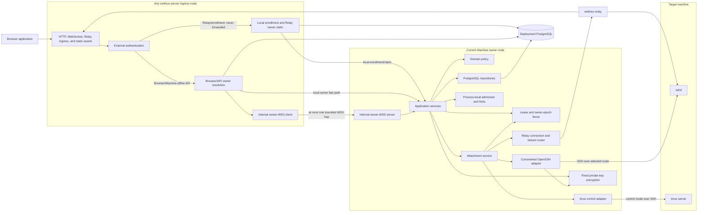
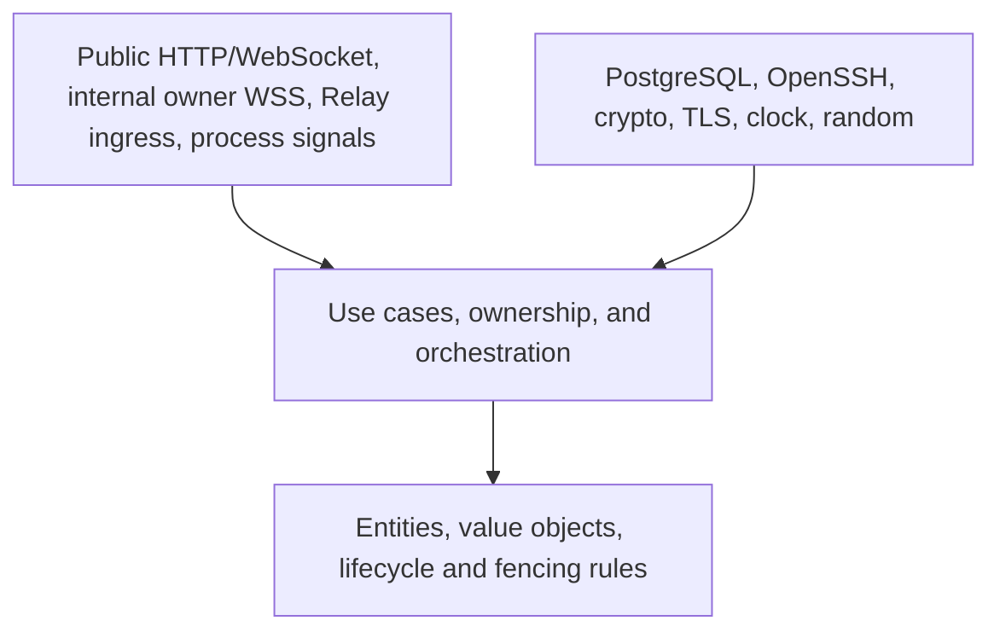
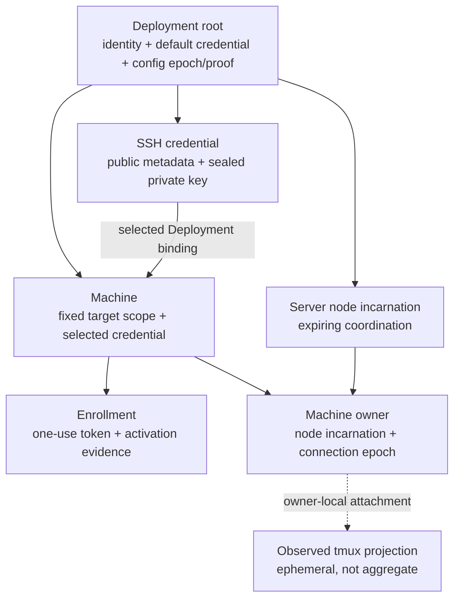
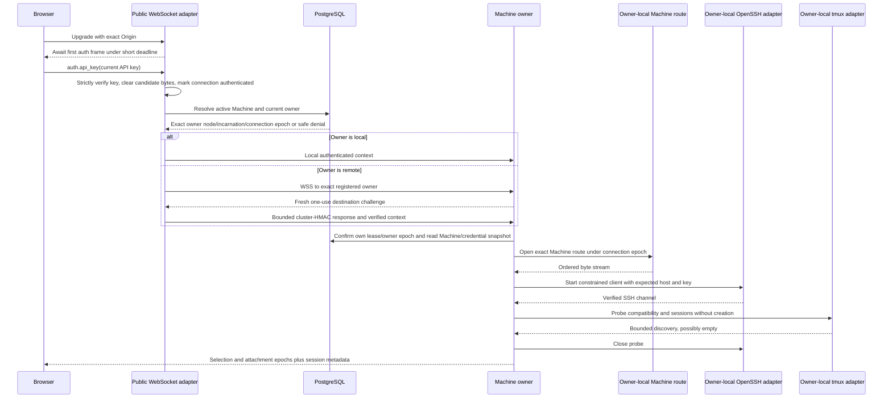

# Domain and component boundaries

## 1. Architectural style

OwlMux has two runtime binaries:

- `owlmux-server`: one symmetric modular-monolith binary containing the public Web/API boundary, Deployment authority, PostgreSQL adapters, node membership/ownership coordination, internal owner-WSS endpoint, Relay router, constrained SSH client, tmux control adapter, and attachment service;
- `owlmux-relay`: one target-side process containing enrollment, Machine identity, outbound tunnel, and a fixed loopback stream bridge.

A Deployment runs one or more equivalent `owlmux-server` nodes. Any node may accept public HTTP, Browser WebSocket, or Relay ingress. The node that accepts and authenticates a new Relay connection is the only incarnation permitted to claim ownership, and it keeps the Relay tunnel plus all Machine-affine state local. A non-owner Browser or Machine-affine API ingress completes external authentication and may use at most one bounded internal WSS hop to the recorded owner. The single-node case takes the same owner path locally without an internal network hop.

The Browser is one separately built React application served by Server nodes. PostgreSQL is the only durable product authority and also holds low-churn expiring Server-node/Machine-owner coordination. High-rate admission state, live routes, OpenSSH/tmux state, projections, the current Browser writer attachment, ordered coordinators, and terminal bytes remain bounded in process memory.

OwlMux remains one modular Server binary until implementation proves a separate ownership boundary. It MUST NOT split Gateway, Worker, scheduler, domain, protocol, storage, SDK, coordination, or key custody into speculative services or crates, and it adds no Redis, message queue, distributed cache, durable terminal broker, or live-state migration layer.

## 2. Logical component view



Ingress and owner are runtime roles for a connection, not separate deployments or binaries. One process may be both, and every node contains every component. The arrows express collaboration, not ownership transfer. Target tmux remains outside OwlMux even while one owner node controls a client.

## 3. Dependency rule



The domain MUST NOT depend on Axum, SQLx, OpenSSH process types, WebSocket frames, TLS implementation types, tmux lines, React models, environment readers, or cryptographic library types.

Application services MAY depend on narrow ports for persistence, database time, Linux `CLOCK_BOOTTIME`, random, owner resolution/local claim, internal owner WSS, route opening, attachment I/O, audit, and live invalidation. The fixed local Ed25519 generation/encryption module and fixed internal cluster authenticator are infrastructure inside Server, not provider ports or plugin boundaries.

This is a source-level rule. Modules remain inside `owlmux-server` until real implementation sharing proves a stable boundary.

## 4. Runtime responsibilities

### 4.1 Browser application

Browser owns:

- a masked Deployment API-key input held only in memory;
- one same-origin terminal-first shell whose Host labels map only to Machine API/domain resources;
- safe Machine, SSH-credential, enrollment, audit, and Deployment-presentation workflows;
- a bounded page-memory workspace-tab registry and active-tab state, with one independent Attachment lifecycle per tab;
- graphical session, window, pane, and attachment presentation;
- xterm.js rendering, keyboard, paste, focus, and current-visible-writer viewport-derived automatic resize interaction;
- reconnect policy and atomic projection replacement;
- local non-authoritative display preferences.

Browser MUST NOT own authorization decisions, durable credentials, Machine reachability truth, Server-node discovery/placement, SSH or Relay credentials, tmux command rendering, or durable terminal state.

### 4.2 Every Server node

Every Server node owns:

- public HTTP, static assets, Browser WebSocket, and Relay ingress endpoints;
- exact validation of the one configured Deployment API key;
- Relay/enrollment external-authentication boundaries;
- one authority-bearing random startup incarnation, optional display name, a renewable node lease, and self-fencing;
- compatibility/configuration proof and clustered-mode internal TLS/cluster authentication;
- actual-owner lookup and ingress-local Relay owner claim;
- bounded internal owner-WSS client/server behavior for Browser and typed Machine-affine API traffic;
- PostgreSQL access to Deployment identity, SSH credentials, Machines, Relay enrollments/bindings, cluster registry, and safe audit;
- generated Ed25519 SSH credential handling and fixed private-key encryption;
- bounded process-local admission, diagnostics, negative hints, and teardown.

A node in the Browser/API ingress role MUST NOT allocate Machine-affine live state after discovering a different valid owner. It holds only bounded authentication/one-hop state and cannot dispatch target operations itself for that connection. A Relay ingress never forwards the connection: it either claims itself after verifying no valid owner, or returns a bounded duplicate/recovering response.

### 4.3 Current Machine owner node

In addition to common node responsibilities, the current valid owner process exclusively owns for one Machine connection epoch:

- the authenticated accepted Relay tunnel and bounded logical-stream multiplexing;
- owner-side internal WSS endpoints for Browser connections and typed Machine-affine API requests;
- constrained OpenSSH child processes and target host verification;
- tmux control parsing, typed operation rendering, and live projections;
- one current Browser writer attachment, explicit atomic takeover, and ordered target dispatch;
- bounded owner-local queues, reachability, attachment state, and safe diagnostics;
- serialization of access-affecting Machine mutations with live dispatch and teardown.

The owner MUST read Linux `CLOCK_BOOTTIME` and recheck sufficient remaining node-lease safety margin, exact node incarnation, Machine connection epoch, lifecycle/binding version, attachment/workspace identity, and current writer attachment before high-value target work. It MUST NOT own target sessions, PTYs, scrollback, process lifetime, or cleanup.

### 4.4 Relay

Relay owns:

- one locally stored Machine identity after enrollment;
- one configured Deployment origin and TLS trust policy;
- one fixed loopback sshd endpoint;
- one authenticated outbound tunnel at a time;
- bounded logical stream sockets, queues, heartbeat, and reconnect behavior.

Relay MUST NOT know Server node IDs or internal endpoints, parse SSH payloads, authenticate a Unix user, invoke tmux, start a shell, create a PTY, inspect terminal traffic, manage target processes, or modify target authorization stores.

### 4.5 Target sshd and tmux

Target sshd owns host identity, authorized-key evaluation, Unix-account selection, and SSH policy. Target tmux owns all interactive state and child-process lifetime. OwlMux is a replaceable client of both.

## 5. Domain and coordination boundaries

| Boundary                      | Owns                                                                                                                                                     | Primary invariants                                                                                                                |
| ----------------------------- | -------------------------------------------------------------------------------------------------------------------------------------------------------- | --------------------------------------------------------------------------------------------------------------------------------- |
| Deployment access             | Exact configured API-key verification                                                                                                                    | One key class grants full access within the Deployment trust domain                                                               |
| Server membership             | Random authority-bearing incarnation, optional display name, Serving/Draining state, exact internal endpoint, config/protocol proof, database-time lease | Only a compatible non-expired incarnation may serve or own Machines                                                               |
| Relay ingress/Machine owner   | Accepting Relay incarnation, actual owner incarnation, monotonically increasing connection epoch                                                         | Only the accepting incarnation may claim itself; PostgreSQL claim and valid node lease are authority; at most one actual owner    |
| Internal owner hop            | Cluster-authenticated Browser/API context and one bounded WSS connection                                                                                 | No Relay/enrollment forwarding, raw external credential, durable buffering/replay, or second hop; exact owner epoch required      |
| SSH credential registry       | Generated Ed25519 Deployment credentials, default selection, public metadata, fixed encrypted envelopes, lifecycle                                       | Immutable key material, exactly one default, referenced credentials remain active                                                 |
| Machine registry              | Machines, expected host, selected credential, lifecycle                                                                                                  | Fixed host/account/socket scope and exactly one active credential binding                                                         |
| Enrollment and Relay identity | One-use enrollment, Relay public binding, activation evidence                                                                                            | One token binds one pending Machine; a Relay ID/key appears in at most one active Machine binding and never replaces SSH identity |
| Live attachment               | Relay streams, SSH/tmux clients, projection, current Browser writer attachment, ordered dispatch                                                         | Owner-process-local and bounded; owner loss discards it without target cleanup                                                    |

Node leases and Machine-owner records are PostgreSQL coordination state, not ownership of target work. Their only positive authority is bounded OwlMux serving/dispatch while current; expiry revokes OwlMux access and never affects tmux.

Live tmux resources are not domain aggregates. They are external state observed through attachment adapters.

## 6. Aggregate and ownership consistency boundaries



A use case may update more than one durable aggregate in one PostgreSQL transaction when an invariant spans them. Node and owner claim/renew/release use short coordination transactions and never remain open around network or target I/O. Transaction details are owned by [06](06-storage-consistency-and-private-key-encryption.md).

## 7. Application services

The service set should center on:

- `VerifyDeploymentApiKey`;
- `RegisterServerIncarnation`, `RenewServerLease`, `BeginServerDrain`, and `SelfFenceCurrentIncarnation`;
- `ResolveMachineOwner`, `ClaimLocalMachineOwner`, and `ReleaseMachineOwner`;
- `AuthenticateInternalOwnerWss` and `ForwardAuthenticatedBrowserOrTypedRequest`;
- `GenerateSshCredential`, `RenameSshCredential`, `ResetDefaultSshCredential`, `SetDefaultSshCredential`, and `RebindMachineCredential`;
- `CreateMachine` and `IssueRelayEnrollment`;
- `VerifySshAccess`, `CompleteRelayEnrollment`, `ReenrollMachine`, `DisableMachine`, and `RevokeRelay`;
- `ListMachines`;
- `OpenAttachment`;
- `SelectBrowserWriter`, `TakeOverBrowserWriter`, and `ReleaseBrowserWriter`;
- `ExecuteTypedTmuxOperation` and `EndAttachment`.

These are logical intents, not mandated public type names. `SelfFenceCurrentIncarnation` is the current process's irreversible local action only; remote process/node fencing is a deployment-operator action, not an OwlMux application service.

Protected HTTP performs exact API-key verification before each operation. An attachment WebSocket performs exact verification only in its first frame, then clears candidate key bytes. If Browser/API ingress is not the owner, it opens WSS to the exact registered owner; the destination sends a fresh one-use challenge and ingress replaces the raw credential with one domain-separated cluster-HMAC response plus bounded verified context. The owner authenticates that transcript once under its destination-local suspend-aware deadline, binds the connection to exact source/destination incarnations and Machine connection epoch, and clears transcript/context bytes. A one-shot typed control request uses that same WSS framing and then closes; there is no internal HTTPS mode. High-value dispatch rechecks current owner-process authenticated state and all local/durable fences, not the API or cluster key per terminal frame.

Machine-affecting operations that immediately invalidate a live route or attachment, such as disablement or Relay revocation, MUST execute through the current owner when one exists. The owner first closes its ordered dispatch barrier, rejects new writes, and fences old-epoch routes, children, writers, queues, and result publication. Only then may one transaction commit the durable lifecycle/binding mutation and exact owner CAS clear. Known rollback or ambiguous response never reopens the old epoch; release/observation follows the exact rules in [06](06-storage-consistency-and-private-key-encryption.md#34-machine-owner-and-connection-epoch), without automatic retry. If the owner is unreachable while its lease remains valid, another node returns `owner_unreachable`; it MUST NOT bypass that owner or wait indefinitely. The deployment operator fences/stops/isolates the owner, waits for database-time lease expiry, and retries. Non-Machine-affine list, metadata, and credential operations may execute on any node subject to their PostgreSQL transactions.

## 8. Ports and adapters

| Port                         | Direction                                                                | Contract                                                                                                                                                                                                                                                         |
| ---------------------------- | ------------------------------------------------------------------------ | ---------------------------------------------------------------------------------------------------------------------------------------------------------------------------------------------------------------------------------------------------------------- |
| Deployment API-key verifier  | Inbound credential to Deployment access                                  | Strictly parses and constant-time compares only the configured versioned 32-byte API key                                                                                                                                                                         |
| Cluster authenticator        | WSS establishment followed by destination challenge/source HMAC response | Requires TLS-protected WSS, one-use destination challenge, valid source/destination incarnation/config epoch, destination-local suspend-aware deadline, and domain-separated bounded authentication; accepts no public credential substitute or sender timestamp |
| Authority/coordination store | Application to PostgreSQL                                                | Transactional durable product state, database-time node leases, and serialized owner epochs                                                                                                                                                                      |
| Database and lease clocks    | Membership/owner coordination to PostgreSQL/Linux `CLOCK_BOOTTIME`       | PostgreSQL creates lease deadlines; Server derives `b0 + L - S` from the pre-request sample and reads the clock before every authority/target dispatch                                                                                                           |
| Admission control            | Application to process-local service                                     | Bounded decisions and expiring hints that never grant durable access                                                                                                                                                                                             |
| Owner resolver               | Browser/API ingress or local Relay claim to PostgreSQL                   | Returns one valid actual owner or proves no valid owner; never selects another Relay node                                                                                                                                                                        |
| Internal owner WSS           | Authenticated Browser/API ingress to owner node                          | One direct bounded backpressured WSS connection; no Relay/enrollment forwarding, raw external credential, second hop, durable buffering, transparent replay, or arbitrary destination                                                                            |
| Machine route                | Owner attachment to route adapter                                        | Opens an ordered bounded byte stream for one resolved Machine and current connection epoch                                                                                                                                                                       |
| SSH client                   | Enrollment proof or owner attachment to OpenSSH adapter                  | Verifies one expected host and authenticates one configured account through only the closed `VerifySshAccess`, `Probe`, `CreateSession`, or `AttachSession` entry operation                                                                                      |
| tmux control                 | Owner attachment to tmux adapter                                         | Discovers state and accepts closed typed operations                                                                                                                                                                                                              |
| Audit sink                   | Application to durable audit                                             | Records safe action, resource, node/epoch context, and outcome classes                                                                                                                                                                                           |
| Live invalidation            | Durable mutation to current owner dispatch state                         | Serializes and closes affected OwlMux access without target cleanup                                                                                                                                                                                              |

An adapter MUST NOT widen its contract. Internal owner-WSS destinations come only from valid owner registry rows, route opening has no caller-selected destination after Machine resolution, and tmux control has no raw command method.

## 9. Relay ingress and owner claim path

```mermaid
sequenceDiagram
    participant Relay
    participant Ingress as Accepting public Server node
    participant DB as PostgreSQL

    Relay->>Ingress: TLS connection and bounded Relay authentication
    Ingress->>Ingress: Verify Relay identity; clear raw proof material
    Ingress->>DB: Serialized claim for this exact ingress incarnation
    alt No valid owner
        DB-->>Ingress: New monotonically increasing connection epoch
        Ingress->>Ingress: Admit local Relay tunnel and all Machine-affine state
    else Same ingress owns and old tunnel is known closed
        Ingress->>Ingress: Close dispatch barrier and fence old-epoch local state
        Ingress->>DB: CAS release exact old owner, then fresh claim
        DB-->>Ingress: New monotonically increasing connection epoch
    else Another valid owner remains
        DB-->>Ingress: Duplicate/recovering; capped retry-after
        Ingress-->>Relay: Close and retry through Deployment origin later
    end
```

The public load balancer chooses the accepting node using ordinary connection-level policy. OwlMux performs no node ranking and never forwards a Relay internally. A reconnect may claim only after the previous owner has safely released or its node lease is invalid. After a claim and possible semantic byte acceptance, failure closes the Relay connection; only Relay's external reconnect may begin a new claim.

Enrollment uses its token-first acceptance transaction before any setup allocation as defined by [03]. Token validation/consumption, setup, proof, activation, and the first owner claim all execute on the same accepting incarnation; raw token material never crosses an internal boundary.

## 10. Browser attachment request path



Before external authentication succeeds, the WebSocket boundary allocates only fixed handshake state. It MUST NOT query a Machine, resolve an owner, open an internal owner-WSS connection, decrypt a credential, create an Attachment, or emit target-derived data.

Before the owner WSS handshake succeeds, ingress allocates no route, SSH/tmux, projection, writer, or owner-local Attachment state. Owner rejects a stale node incarnation, configuration epoch, Machine connection epoch, one-use destination challenge/HMAC transcript, or destination-local suspend-aware handoff deadline.

Every HTTP request independently carries and verifies the current API key. API-key replacement is a cluster-wide controlled drain/restart/configuration-epoch change; old external and internal authenticated connections end with their processes and epochs.

## 11. Error ownership

| Origin                                                       | Internal owner                  | Public result                                                                         |
| ------------------------------------------------------------ | ------------------------------- | ------------------------------------------------------------------------------------- |
| Missing or wrong API key                                     | External authentication adapter | Generic unauthenticated result                                                        |
| Invalid WSS TLS peer/challenge/HMAC/incarnation/config epoch | Internal owner-WSS adapter      | Generic internal-unavailable result; no external detail                               |
| Missing or inactive Machine                                  | Machine policy                  | Safe not-found or inactive class                                                      |
| PostgreSQL unavailable                                       | Authority/coordination store    | Node becomes unready and self-fences by lease deadline                                |
| No valid owner/Relay                                         | Owner resolver/route adapter    | Safe route-unavailable class                                                          |
| Stale node lease/incarnation/connection epoch                | Owner fence                     | Reject/close stale connection without target action                                   |
| Admission budget exhausted                                   | Node-local admission service    | Bounded rejection without side effect                                                 |
| Valid owner unreachable from ingress                         | Owner-WSS adapter               | `owner_unreachable`; operator fences/isolates owner, waits lease expiry, then retries |
| Internal owner WSS unavailable/overloaded                    | Owner-WSS adapter               | Browser/API operation unavailable; never replay live bytes                            |
| Relay absent or stream rejected                              | Owner-local route adapter       | Safe route-unavailable class                                                          |
| SSH host mismatch                                            | SSH adapter                     | Non-retryable host-verification failure                                               |
| SSH account/key failure                                      | SSH adapter                     | Safe authentication failure                                                           |
| Unsupported or malformed tmux                                | tmux adapter                    | Incompatible-target or protocol-failure class                                         |
| Slow Browser or queue exhaustion                             | Owner attachment state          | Attachment-local overload closure                                                     |
| Unknown mutation outcome                                     | Owner ordered dispatch          | Ambiguous result and refresh; never automatic replay                                  |

Delivery adapters own HTTP status, WebSocket close code, request ID, and redaction. Errors MUST NOT leak node/internal endpoints, paths, SQL, process arguments, credentials, terminal bytes, or hidden target diagnostics.

## 12. Lifecycle coupling

- A Server node shutdown or fence closes its public/internal sockets and owner-local Relay, SSH, tmux, writer, and projection state only.
- A node join does not move or close a valid existing Machine owner.
- A node drain marks it unready, then closes owned Machines in a bounded sequence so external clients reconnect and the public load balancer sends new connections to ready nodes.
- Relay shutdown closes its tunnel and local TCP sockets only.
- API-key replacement requires a Deployment-wide controlled drain/restart and configuration-epoch replacement; it closes OwlMux connectivity only and never changes target state.
- Machine disablement or Relay revocation is serialized through the valid owner or waits for owner-lease invalidity, then closes affected OwlMux access only; credential rebind is an ordinary control-plane update for future SSH children and does not tear down current ownership.
- PostgreSQL failure makes nodes unready and causes self-fencing no later than their lease deadlines; it never calls a target cleanup adapter.
- Attachment cleanup may terminate owner-local OpenSSH and detach the local tmux control client, but must not destroy target tmux resources.

## 13. Acceptance criteria

- One current API key is the complete human/API access authority for the Deployment; no finer-grained authorization path exists.
- Every Server node uses the same binary and capability set; ingress/owner are per-connection roles, not new services.
- Source dependencies follow the dependency rule without speculative crates, queues, caches, or services.
- Actual ownership requires the accepting Relay node's valid incarnation lease and serialized Machine connection epoch; no remote node may claim on its behalf.
- A non-owner Browser/API ingress authenticates and uses at most one owner WSS hop but never opens Machine SSH/tmux work locally; Relay and enrollment ingress are never forwarded to another Server node.
- Attachment startup verifies current owner and durable Machine/credential state before route, SSH, or tmux work.
- No domain aggregate represents target sessions, panes, PTYs, output, or processes.
- Owner/node restart discards all affected process-local state and leaves target work untouched.
- Separate OwlMux Deployments share no database, membership, owner registry, secrets, or live authority.
