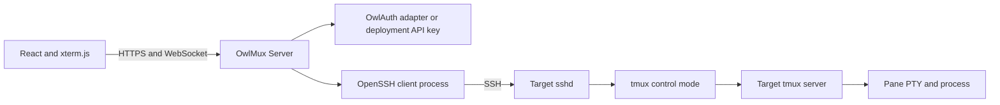
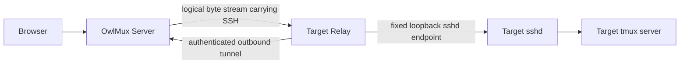
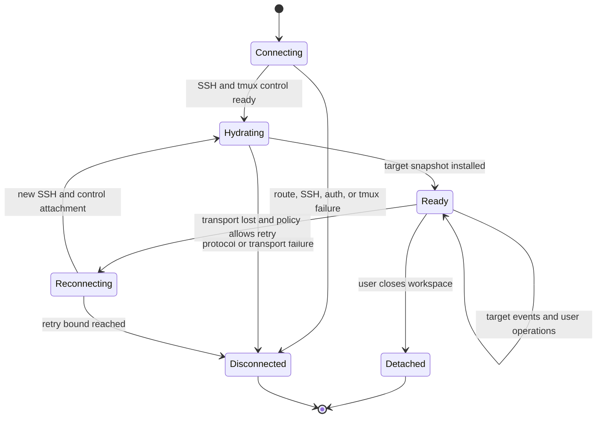

# System Architecture

## Decision

OwlMux separates durable execution from replaceable access paths.

- target tmux owns interactive state and process lifetime;
- target sshd owns SSH host identity and Unix-account authentication;
- OwlMux Server owns browser access, organization authorization, SSH client
  attachments, tmux control translation, and live projection;
- OwlMux Relay owns only an outbound route to target sshd;
- PostgreSQL owns durable OwlMux product state;
- Redis owns bounded disposable cache and rate-limit state;
- the browser owns visual rendering and local interaction state.

No central actor owns a terminal room. The Relay route is the first delivery
path; the direct route below is a later optional transport over the same SSH
boundary.

## Direct Route

## Relay Route

The SSH handshake remains between the Server's SSH client and target sshd. The
Relay forwards encrypted SSH bytes and cannot authenticate the Unix user,
forge the target host key, or act as a tmux runtime.

## State Ownership

| State                                                       | Owner                       | Durability                            |
| ----------------------------------------------------------- | --------------------------- | ------------------------------------- |
| Shell, coding agent, and child processes                    | Target OS under tmux        | Until process, tmux, or target exit   |
| Session, window, pane, layout, PTY, and scrollback          | Target tmux server          | Target-local tmux lifetime            |
| Unix account and authorized SSH credentials                 | Target sshd and OS          | Target configuration                  |
| SSH host key                                                | Target sshd                 | Target configuration                  |
| OwlAuth user and application session                        | OwlAuth                     | OwlAuth Project/Application lifetime  |
| Deployment API key                                          | OwlMux Server configuration | Until operator replacement            |
| Users, organizations, and memberships                       | Server PostgreSQL           | Durable                               |
| Machines, route, host-key policy, and Relay public identity | Server PostgreSQL           | Durable                               |
| Relay enrollment token digest                               | Server PostgreSQL           | Short-lived and one-use               |
| Encrypted per-machine SSH private key                       | Server PostgreSQL           | Durable under secret custody          |
| Browser sessions and audit                                  | Server PostgreSQL           | Durable and retained by policy        |
| Rate limits, revocation cache, and reachability cache       | Redis                       | Disposable and reconstructible        |
| Relay tunnel and logical streams                            | Relay and Server            | Ephemeral                             |
| SSH process and tmux control client                         | Server attachment           | Ephemeral                             |
| Parsed tmux projection                                      | Server attachment           | Ephemeral and reconstructible         |
| Pane terminal renderer and UI selection                     | Browser                     | Ephemeral or browser-local preference |

OwlMux persists only product control state. It never persists tmux sessions,
panes, terminal output, or live projection as evidence that a target process
still exists. PostgreSQL or Redis availability may block new attachments but
must never trigger target tmux cleanup.

## Components

### Browser application

The browser application owns:

- OwlAuth login or deployment API-key exchange UX;
- organization selection and active-member machine discovery;
- graphical session, window, and pane navigation;
- one xterm.js renderer per visible pane;
- keyboard, paste, resize, focus, and explicit tmux actions;
- local workspace preferences;
- reconnection and complete projection replacement after rehydration.

It receives only typed OwlMux protocol messages. It never receives SSH private
keys, OwlAuth refresh tokens, Relay credentials, raw tmux command authority,
or a target shell outside the typed pane-input path.

### OwlMux Server

The public `owlmux-server` owns:

- HTTPS, static assets, API, and WebSocket endpoints;
- authentication-mode composition and one normalized principal;
- users, organizations, memberships, and organization-scoped machine access;
- machine registration, one-use Relay enrollment, and route resolution;
- PostgreSQL authority and bounded Redis coordination;
- secret-custody composition for recoverable SSH private keys;
- strict SSH host-key and credential policy;
- ephemeral OpenSSH process supervision;
- tmux control-protocol parsing and typed command rendering;
- bounded queues, browser backpressure, and safe diagnostics;
- Relay enrollment, route registration, and bounded stream relay.

Server does not own target session lifetime, PTYs, process handles, terminal
history durability, canonical terminal state, or target cleanup.

### OpenSSH adapter

The first Server uses the system OpenSSH client as a constrained subprocess.
This reuses the mature SSH protocol, host-key, host-certificate, and jump-host
implementation without inheriting ambient user configuration or credentials.
Server supplies a dedicated configuration and `known_hosts` boundary for every
child. A later direct-route profile may explicitly configure bastion credentials,
but target authentication still uses only the registered per-machine key.

The adapter:

- accepts only an authorized registered machine record, never arbitrary browser
  SSH options;
- uses an isolated Server-owned configuration, cleaned environment, explicit
  host-key source, `IdentitiesOnly`, and no ambient agent for the target leg;
- builds process arguments without a local shell;
- runs one fixed remote tmux entry operation with validated values;
- separates protocol stdout, bounded diagnostics, process status, and shutdown;
- treats process termination as attachment loss, not target-session loss;
- never invokes a remote session-destruction command during local cleanup.

Server may later replace this adapter with an embedded SSH client only if it
preserves the same target-host identity, credential, stream, and failure
contract. tmux and browser layers must not depend on which adapter is used.

### tmux control adapter

The tmux adapter owns one ephemeral control-mode client and a reconstructible
projection of the selected target tmux server. It:

- discovers and validates tmux capability;
- parses bounded control-mode lines and escaped pane bytes;
- correlates issued commands with completion or failure;
- normalizes target session, window, pane, layout, and output events;
- renders only closed typed tmux operations;
- rehydrates after every new SSH attachment.

It never writes a durable shadow session graph or invents IDs that outlive the
observed tmux server.

### Relay

The Relay owns:

- one durable machine identity;
- one authenticated outbound Server connection;
- bounded logical byte streams to one configured loopback sshd endpoint;
- liveness, backpressure, reconnection, and local stream cleanup.

It does not own a Unix login, tmux command, PTY, process, browser principal, or
terminal payload interpretation. Tunnel loss closes streams only.

## Attachment Lifecycle

This state machine belongs to one browser attachment. It says nothing about the
lifecycle of the target tmux session.

A local retry creates a fresh SSH connection and fresh control-mode client. It
does not replay ambiguous mutating tmux operations. Instead, it rehydrates target
state and reports the observed result.

## Failure Semantics

| Failure                       | Required behavior                                                   |
| ----------------------------- | ------------------------------------------------------------------- |
| Browser closes or reloads     | Close attachment; target tmux continues                             |
| WebSocket fails               | Close or retry attachment; target tmux continues                    |
| Server SSH child exits        | Mark attachment disconnected; target tmux continues                 |
| Server restarts               | Drop attachments; target tmux continues; browser reconnects         |
| Relay tunnel fails            | Drop routed streams; target tmux continues                          |
| Relay restarts                | Restore route without recovering Relay-owned session state          |
| Target sshd restarts          | SSH attachments drop; target tmux may continue independently        |
| tmux control client exits     | Reattach or report unavailable; tmux server continues               |
| Target tmux session is killed | That session and its pane processes end                             |
| Target tmux server exits      | Its owned sessions end                                              |
| Target reboots                | Continuity is not promised without a separate target-local facility |

The Server never converts an ambiguous transport outcome into target cleanup.
Operations that may already have reached tmux are observed after rehydration
instead of blindly replayed.

## Storage Boundary

PostgreSQL is the durable authority for:

- OwlAuth user bindings and the built-in API-key owner;
- organizations, roles, memberships, and invitations;
- organization-owned machines and aliases;
- one-use Relay enrollments and Relay public identities;
- expected SSH host identity and encrypted per-machine SSH private keys;
- opaque browser-session digests, safe audit, and operational metadata.

Redis is required infrastructure for bounded authentication/enrollment rate
limits, session and revocation cache, and advisory machine reachability. Redis is
not durable authority; loss causes cold cache and conservative admission, not
product-state loss.

The live Relay directory, logical streams, SSH child processes, tmux control
clients, attachment queues, and projections remain in the single Server process.
They are never reconstructed from Redis after restart.

Raw deployment API keys, secret-custody root keys, OwlAuth access/refresh tokens,
Relay private keys, unencrypted SSH private keys, terminal input/output, pane
scrollback, and tmux projections are excluded from product storage.

## Architectural Acceptance Criteria

- Killing the Server while a pane runs does not kill or signal that pane.
- One reconnect test proves a new Server attachment sees the original tmux
  session and continued process output.
- Direct and Relay routes feed the same SSH adapter contract above the byte
  stream.
- No component outside target tmux is described as the owner of a session,
  window, pane, PTY, or process.
- The browser cannot select an arbitrary SSH destination, local SSH option,
  Relay port, or raw tmux command.
- Deleting or restoring OwlMux PostgreSQL/Redis state never sends a termination
  operation to target tmux, although lost machine credentials can make the
  session unreachable until the machine is re-enrolled.
