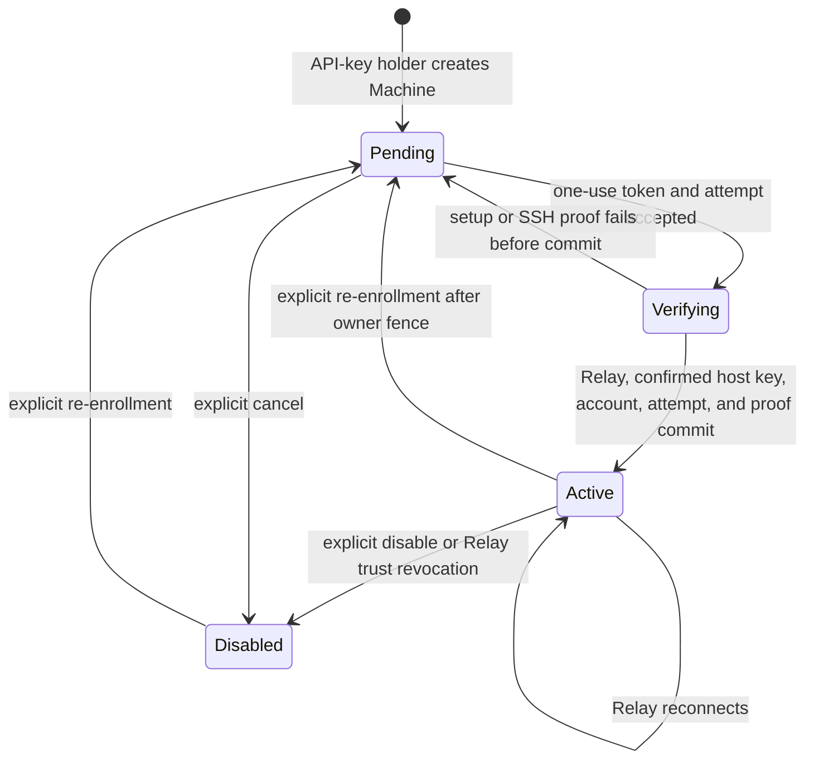
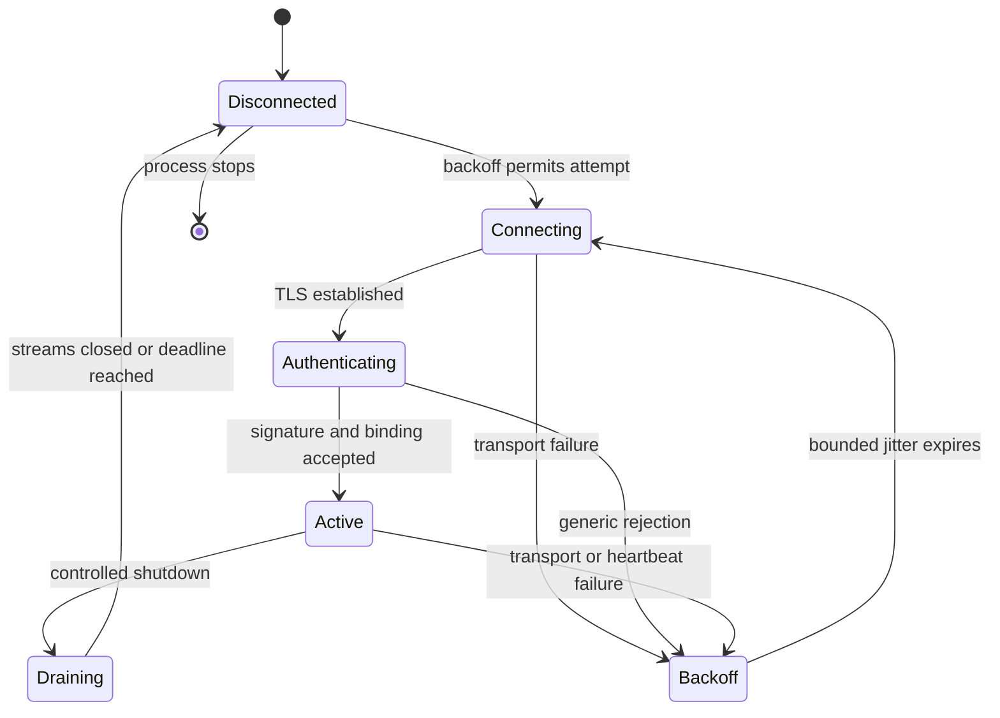

# Relay enrollment and transport

## 1. Transport model

Relay is the primary route from OwlMux to target sshd. It runs on the target or in the same trusted network namespace, opens one authenticated outbound connection to the Deployment origin, and forwards bounded logical byte streams only to one enrolled loopback sshd endpoint.

Any Serving `owlmux-server` node may accept the public connection. The public load balancer's ordinary connection-level policy determines which node receives each new connection. That exact ingress node completes Relay/enrollment authentication and is the only incarnation allowed to claim the Machine. Relay enrollment, tunnel, stream router, SSH/tmux children, projection, writer, and queues remain on that node; Relay traffic never takes an internal Server hop. OwlMux provides no placement or even-distribution guarantee.

Relay is a reverse SSH transport, not an agent runtime. It MUST NOT know Server-node identity/placement, start a shell, create a PTY, invoke tmux, interpret SSH payloads, manage a process, or dial a caller-selected destination.

## 2. Route boundary

```text
MachineRoute {
    open(resolved_machine_snapshot, owner_connection_epoch) -> OrderedByteStream
}
```

The resolved snapshot fixes Machine ID, active Relay binding, pinned target host identity, target account, selected credential snapshot, credential revision, and route revision. The exact owner node incarnation and Machine connection epoch fence the call. Browser input MUST NOT supply or override route, owner, or placement parameters.

```mermaid
flowchart LR
    Browser["Authenticated Browser connection"] --> Ingress["Any Server ingress node"]
    Ingress -->|"Browser/API: local or one internal WSS hop"| Owner["Current Machine owner"]
    Owner --> Route["MachineRoute under connection epoch"]
    Route --> Router["Owner-local Relay router"]
    Router --> Tunnel["Authenticated owner-local tunnel"]
    Tunnel --> Relay["Target Relay"]
    Relay --> Loopback["Fixed loopback sshd endpoint"]
    Loopback --> SSHD["Target sshd"]
    SSHD --> SSH["End-to-end SSH session"]
```



The route returns bytes and safe diagnostics only. It does not expose a terminal, SSH login, tmux client, resumable stream, or another Server node. A stale owner incarnation/connection epoch cannot open a route.

## 3. Machine and Relay lifecycle



A Machine is attachable only in `Active`. Advisory Relay reachability does not change durable lifecycle. A newly created Machine has no trusted host key; its first successful enrollment discovers, confirms, and durably pins exactly one Ed25519 host key. Re-enrollment is explicit. From `Active`, the valid owner first closes its dispatch barrier; one durable transaction then invalidates the old Relay binding, increments `route_revision`, clears the exact owner, moves the Machine to tokenless `Pending`, and audits before a new token is explicitly issued. From `Disabled`, re-enrollment similarly retains the fixed Machine scope and pinned host key and enters tokenless `Pending`. Reconnect and re-enrollment never discover, replace, or clear that pin. A target host-key, account, or socket change requires a new Machine.

Among active bindings, each Relay ID and Ed25519 public key can identify at most one Machine. Final activation enforces both partial uniqueness constraints; invalidated bindings do not create a permanent identity-history registry. One Relay process supports only its enrolled identity and endpoint in the initial product. There is no fleet join key or shared Relay credential.

## 4. Enrollment issuance

The API-key holder creates a pending Machine through any Server node and either selects one active Deployment SSH credential or accepts the Deployment default. In one PostgreSQL transaction the accepting node MUST:

1. create the Machine with fixed target account/tmux scope and no trusted host key;
2. validate and bind the selected/default active generated Ed25519 credential;
3. generate a high-entropy, short-lived, one-use enrollment token;
4. store only a domain-separated token digest, expiry, and lifecycle metadata;
5. append a safe audit event.

Machine creation neither accepts an SSH host key nor generates another private key. Its host identity remains absent until first enrollment activation. Ed25519 credential generation and encryption are owned by [06](06-storage-consistency-and-private-key-encryption.md#32-ssh-credentials). Public credential key and SHA-256 fingerprint may accompany the one-use result and remain readable; private material and encrypted envelopes never cross this boundary.

The plaintext enrollment token is returned exactly once. Normal reads, audit, retries, and logs MUST NOT reveal it. Only the Relay enrollment endpoint accepts it. The deployment API key, Relay signature, SSH credential, or private-key encryption key MUST NOT substitute for it.

Enrollment WebSocket grammar is strictly staged:

1. Before token validation, the ingress node allocates only fixed small handshake state and a short deadline. The first frame is a dedicated size-bounded `enroll.token` schema containing only the one-use token; any setup field, other frame, duplicate, malformed value, or timeout closes generically.
2. The exact initial protocol endpoint strictly parses the token, clears candidate bytes, and performs one bounded transaction that first locks `DEPLOYMENT` and rechecks exact current config/build/protocol, then locks the matching unexpired pending enrollment plus the executing `SERVER_NODE` and uses post-lock PostgreSQL time to recheck Machine/credential lifecycle and the exact node's Serving lease/config/build/protocol, atomically consumes the token, creates a fresh attempt identity with a durable short deadline, and moves the Machine to `Verifying`. Failure closes generically without owner resolution, internal node routing, setup parsing, or durable change. A consumed token can never open another connection.
3. The same live enrollment connection remains on that accepting ingress process; there is no persisted coordinator, node selection, internal forwarding, or resumable attempt connection. The acceptance response supplies the immutable Deployment and Machine IDs known from the consumed token. Relay already generated and persisted a fresh candidate Relay ID plus Ed25519 key and MUST durably persist those returned IDs before continuing. Ingress then accepts exactly one bounded `enroll.setup` frame containing that candidate Relay ID/public key, fixed loopback endpoint, observed account, and the exact initial Relay protocol version. The token is never repeated. Before setup, host-key preflight, proof, or database dispatch, ingress reads `CLOCK_BOOTTIME` and checks its local hard deadline. It validates setup against that exact attempt, presents the selected SSH credential, receives the Relay-local authorization-readiness confirmation, creates a fresh in-memory Relay proof challenge, and verifies the candidate Relay identity.
4. If the Machine has no pinned host key, ingress opens provisional stream 1 and runs the system OpenSSH client without any user-authentication credential. The child uses an empty isolated `known_hosts`, `StrictHostKeyChecking=accept-new`, the fixed `owlmux-target` alias, `HostKeyAlgorithms=ssh-ed25519`, no ambient configuration/agent/forwarding/PTY, and a deliberately invalid account so it stops after host-key exchange. Server accepts only one bounded canonical key written by OpenSSH, derives its SHA-256 fingerprint, closes stream 1, and sends both values to Relay. Relay independently parses the canonical Ed25519 key, recomputes its SHA-256 fingerprint, and rejects any mismatch with the advertised value before display or comparison. Interactive Relay prints the normal SSH authenticity warning and continues only after the user enters exactly `yes` with no surrounding whitespace; non-interactive Relay requires an exact `--expected-host-key-sha256` match against that locally derived value. Relay echoes the exact public key in `enroll.host_key_accepted`. No flag unconditionally trusts an unknown key.
5. After first-use confirmation, ingress opens provisional stream 2 and runs the closed `VerifySshAccess` operation with `StrictHostKeyChecking=yes` against the just-confirmed key and selected Machine credential. If a host key was already pinned by a prior activation, discovery and confirmation are skipped and provisional stream 1 directly performs that same strict proof against the durable pin. A known setup/preflight/confirmation/proof failure, deadline, connection loss, node drain/fence, or process loss leaves the Machine non-active and returns the durable expired/failed attempt to tokenless `Pending`; the API-key holder explicitly issues a new token before retry. No failure pins a key, activates a route, or transfers/resumes the attempt.
6. Final activation is one transaction that first locks `DEPLOYMENT` and rechecks exact current config/build/protocol, then locks the exact `Verifying` attempt, Machine/credential, and executing ingress's exact `SERVER_NODE` row. Under that still-held Deployment lock and the database partial unique constraints, it uses a fresh PostgreSQL `clock_timestamp()` sample, never transaction-start `now()` or pre-wait statement time, to require the attempt deadline and executing incarnation lease still valid, that incarnation still `Serving` with exact current config/build/protocol, the Machine/credential/route context still current, and that no other active binding uses the candidate Relay ID or public key. For a first enrollment, it atomically writes the exact confirmed host key only if the field is still absent; otherwise it requires exact equality with the immutable pin. It then creates the active Relay binding and audit. Connection-local Relay proof, host-key confirmation when required, and strict `VerifySshAccess` success are required application preconditions and are never represented as database proof rows. Challenges and provisional proof state stay in this connection's bounded memory; they are never durable or resumable. A request delayed across lease expiry, drain, fence, incarnation replacement, or config transition cannot activate durable trust. The same ingress then claims itself as actual Machine owner under a fresh connection epoch before reporting `tunnel.active`. If activation commits but owner claim/reporting is lost, Relay reports an unknown/closed outcome and reconnects with the Deployment/Machine/Relay IDs and private key it durably stored before setup; no activation or tunnel bytes are replayed.

Exact frame fields and close codes live in the reviewed generated protocol artifact required by [07](07-http-websocket-and-product-ui.md); this ordering and pre-token allocation/database boundary are normative.

## 5. Enrollment flow

```mermaid
sequenceDiagram
    actor User as API-key holder
    participant Web as Browser
    participant Ingress as Accepting Server
    participant DB as PostgreSQL
    participant Relay as Target Relay
    participant SSHD as Loopback sshd

    User->>Web: Create Machine
    Web->>Ingress: Bearer API key and Machine configuration
    Ingress->>DB: Machine, owner counter, selected credential, token digest, audit
    Ingress-->>Web: One-use token plus public-key presentation
    User->>Relay: Start enrollment with Deployment origin
    Relay-->>User: Request token through no-echo protected input
    User->>Relay: Supply token without argv, environment, or URL
    Relay->>Relay: Generate and persist candidate Relay ID and Ed25519 key
    Relay->>Ingress: enroll.token(token only) as first bounded frame
    Ingress->>DB: Lock Deployment then own node; create one Verifying attempt
    Ingress-->>Relay: Attempt accepted with immutable Deployment and Machine IDs
    Relay->>Relay: Persist returned IDs before setup
    Relay->>Ingress: enroll.setup(Relay ID/key, endpoint, account)
    Ingress->>Ingress: Validate setup and create in-memory Relay challenge
    Ingress-->>Relay: Selected SSH public key and confirmation data
    Relay-->>User: Show account, credential public key, and fingerprint
    User->>SSHD: Install exact credential public key through external operations
    User->>Relay: Confirm authorization readiness
    Relay-->>Ingress: Human readiness confirmation only
    Ingress->>Relay: Open provisional stream 1
    Relay->>SSHD: Connect fixed loopback endpoint
    Ingress->>SSHD: OpenSSH accept-new preflight without user authentication
    SSHD-->>Ingress: Ed25519 host key
    Ingress-->>Relay: Discovered host public key and SHA-256 fingerprint
    Relay-->>User: Show standard SSH authenticity prompt
    User->>Relay: Enter exact yes
    Relay->>Ingress: Echo exact accepted host public key
    Ingress->>Relay: Close stream 1; open provisional stream 2
    Relay->>SSHD: Connect fixed loopback endpoint
    Ingress->>SSHD: Run strict VerifySshAccess for confirmed host/account/key
    SSHD-->>Ingress: Bound host/account proof
    Ingress->>DB: Lock attempt/Machine/credential/own node; atomically pin host and activate binding
    Ingress->>DB: Claim this exact ingress incarnation as Machine owner
    DB-->>Ingress: New connection epoch
    Ingress-->>Relay: Enrollment complete and tunnel active
```

OwlMux retains the selected deployment SSH credential but never modifies `authorized_keys`, `AuthorizedKeysCommand`, sshd configuration, target accounts, or another authorization store. Browser and Relay may present exact public-key material and bounded guidance. Target administrators install, rotate, and remove public keys through external tooling.

Authorization-readiness confirmation permits SSH work to begin; it is not evidence that the credential works. First-use host-key confirmation establishes the user's trust decision for the exact discovered Ed25519 key, but does not prove account authorization. Only the exact constant marker followed by clean zero exit from the closed, fixed, no-tmux `VerifySshAccess` operation over end-to-end strict SSH proves acceptance by the selected account at that key. Failed or ambiguous preflight, confirmation, or proof leaves the Machine non-active, neither creates nor changes its host pin, and creates no OwlMux-owned target mutation to compensate.

The credential binding of a pending/verifying Machine is immutable for that enrollment attempt. Changing it requires cancellation and newly issued enrollment. Ordinary credential rebind is available only after activation.

The provisional connection permits exactly one bounded setup frame after token consumption. A Machine with no host pin permits exactly two strictly ordered streams: one host-key-only preflight followed by one strict account/key proof. A Machine with an existing pin permits exactly one strict proof stream. Each completed stream is explicitly closed and acknowledged before another may open. The connection has no general stream API, caller-selected destination, reusable route, or owner authority before activation. Challenge and transcript bind the `Verifying` Machine, candidate Relay ID/public key, endpoint, account, exact credential ID/fingerprint, fresh attempt identity, executing Server incarnation, and Deployment configuration epoch. The strict SSH proof additionally binds the confirmed or previously pinned host identity. No internal destination-challenge/HMAC handoff exists on the enrollment path and no cluster credential can substitute for Relay proof.

No PostgreSQL transaction or row lock remains open while waiting for setup, authorization readiness, first-use host-key confirmation, or network proof. Token acceptance is one short transaction before setup. The final activation transaction locks `DEPLOYMENT` first, then revalidates the same unexpired `Verifying` Machine/attempt, consumed enrollment identity, immutable credential binding, active credential lifecycle, proved Relay identity unused by another active binding, route context, and the executing ingress's exact `SERVER_NODE`; its predicates use a post-lock PostgreSQL `clock_timestamp()` sample and require that exact incarnation still `Serving`, lease-valid, and config-current when the SQL executes before atomically activating the Machine/Relay binding with audit. Owner claim is a following short serialized lock-`DEPLOYMENT`-first transaction under [06](06-storage-consistency-and-private-key-encryption.md#34-machine-owner-and-connection-epoch); no ordinary logical SSH stream opens before it succeeds. Known failure invalidation and expired-attempt recovery are bounded transactions that return to `Pending` without resurrecting the consumed token.

If token-acceptance commit response is ambiguous, Relay stops, reports an unknown outcome, and clears the token. If final-activation or owner-reporting response is ambiguous, Relay clears the token and may reconnect only through ordinary active-tunnel authentication with the identity persisted before setup; a non-active rejection stops the attempt. The API-key holder inspects the protected Machine/enrollment state and either observes `Active`, waits for the bounded attempt deadline, or explicitly cancels/invalidates and issues a new token. No unauthenticated attempt-status surface exists, and Relay MUST NOT replay token acceptance, setup, or activation.

## 6. Relay local state

Before sending setup, Relay atomically persists the candidate Relay ID/private key together with the Deployment and Machine IDs returned only after token acceptance. That pre-activation record is enough to authenticate a reconnect if final activation commits but its response is lost; it grants no authority unless Server committed the binding. Relay otherwise persists only:

- Deployment ID and public Deployment origin;
- TLS trust configuration;
- Machine and Relay identifiers;
- Relay Ed25519 private key in a permission-restricted file;
- fixed loopback sshd endpoint;
- the exact Relay protocol version.

Relay accepts the one-use token through a no-echo prompt, stdin, permission-restricted file descriptor, or protected temporary file removed after reading. It MUST NOT appear in argv, environment, URL, shell history, logs, errors, or crash diagnostics. Relay clears its in-memory token after the attempt.

Relay MUST NOT persist Server SSH private keys, the Deployment API key, cluster key, Server-node/internal endpoint data, terminal data, tmux state, or an SSH stream resume cursor. Local Relay key replacement is re-enrollment.

## 7. Tunnel authentication and ingress-local owner claim

Relay opens one WebSocket-over-TLS connection to the Deployment origin, normally over TCP 443. Production TLS uses WebPKI, an operator-installed private CA, or an explicit pin. A production bypass is forbidden. Public routing may deliver each reconnect to any Serving Server node; Relay never discovers or pins an internal node.

```mermaid
sequenceDiagram
    participant Relay
    participant Ingress as Any Server ingress node
    participant DB as PostgreSQL


    Relay->>Ingress: TLS connection and bounded hello
    Note over Relay,Ingress: relay_id, client_nonce, exact protocol version, software metadata
    Ingress->>DB: Resolve active Machine-bound Relay public key
    DB-->>Ingress: Current binding or rejection
    Ingress-->>Relay: deployment_id, server_nonce, accepted exact version, limits
    Relay->>Relay: Sign domain-separated canonical transcript
    Relay->>Ingress: Signature and key identifier
    Ingress->>Ingress: Verify transcript, binding, version, and limits; clear proof buffers
    Ingress->>DB: Claim this exact accepting incarnation if no valid owner exists
    alt No valid owner
        DB-->>Ingress: New monotonically increasing connection epoch
        Ingress-->>Relay: tunnel.active(connection epoch context)
    else Same ingress owns but old tunnel is known closed
        Ingress->>Ingress: Close dispatch barrier and fence old-epoch local state
        Ingress->>DB: CAS release exact owner, then fresh claim
        DB-->>Ingress: New connection epoch
        Ingress-->>Relay: tunnel.active(connection epoch context)
    else Another valid owner remains
        DB-->>Ingress: Duplicate/recovering with capped retry-after
        Ingress-->>Relay: Generic close and reconnect later
    end
```

The Relay-visible authentication transcript binds both nonces, Deployment ID, Relay ID, Machine ID, the exact protocol version, and limits. It MUST NOT use ambiguous textual concatenation. Relay signature/proof material remains at ingress and is never converted into internal authority because the Relay connection is never forwarded. Before acceptance, ingress revalidates its own exact incarnation/config epoch, active Machine/route revision, and owner claim result.

The first product protocol accepts exactly one Relay protocol version embedded in the Server and Relay builds; a mismatch fails closed with upgrade guidance. There is no initial version negotiation or compatibility window. If a future incompatible version exists, its release must then decide whether explicit multi-version support is worth its implementation and test cost; it is not predesigned now.

Once a claim succeeds or semantic tunnel bytes may have been accepted, ingress failure closes the public connection; only Relay's normal reconnect can start a new claim. A second connection while any valid owner remains receives duplicate/recovering rejection and bounded jittered retry. It is never proxied to that owner. A new ingress may claim only after the exact owner is safely released or its node lease expires. If the reconnect lands on the same owner and that process knows its old transport is closed, it closes its local dispatch barrier, rejects new writes, fences routes/children/queues, compare-and-set releases the exact old owner, and only then makes a fresh claim. Old logical streams never migrate or replay.

## 8. Tunnel state



Heartbeat proves one owner-local tunnel's liveness only. It is not a PostgreSQL owner heartbeat or target-process lease. Timeout first closes the owner-local dispatch barrier, rejects new writes, closes/fences streams, routes, children, writers, and queues, then compare-and-set releases the exact Machine owner when possible and updates advisory reachability; it never invokes target cleanup. If PostgreSQL is unavailable, the node self-fences by its lease deadline and another node waits for database-time expiry.

## 9. Logical stream protocol

One active tunnel multiplexes bounded logical streams:

- `stream.open` with Server-assigned ID and bound Machine ID;
- `stream.opened` or sanitized `stream.rejected`;
- `stream.data` with nonempty bounded bytes;
- `stream.half_close` for one direction;
- `stream.close` with a safe reason class;
- `connection.ping`, `connection.pong`, and `connection.drain`.

The target endpoint never appears in `stream.open`; Relay obtains it only from enrolled local configuration. There are no shell, PTY, tmux, process, filesystem, forwarding, resize, input, or arbitrary-command frames.

Every frame belongs to one owner node incarnation, Machine connection epoch, tunnel incarnation, and protocol version. Duplicate, stale-epoch, unknown-stream, oversized, malformed, or invalid-transition frames fail the smallest safe scope without unbounded allocation.

## 10. Ordering, flow control, and backpressure

- Preserve ordering within each stream.
- Bound every per-stream inbound/outbound queue by bytes.
- Bound connection-wide memory and stream count.
- Fairly schedule heartbeat, closure, and streams.
- Reject or close before accepting unbounded memory.
- Never replay data whose delivery outcome is unknown.

Backpressure may delay or terminate SSH. It MUST NOT pause, signal, or terminate target tmux processes as recovery.

## 11. Route and identity check

Before routed SSH starts:

```text
requested_machine_id == machine.id
machine.id == route.machine_id
machine.id == relay_binding.machine_id
machine.id == pinned_host_identity.machine_id
machine.ssh_credential_id == ssh_credential.id
machine.route_revision == owner.route_revision
owner.incarnation_id == current_process.incarnation_id
owner.connection_epoch == requested_connection_epoch
owner.node_lease == valid
machine.lifecycle == active
ssh_credential.status == active
```

Public load-balancer choice alone, Relay ID alone, DNS names, source addresses, node display names, and Browser route parameters are not owner or route authority. Only the accepting incarnation's serialized claim may create ownership.

## 12. Failure semantics

| Failure                                                                   | Required result                                                                                                                                                                     |
| ------------------------------------------------------------------------- | ----------------------------------------------------------------------------------------------------------------------------------------------------------------------------------- |
| Enrollment token/attempt expiry, connection loss, or executing-node fence | Generic rejection; consumed tokens never reopen an attempt; invalid/expired `Verifying` state cannot activate and converges to `Pending` without a token through protected recovery |
| Relay tunnel loss                                                         | Owner closes logical streams and releases the exact owner epoch when possible; target tmux untouched                                                                                |
| Relay restart                                                             | Authenticate new tunnel through Deployment origin; claim a higher epoch; do not recover old streams                                                                                 |
| Duplicate healthy tunnel                                                  | Resolve the valid owner and reject the new connection                                                                                                                               |
| Valid old owner during reconnect                                          | Reject as duplicate/recovering with capped retry-after; never proxy or steal the owner                                                                                              |
| Accepting owner failure after semantic acceptance                         | Close the public connection; Relay reconnects; never transparently replay                                                                                                           |
| Owner node failure or fence                                               | Drop owner-local tunnel/streams; wait for database lease invalidity; Relay reconnects and one node claims higher epoch                                                              |
| Loopback sshd unavailable                                                 | Reject/close stream; no fallback destination                                                                                                                                        |
| SSH host mismatch                                                         | Fail closed. Re-enrollment may replace Relay identity only and must prove the same pinned host/account/socket; if target host identity changed, create a new Machine                |
| Relay key revocation                                                      | Serialize through current owner or wait for lease invalidity, then reject/close tunnel and attachments; no target cleanup                                                           |
| Unknown stream delivery                                                   | Let SSH fail, discard workspace, fresh probe and explicit selection; never replay                                                                                                   |
| Protocol/resource violation                                               | Close the smallest bounded stream/tunnel/connection scope                                                                                                                           |
| PostgreSQL loss                                                           | Nodes become unready and owner tunnels close by lease hard deadlines; target tmux continues                                                                                         |

## 13. Acceptance criteria

- A target with no inbound route is reachable through one outbound Relay tunnel to the Deployment origin and one fixed loopback sshd endpoint, regardless of which Serving node accepts the connection.
- First successful token verification atomically consumes it and creates one deadline-bounded `Verifying` attempt before setup; Relay persists the returned Deployment/Machine IDs with its candidate identity before setup, and setup, optional first-use preflight/confirmation, strict proof, activation, and initial owner claim stay on the same live enrollment connection and accepting incarnation without a durable coordinator record. Known failure or expired crash residue returns to `Pending` without token resurrection; retry requires explicit issuance.
- A newly created Machine accepts no host-key input. Its first enrollment uses constrained OpenSSH `accept-new` against an isolated empty `known_hosts`, accepts only one Ed25519 key, requires exact interactive `yes` or an exact expected SHA-256 fingerprint for automation, and performs a separate strict proof stream. No confirmation failure durably pins the key.
- Final activation atomically binds one Machine, Relay ID/key unused by another active binding, SSH host, account, endpoint, and selected Deployment credential only if the transaction locks and revalidates the executing ingress's PostgreSQL-time Serving lease/config plus exact strict `VerifySshAccess` success. It performs the only permitted absent-to-confirmed host-key write; every later enrollment and SSH child requires the immutable pin. Delayed stale/fenced SQL or an active identity conflict cannot activate. That exact ingress then claims a monotonic Machine connection epoch before ordinary streams open, and a lost response is recoverable by authenticated reconnect without enrollment replay.
- Concurrent owner claims and duplicate Relay connections produce one valid accepting owner; stale incarnations, connection epochs, streams, releases, and results fail closed.
- The public load balancer chooses new connection ingress; OwlMux has no node-ranking/placement policy or balance promise, and node join does not move a healthy tunnel.
- Enrollment token plaintext never enters argv, environment, URL, logs, errors, crash diagnostics, retained files, or any internal node connection; its token-only first frame is validated and cleared before any setup frame is parsed.
- Active re-enrollment fences live access, invalidates the old binding, increments route revision, enters tokenless `Pending`, and retains the fixed Machine host/account/socket before separate new-token issuance.
- Relay cannot use the Deployment API key or cluster key, and Server cannot use Relay key as SSH user credential.
- Tunnel or owner-ingress restart, malformed frames, exhaustion, and backpressure drop only route state and never target tmux.
- No public or internal protocol frame can select an arbitrary destination, Server owner, or mutate target authorization stores.
