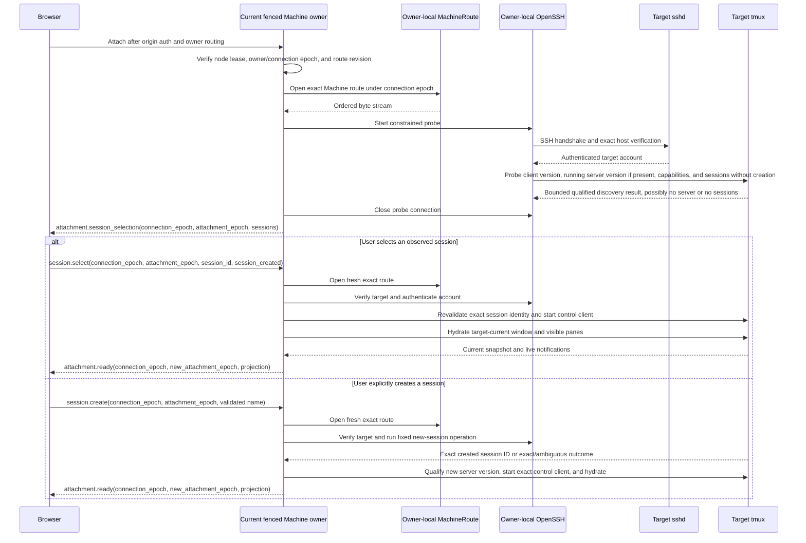
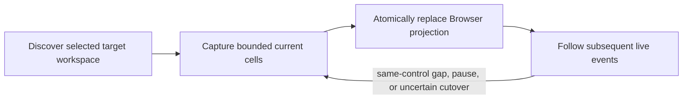
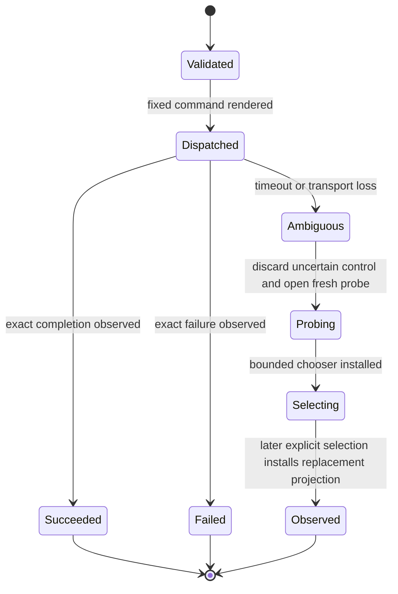

# SSH, tmux attachment, and roaming

## 1. Attachment model

Every attachment is routed to the current fenced Machine owner and first probes the registered target through a fresh owner-local constrained SSH client without creating or attaching to a tmux session. The owner returns one bounded session-selection state, including an empty list when no session exists, and closes the probe connection. It does not automatically select a session even when exactly one exists.

Only an explicit Browser selection opens a fresh owner-local route and SSH boundary under the same Machine connection epoch, revalidates the exact observed session identity, starts a tmux control-mode client, and projects that selected workspace. The control client and projection are discarded when the Browser returns to selection, the attachment ends, or the node/owner/connection epoch changes.

OwlMux does not scrape a normal terminal, emulate tmux, own a PTY, or maintain a durable shadow session graph. Roaming succeeds because the target process remains inside target tmux while OwlMux attachments are replaced.

## 2. SSH boundary

The current Machine owner uses the system OpenSSH client as a supervised node-local subprocess. Every owner node MUST:

- run it under a dedicated unprivileged service account;
- use a Server-owned configuration and explicit `known_hosts` input;
- ignore ambient user SSH configuration for target authentication;
- select only the Machine-bound deployment credential with `IdentitiesOnly`;
- disable the ambient SSH agent for target authentication;
- disable password and host-key prompts, agent/X11 forwarding, TCP forwarding, PTY allocation, and interactive fallback;
- construct local arguments without a local shell and render the one remote command through the closed entry-operation boundary below;
- clean the child environment and bound stdin, stdout, stderr, lifetime, and diagnostics;
- materialize decrypted key material only through its node-local private runtime root/startup-instance/child-instance hierarchy, exclusive `0600` identity file, authenticated-protocol post-load unlink, child-isolated cleanup, and fail-closed own-root orphan-scavenging boundary in [06](06-storage-consistency-and-private-key-encryption.md#71-owner-local-openssh-identity-materialization);
- terminate the local child without issuing target session-destruction commands.

Before each new OpenSSH child, the owner reads the Machine's current credential ID/revision and pins that generated Ed25519 snapshot for the child's lifetime as defined by [06](06-storage-consistency-and-private-key-encryption.md#32-ssh-credentials). A later credential rebind affects only later children and does not invalidate the authenticated child or its Attachment. OwlMux accepts no caller-provided identity, private-key upload, alternate SSH key algorithm, bastion profile, or `ProxyJump` surface.

Browser input cannot choose SSH address, username, identity, configuration, option, environment, forwarding, command, or host-key policy.

OpenSSH sends ordinary remote execution as one command string that target sshd invokes through the account's login shell; separate local argv values do not preserve remote argv boundaries. Server therefore exposes no generic remote-command API. It renders only a closed `VerifySshAccess`, `Probe`, `CreateSession`, or `AttachSession` entry operation from fixed command structure and validated typed values. `VerifySshAccess` is enrollment-only and renders one fixed non-mutating command with no caller value or tmux dependency; it emits exactly one constant bounded marker and exits zero. The exact marker followed by clean exit proves the configured host/account/key boundary and supplies the authenticated-protocol milestone for identity-file unlink. Every other value occupies one complete remote argument encoded by one qualified shell-literal renderer; no caller supplies an option, command fragment, separator, expansion, redirection, environment assignment, or quoting text. Session IDs parse only as `$` followed by ASCII decimal digits from the current selection epoch. Session names and the trusted Machine socket identity obey explicit byte and character constraints before rendering.

Every entry uses `ssh -T` and `RequestTTY=no`. Probe, create, and attach use an operator-configured absolute tmux executable path validated by the probe and `tmux -C` rather than `-CC`; verification does not invoke tmux. Verify, probe, and create are bounded short-lived children; attach is a separate control child for one exact session. Control stdout must begin with the expected bounded protocol and stderr remains separate. Login-shell startup, account policy, banner, rc, or other output that pollutes stdout causes a safe compatibility failure. OwlMux does not install a target wrapper; a wrapper or SSH implementation change requires a later explicit architecture decision.

The owner presents its accepted owner-local Relay ordered byte stream to OpenSSH through one bounded node-local bridge, such as a fixed `ProxyCommand` helper or equivalent socket adapter. The bridge accepts no caller-selected destination and is scoped to one Machine, connection epoch, and SSH child. The owner supplies an explicit host-key alias and `known_hosts` material so OpenSSH verifies the enrolled target identity rather than any Relay/internal bridge address.

## 3. Target compatibility boundary

A qualified target MUST provide:

- a supported OpenSSH server;
- a POSIX account authorized for the Machine's selected deployment SSH public key and using a login shell in OwlMux's qualified remote-entry matrix;
- an operator-installed tmux at the configured absolute executable path;
- a configured tmux client binary and, when the socket has a live server, a target tmux server whose independently reported upstream versions are 3.2a or newer;
- the small required control-mode capability probe passing at runtime;
- an accessible tmux socket for that account.

Version 3.2a is the minimum compatibility baseline. Control mode itself predates 3.2; the detach notification, format subscriptions, `pause-after`/resume, revised bounded/fair control output, and independent client flags used by OwlMux's adapter were introduced in 3.2, and 3.2a is that line's first bug-fix release.

Before any writable workspace, the current Machine owner runs one bounded capability probe for the executable, normalized client version, login-shell entry grammar, socket access, the small required command/format/notification set, capture behavior, and output cleanliness. When the configured socket already has a tmux server, it also checks that server's own `#{version}` because a package upgrade may leave an older process alive. If no server exists, the probe remains non-creating; after explicit first-session creation, Server probes the new server before publishing a writable workspace. Successful results may be cached only owner-locally for that exact target tmux incarnation.

An absent executable, client or running server below 3.2a, a release-known-bad version, malformed version, incompatible client/server pair, inaccessible socket, missing capability, parse failure, or stdout pollution is a safe compatibility error. tmux version strings use a reviewed tmux-specific parser rather than SemVer ordering. CI tests the minimum, selected maintained distribution packages, and a current upstream release as evidence; it does not create a runtime package-provenance allowlist or a Cartesian target-profile manifest. The Browser presents a bounded reason and safely available client/server versions and configured path without exposing raw target diagnostics.

OwlMux never installs, upgrades, downgrades, patches, or repairs tmux and never invokes a target package manager. It may explain that tmux must be installed or changed by the target administrator and link to compatibility guidance, but it does not emit or execute distribution-specific installation commands as a target mutation. Enrollment and Relay do not change this boundary.

A custom tmux socket name or path and the absolute tmux executable path may come only from trusted Machine or operator configuration. They cannot come from a Browser attachment operation and are each rendered only as one validated argument.

## 4. Attachment identity

Observed tmux identifiers are valid only inside:

```text
AttachmentScope {
    machine_id,
    owner_node_incarnation,
    machine_connection_epoch,
    verified_ssh_host_identity,
    target_account,
    tmux_socket_identity,
    attachment_epoch,
}
```

Session names and tmux numeric IDs are not globally unique OwlMux resource IDs. They may be reused after tmux restart. Every Browser operation MUST carry the current opaque Machine connection epoch, current attachment epoch, and exact observed identifier. Browser never supplies the owner node identity. A stale owner incarnation, Machine connection epoch, attachment epoch, or unknown identifier is rejected before command rendering.

OwlMux MUST NOT invent a durable pane ID, room ID, runtime generation, canonical output sequence, or resume cursor.

## 5. Attachment startup



Every successful probe enters session selection, whether it discovers zero, one, or multiple sessions. Discovery returns every session within the qualified hard count limit; exceeding that limit is a bounded incompatibility or capacity error, not a silently truncated chooser. The selection state retains no live SSH or tmux control client and contains no pane cells or output.

A session name is mutable presentation. Selection targets the observed tmux session ID plus creation time in the current selection epoch; it never falls back to name matching. If that identity is stale when the fresh control boundary opens, the owner closes it and returns a newly discovered selection state. If the Machine owner/connection epoch changed, the whole public Attachment closes and Browser reconnects through the Deployment origin instead.

The owner MUST NOT create a tmux session because a Browser connected. Creation requires an explicit typed operation, one connection that completed external first-frame API-key authentication plus any required authenticated owner-WSS hop, and current node-lease/owner-epoch/Machine-lifecycle/current-writer validation. Neither ingress nor owner retains candidate API-key or internal challenge/HMAC/context bytes after acceptance. An exact success may proceed to the exact newly created session. Exact failure or an ambiguous outcome is never retried; the owner performs fresh discovery and lets the user observe whether a session exists.

The attachment sends no target-derived state before API-key authentication, required owner-WSS challenge/HMAC authentication, current node lease/owner connection epoch, Machine/credential/route validation, SSH host verification, account authentication, and a compatible probe succeed. After selection, control startup and bounded hydration must also succeed before a workspace projection or terminal bytes are sent.

## 6. Attachment state machine

```mermaid
stateDiagram-v2
    [*] --> Authorizing
    Authorizing --> Connecting: current authority accepted
    Authorizing --> Closed: concealed denial
    Connecting --> Probing: route and SSH verified
    Connecting --> Disconnected: route, SSH, or compatibility failure
    Probing --> Selecting: bounded discovery complete and probe closed
    Probing --> Disconnected: probe or transport failure
    Selecting --> Opening: explicit observed-session selection
    Opening --> Hydrating: identity revalidated and control ready
    Opening --> Probing: selected identity became stale
    Opening --> Disconnected: route, SSH, or control failure
    Selecting --> Creating: explicit create opens fresh route and SSH
    Creating --> Hydrating: exact created identity and control ready
    Creating --> Probing: exact failure or ambiguity; observe without replay
    Creating --> Disconnected: fresh observation cannot complete
    Hydrating --> Ready: complete selected-workspace projection installed
    Hydrating --> Disconnected: parse, capture, or transport failure
    Ready --> Refreshing: selected-workspace consistency reset
    Refreshing --> Ready: replacement projection installed
    Refreshing --> Probing: selected session no longer exists
    Refreshing --> Disconnected: refresh failed
    Ready --> Probing: user returns to session chooser
    Ready --> Reconnecting: replaceable transport lost
    Reconnecting --> Probing: fresh route and SSH
    Reconnecting --> Disconnected: retry bound reached
    Selecting --> Detached: user closes attachment
    Ready --> Detached: user closes attachment
    Detached --> Closed
    Disconnected --> Closed
    Closed --> [*]
```



This state belongs only to an OwlMux Attachment. Target tmux is outside the state machine and continues according to target-local lifecycle.

`temporarily_unavailable` is the only safe pre-dispatch retry result and may include a capped `retry_after`; it applies only when no valid owner-side mutation was dispatched. A valid owner that ingress cannot reach instead yields terminal-for-this-attempt `owner_unreachable`: Browser shows the operator fence/isolate-and-wait action and MUST NOT silently retry into owner bypass. Retry never carries a pending mutation, input, session selection, writer authority, or assumed projection. Every owner, route, SSH, control-client, or attachment replacement returns to a fresh session chooser; OwlMux does not remember or automatically select a prior session.

Each successful probe installs a new selection epoch. Each successful session open installs a new workspace epoch. A control client, parser, pane queues, and workspace projection exist only in hydration, ready, and refresh states. Prior selection or workspace state is never resumed as authoritative.

## 7. Selection and projection models

Every successful initial or chooser refresh probe produces:

```text
SessionSelectionState {
    attachment_epoch,
    machine_id,
    tmux_version,
    sessions[] {
        session_id,
        session_created,
        mutable_name,
        attached_client_count,
        window_count,
    },
}
```

The selection state has no selected tmux identifier, pane output path, pending control command, or live SSH/control-client ownership. Session names are mutable labels. The exact session ID and creation time are valid only for the current target tmux server and selection epoch.

After explicit selection, the in-memory workspace projection contains observed, bounded presentation for that selected session and its target-current window:

```text
TmuxProjection {
    attachment_epoch,
    machine_id,
    tmux_version,
    selected_session,
    selected_window,
    windows[],
    panes[],
    active_panes[],
    layout_revision,
}
```

Session, window, and pane entries include exact observed tmux IDs, parent relationships, active flags, dimensions, layout coordinates, and allowlisted safe presentation such as mutable names, title, or current command. Pane cells and live output are admitted only for visible panes of the selected window. All target-provided values remain untrusted text or bytes.

The projection MUST NOT be written to PostgreSQL, audit, telemetry, or a server-side terminal journal. Browser state is a rendering copy and cannot widen or correct target truth.

## 8. Control-mode adapter

The adapter is an incremental byte parser with explicit limits for:

- partial and complete control lines;
- decoded pane-output bytes per notification;
- response-block lines and bytes;
- pending command count and lifetime;
- identifier, name, and format-field length;
- session, window, pane, and client count;
- projection and queued-output memory.

It recognizes only the control notifications and response markers required by the probed initial capability set. Unknown syntax is either explicitly ignorable under a tested compatibility rule or closes the attachment. It MUST NOT be reinterpreted as pane output, command completion, or safe text by default.

Pane-output escaping is decoded exactly once into bytes. Server does not assume UTF-8. The browser terminal renderer owns terminal decoding under the side-effect capability allowlist in [07](07-http-websocket-and-product-ui.md#12-browser-security); handing bytes to a terminal emulator does not authorize clipboard, navigation, notification, file, or window effects. Malformed tmux escapes, invalid response nesting, impossible identifiers, or limit violations close the attachment without target cleanup.

## 9. Current-cell rehydration and live cutover

Hydration rebuilds best-effort display state from tmux only after explicit session selection:

1. revalidate the selected session identity inside the fresh control boundary;
2. discover its target-current window, authoritative layout, and visible panes;
3. capture bounded current tmux-rendered cells and dimensions for those panes;
4. reset each Browser renderer and install those cells as one replacement snapshot;
5. forward later control notifications only for the same workspace epoch.



Control mode has no historical replay cursor. A cell capture is not a complete reversible terminal checkpoint: it does not prove byte continuity or exact recovery of every cursor mode, terminal mode, tab stop, primary/alternate-buffer transition, or application protocol state. Resize-induced application redraw and fresh capture are convergence mechanisms, not lossless replay evidence.

Within one still-live, parseable control client, a gap caused by a bounded backpressure pause, an uncertain capture-to-live cutover, or an invalid incremental relationship causes another bounded current-cell capture and atomic replacement projection. Control-client, SSH, WebSocket, internal-owner-WSS, owner-node, Machine-connection-epoch, or Attachment replacement is different: the current/next owner discards any old workspace and writer selection, performs a fresh bounded probe after reconnect, returns to the session chooser, and waits for another explicit selection before opening a new control client. OwlMux MUST NOT invent a durable output sequence, resume cursor, automatic session-resume target, or disconnected-byte replay. Its promise is a best-effort current tmux-rendered view followed by subsequent live interaction while target process continuity remains owned by tmux.

Only panes visible in the selected target-current window have admitted cells and live output. When that selected window changes through an OwlMux typed operation or a native tmux client, Server enters `Refreshing` under the same live control client, fences workspace writes, observes the new authoritative layout, captures bounded current cells for the newly visible panes, and atomically installs a new workspace epoch before re-enabling input. Renderers and pane IDs from the prior epoch are discarded. A native change already made before Server observes it cannot be undone; refresh failure or control loss returns to fresh probe and explicit session selection.

Tests MUST cover output before, during, and after capture; control response ordering; renderer reset; primary/alternate-buffer cases; pause/resume; selected-window changes; resize redraw; same-control refresh; and replacement attachment through a fresh chooser. They prove only this bounded current-cell guarantee.

## 10. Browser writer selection and dispatch fencing

For one Machine connection epoch and fixed tmux socket, the current owner keeps one pointer to the Browser attachment allowed to write. Other OwlMux Browser attachments are observers. An observer's tmux client is created with the qualified read-only and `ignore-size` client flags, so attaching, viewing, resizing its Browser viewport, or detaching does not participate in shared tmux window-size calculation. Only the writer may create a session, send pane input, submit Browser-driven resize, select a target window/pane, or request refresh that changes target client state. Server-side dispatch checks remain authoritative even if a tmux flag regresses.

This is an owner-local connection choice, not a renewable lease, target lock, or global tmux exclusivity. It has no TTL, renewal, generation, database row, Browser timer, or cross-node protocol. The pointer contains only the current authenticated attachment identity and is discarded with that attachment, owner incarnation, or Machine connection epoch. Native tmux clients remain outside it and may concurrently write or change target state.

When no writer exists, the owner serializes concurrent claims and accepts the first. The product UI labels that action `Take control` and the resulting writer as `You have control`/`Writable`. A later observer may explicitly select `Take over`; the same owner-local ordered dispatch path atomically replaces the pointer before accepting any later write. Multiple page-memory tabs for one Machine are still separate attachments competing for this one pointer, not independent writers. Every write is received on its authenticated attachment connection and is rejected immediately unless that exact connection is still the pointer, its workspace is current, and the node/owner/Machine fences remain valid. A separate writer token is neither sent nor stored.

Takeover cannot undo an input or mutation dispatched before the pointer changed. Under the same ordered barrier, Server first prevents later writes, changes the former writer client to read-only plus `ignore-size`, changes the claimant client to the qualified writer/size-participating flags, atomically replaces the pointer, applies the claimant's measured dimensions, waits for tmux-authoritative layout, and installs a fresh bounded current-cell capture before enabling input. Any unknown flag/resize outcome closes the affected workspaces and leaves no writer until a fresh explicit claim; the former holder is not silently restored. A claimant on the chooser may become writer before explicit session creation but owns no SSH/control client merely by doing so.

Correctness does not depend on graceful release or `pagehide`. Attachment closure clears the pointer when it is the holder. Owner/connection replacement closes every old attachment and therefore clears writer authority. Target tmux never consumes OwlMux attachment identities, so effects already dispatched before invalidation remain exact, failed, or ambiguous and are never replayed or automatically undone.

## 11. Closed typed operations

The initial Browser operation set is intentionally small:

- select one exact session ID and creation time observed in the current chooser;
- explicitly create one session with a validated name and operator-configured default startup command;
- return from the selected workspace to fresh session discovery;
- select an observed window or pane;
- send bounded literal bytes to the observed current pane;
- update the current control client's dimensions;
- request a complete bounded projection/current-cell refresh;
- detach the OwlMux attachment.

Session creation, window/pane selection, pane input, and target resize require the current Browser writer attachment and Section 10 dispatch fencing. Read-only discovery does not. The initial product does not rename/destroy sessions, create/rename/move/close windows, or split/resize/close panes as management operations. Those operations may be added individually only after a real product need supplies exact rendering, ambiguity, projection, and end-to-end tests; they MUST NOT emerge through a raw command surface.

The public protocol has no raw tmux command, format expression, shell command, socket selector, environment assignment, arbitrary startup command, or unobserved target ID. Names reject control characters and obey explicit byte limits.

## 12. Pane input

Pane input is the sole opaque byte path. It MUST be:

- size bounded;
- tied to the current Machine connection epoch, workspace epoch, and observed pane ID;
- received on the attachment connection that completed external first-frame API-key authentication and any required authenticated owner-WSS hop, then validated by the owner against its node lease/owner epoch, current Machine lifecycle/route revision, current writer-attachment pointer, and workspace epoch immediately before dispatch, without retaining or re-comparing candidate API/cluster-key bytes;
- passed through tmux's literal input mechanism;
- excluded from logs, audit, metrics, tracing, and durable storage;
- never interpolated into a shell, SSH, or tmux command string.

The owner-local writer pointer coordinates only OwlMux Browser writes. Native tmux clients still make target tmux multi-client and potentially multi-writer. OwlMux provides no CRDT input, shared cursor, native-client lock, or global collaborative arbitration.

## 13. Command correlation and ambiguity

Takeover, pane input, Browser resize, session creation, and target selection are ordered per Machine through the owner-local dispatch path. Within a control client, each dispatched typed command has one Browser request ID and one internal pending entry matched to exact tmux completion or failure markers. Read-only discovery may use independent bounded boundaries but cannot authorize a write or bypass the current attachment-pointer check.



A request ID is correlation, not an idempotency key. After `Ambiguous`, Server MUST NOT automatically replay pane input or a mutating operation. It closes the uncertain workspace, invalidates its workspace epoch, performs fresh read-only discovery, returns to the chooser, and reports public error `operation_ambiguous`; target state becomes visible only after another explicit selection and replacement projection. Read-only discovery may be repeated only across a fresh, known command boundary.

## 14. Layout and resize

Target tmux is authoritative for layout and pane dimensions. Browser CSS layout is presentation only. The product UI has no rows/columns form. Only the current visible ready Browser writer measures its pane surface and xterm cell size and may submit resize intent; observer clients remain read-only plus `ignore-size`, so observer attach/detach and viewport resize affect local presentation only, and a hidden page-memory workspace tab sends no resize. Claim/takeover uses the best currently measured dimensions or one bounded default before a renderer exists. Writer resize is debounced, bounded, deduplicated, and fenced by the current attachment pointer and workspace epoch immediately before dispatch.

Once dispatched, resize follows normal command ambiguity rules. If exact command completion is known but the following layout/capture relationship is invalid while the same control client remains parseable, Server installs a replacement current-cell projection under a new workspace epoch. If the command result itself is ambiguous or the control boundary is lost, Server closes that workspace and returns through fresh probe and explicit selection rather than replaying resize. Layout revisions are attachment-local observations and not durable concurrency tokens. Native tmux clients may independently change shared window geometry; OwlMux first renders the authoritative result. While this Browser writer remains current, visible, and ready, its bounded viewport convergence may then request its measured size again; Server and the following target-authoritative projection remain final.

## 15. Backpressure

Every attachment has byte- and count-bounded queues between:

- public WebSocket and any internal ingress-to-owner WSS hop in both directions;
- owner-local route/OpenSSH output and the tmux parser;
- parsed pane events and the owner/WSS/WebSocket writer;
- Browser operations and the owner-local tmux command writer;
- Relay stream endpoints when that route is used.

A slow Browser or internal owner-WSS hop MAY receive a bounded warning. If it cannot keep up, the owner/ingress closes only that attachment and propagates backpressure end to end. It MUST NOT block unrelated attachments indefinitely, grow without bound, pause target tmux, durably buffer terminal bytes, or kill target work.

## 16. Detach, shutdown, and failure

| Event                                               | Required behavior                                                                                                                                                                                                                              |
| --------------------------------------------------- | ---------------------------------------------------------------------------------------------------------------------------------------------------------------------------------------------------------------------------------------------- |
| Browser closes or reloads                           | Close its public/internal attachment path and clear the owner-local writer pointer if it was the holder; target tmux continues                                                                                                                 |
| Non-owner Browser ingress or public WebSocket fails | Drop only the affected one-hop Attachment; owner/tunnel may remain; Browser reconnects through Deployment origin and performs fresh owner resolution/probe/selection                                                                           |
| Internal owner WSS fails                            | Close affected Attachment; never transfer/replay it; owner and target remain subject to their own liveness                                                                                                                                     |
| Owner node fails, fences, or changes                | Drop every old-epoch Attachment, Relay stream, OpenSSH/tmux client, projection, and writer pointer; after node-lease invalidity/reconnect one owner claims a higher Machine epoch and Browser performs fresh probe/chooser/selection/hydration |
| Current Machine route fails                         | SSH loses transport; discard the workspace and return through fresh probe and explicit selection when a new owner-local route recovers; target tmux continues                                                                                  |
| OpenSSH child exits                                 | Classify attachment failure, discard its workspace, and require fresh probe plus explicit selection; no target cleanup command                                                                                                                 |
| tmux control client exits while sessions remain     | End the projection and return through fresh probe and explicit selection; tmux server continues                                                                                                                                                |
| Selected or last tmux session ends                  | Close control transport, perform fresh bounded discovery, and enter session selection                                                                                                                                                          |
| User detaches workspace                             | Detach local client and close SSH only                                                                                                                                                                                                         |
| Target tmux session is killed                       | Its target-owned panes and processes end                                                                                                                                                                                                       |
| Target tmux server exits or target reboots          | Continuity is not promised without a separate target-local facility                                                                                                                                                                            |

Server-node drain, fence, or shutdown MUST NOT dispatch destructive tmux operations. Machine disablement, re-enrollment, or Relay revocation is serialized through the valid owner. If that owner is unreachable, Server returns `owner_unreachable`; the operator fences/stops/isolates the node, waits for owner-lease invalidity, and retries. Credential rebind is a non-revoking control-plane update for future SSH children and does not tear down an already authenticated child. Every case leaves target tmux lifecycle unchanged.

## 17. Acceptance criteria

- Remote-entry fixtures cover every closed `VerifySshAccess`, `Probe`, `CreateSession`, and `AttachSession` renderer across each qualified login shell, including the fixed no-tmux marker and clean-exit proof, literal `$<decimal>` session IDs, allowed names/socket paths, local-argv joining, quoting metacharacters, stdout pollution, missing executable, inaccessible socket, and stale session races; no dynamic value can alter shell grammar.
- Representative tmux evidence covers upstream 3.2a, selected maintained distribution packages, and one current upstream release with real probe/control, backpressure, hydration, mutation, ambiguity, and target-lifecycle tests; runtime separately validates the configured client, any running server, the minimum version, the known-bad denylist, and bounded required capabilities without claiming package provenance.
- Each qualified login shell passes the closed remote-entry render/escape fixtures, and focused Relay-backed protocol E2E covers real target behavior without repeating the complete product path or claiming a Cartesian target matrix.
- Real tmux fixtures cover every accepted notification, escape, response marker, command rendering path, protocol limit, no-session probe, explicit first-session creation, and last-session removal.
- Missing or incompatible tmux produces bounded detection and guidance only; no Server, Relay, enrollment, or Browser path invokes a package manager or installs, upgrades, downgrades, patches, or repairs target tmux.
- A target process remains alive while all OwlMux Attachments, internal owner-WSS connections, Relay streams, and Server-node processes are closed.
- Reattachment discovers surviving target sessions through a fresh SSH probe and always stops at the chooser; no path automatically selects a remembered session, restores writer authority, or replays input/mutations.
- No stale epoch, unknown ID, browser string, or target presentation value becomes raw SSH, shell, tmux, format, or socket syntax.
- Pane input is literal, bounded, nondurable, node-lease/Machine-connection/workspace/current-writer fenced, and never automatically replayed.
- Concurrent owner and writer claim/takeover fixtures establish one valid Machine owner and one current OwlMux Browser writer attachment, reject stale node/Machine/attachment epochs and non-current writers before dispatch, and cannot undo an already dispatched mutation.
- Chooser-scoped claims bind only to their selection epoch and observed target incarnation, transition atomically to the first exact control incarnation, and are invalidated rather than transferred across a stale target or replacement control boundary.
- Public/internal disconnect, API-key failure, Machine invalidation, owner node restart/fence/change, or connection-epoch increase clears affected writer pointers without target cleanup, authority transfer, or geometry restoration.
- Real multi-client tmux fixtures prove observer attach/detach/viewport resize never changes shared geometry, takeover orders former-writer `ignore-size`, claimant size participation, pointer replacement, writer resize, tmux-authoritative layout, fresh current-cell capture, projection replacement, and new-writer enablement, and any ambiguous flag/resize transition clears all writer authority without restoring the old holder.
- Native tmux clients can still input, resize, and mutate, proving that the Browser writer pointer is not global tmux exclusivity.
- Selected-window changes fence writes, install a new workspace epoch with fresh cells for newly visible panes, and never rely on hidden-window output retention.
- Rehydration fixtures satisfy only the declared bounded current-cell guarantee and never claim a complete checkpoint or byte-exact disconnected replay; replacement owner, connection epoch, internal owner WSS, control, SSH, WebSocket, or Attachment boundaries always use a fresh origin connection, probe, and chooser.
- Ambiguous mutations, including possible late effects dispatched by a previously valid owner before failure/fencing, resolve through fresh target observation rather than retry or compensation.
- Slow-browser and parser failures close only the attachment and never change target tmux lifecycle.
