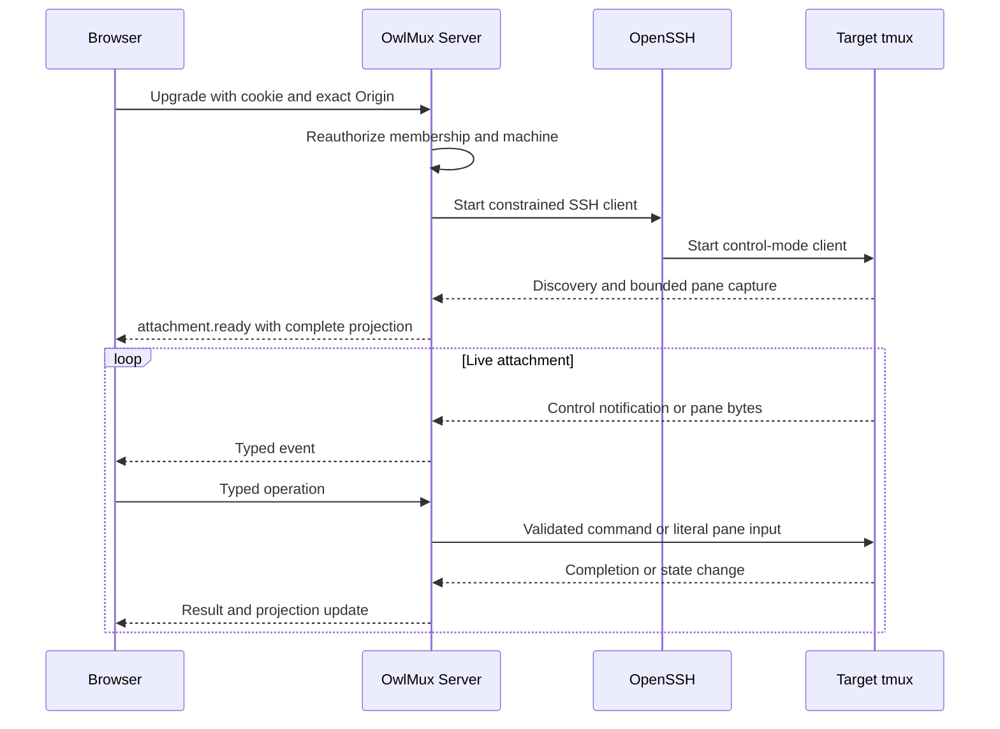

# Web Application And Browser Protocol

## Decision

OwlMux is Web first. One public OwlMux Server serves the API, WebSocket attachment
endpoint, and the production React application. The browser presents a graphical
tmux workspace rather than a single opaque terminal canvas.

The browser protocol is an adapter over one ephemeral tmux control attachment.
It carries no durable room state and has no cross-connection resume cursor.

## HTTP Surfaces

One server exposes four logical surfaces:

1. minimal unauthenticated process health;
2. authentication exchange and logout;
3. authenticated organization, membership, machine, enrollment, and attachment
   APIs;
4. embedded static application assets.

Initial route families are:

```text
GET  /health
GET  /ready

GET  /auth/v1/mode
POST /auth/v1/api-key/session/actions/create
POST /auth/v1/owlauth/session/actions/create
POST /auth/v1/session/actions/logout

GET  /api/v1/me
GET  /api/v1/organizations
POST /api/v1/organizations/actions/create
GET  /api/v1/organizations/{organization_id}
GET  /api/v1/organizations/{organization_id}/members
POST /api/v1/organizations/{organization_id}/members/actions/add
POST /api/v1/organizations/{organization_id}/members/{user_id}/actions/update
GET  /api/v1/organizations/{organization_id}/machines
POST /api/v1/organizations/{organization_id}/machines/actions/create
GET  /api/v1/organizations/{organization_id}/machines/{machine_id}
POST /api/v1/organizations/{organization_id}/machines/{machine_id}/actions/update
POST /api/v1/organizations/{organization_id}/machines/{machine_id}/actions/enroll
GET  /api/v1/organizations/{organization_id}/machines/{machine_id}/attach
     # WebSocket upgrade
```

Only the session-exchange endpoint for the configured authentication mode exists.
OwlAuth and API-key credentials are never tried as one another. API paths,
auth paths, health paths, and WebSocket upgrade failures are excluded from SPA
fallback.

Authenticated lookup and authorization failures conceal organizations and
machines not visible to the principal. Errors use a stable bounded envelope with
a request ID and safe
machine-readable code.

## Browser Session Exchange

WebSocket clients cannot reliably supply an arbitrary Authorization header, so
both authentication modes converge on an opaque OwlMux browser session cookie.

### OwlAuth mode

The browser completes the OwlAuth Project Auth Application flow through the
supported OwlAuth SDK, including exact Application redirect and PKCE. It submits
one current OwlAuth Project access token over TLS to the OwlMux exchange endpoint.

Server validates:

- an allowlisted asymmetric algorithm and current signing key;
- exact configured Project issuer and audience;
- OwlAuth Project access-token type;
- exact configured OwlMux Application ID in `app_id`;
- signature, `iat`, `nbf`, `exp`, and allowed skew;
- stable Project-scoped subject and required session context.

The exchange returns only an opaque OwlMux secure session cookie. The OwlAuth
token is redacted before diagnostics, is not echoed or persisted, and does not
enter browser storage through OwlMux. The OwlMux session cannot outlive the
accepted token or the configured shorter session bound. A later OwlAuth token
with broader identity data or authority does not widen an existing session.

OwlAuth authenticates the subject. OwlMux provisions or resolves the exact local
user, personal organization, and current memberships, then evaluates organization
role and machine state for every API request and attachment.

### API-key mode

The browser submits one deployment API key over TLS. The server compares it in
constant time against the configured key and creates a session for the fixed
implicit `owner` principal.

The exchange is same-origin, body-bounded, separately rate-limited,
non-cacheable, and clears the frontend's in-memory key value after every attempt.
The raw key is never stored in local storage, session storage, cookies,
application persistence, logs, telemetry, errors, or audit.

Direct API clients use:

```text
Authorization: Bearer <deployment-api-key>
```

The key is accepted only in API-key mode and only on OwlMux API surfaces.

### Cookie policy

OwlMux browser sessions use high-entropy opaque IDs stored as PostgreSQL digests.
Redis may cache validity but is not authority. Cookies are `Secure`, `HttpOnly`,
host-only where
possible, narrowly scoped, and use a reviewed `SameSite` policy. Login rotates
session identity; logout invalidates it idempotently.

State-changing HTTP commands require same-origin validation and CSRF protection.
WebSocket upgrades require an exact allowed `Origin`, a current cookie session,
an active organization membership, and an active organization-owned machine.

## Current Principal

`GET /api/v1/me` returns a bounded presentation:

```text
CurrentPrincipal {
    kind: owlauth_user | api_key_owner,
    user_id?,
    subject,
    display_name?,
    avatar_url?,
    authentication_mode,
    personal_organization_id,
    session_expires_at,
}
```

`user_id` is the stable local OwlMux ID exposed for an OwlAuth user so they can
be added to a shared organization; it is absent for the built-in API-key owner.
OwlAuth presentation fields come only from the accepted bounded Project user
projection or configured token claims and are rendered as untrusted text/URLs.
Provider tokens, upstream identity payloads, email internals, refresh tokens,
Project browser-session cookies, and arbitrary custom claims are never returned.

## Organization And Machine APIs

The organization list contains only active memberships and the caller's effective
role. Every first-admitted OwlAuth user has exactly one personal organization;
API-key mode exposes its one default organization. Organization responses do not
project OwlAuth provider groups or claims.

The machine list is scoped to one authorized organization and contains every
active organization machine with safe live reachability summaries:

```text
MachineSummary {
    machine_id,
    organization_id,
    alias,
    display_name,
    route_kind: direct | relay,
    reachability: unknown | connecting | reachable | unavailable,
    last_safe_diagnostic?,
}
```

It does not expose SSH private-key paths, encrypted envelopes, complete SSH
config, raw host-key material, Relay addresses, tunnel IDs, Unix credential
details, or another organization's state.

Machine creation requires owner/admin authority and returns one short-lived,
one-use enrollment token exactly once. A normal machine read never returns it.
Enrollment and re-enrollment are explicit lifecycle actions, not ordinary field
updates.

Reachability is advisory. Selecting a machine always performs fresh membership,
SSH host verification, authentication, and tmux discovery.

## WebSocket Lifecycle

The authenticated upgrade creates one attachment:



Server sends no machine data before membership authorization, SSH host
verification, and
attachment setup succeed. A setup failure closes with one safe reason class.

## Message Envelope

The initial protocol uses size-bounded tagged JSON. Terminal bytes are base64 in
pane-output messages so arbitrary bytes and split UTF-8 sequences are preserved.
This is intentionally simple for the first product; a binary frame profile is
introduced only after measurement.

Client messages contain:

```text
{
    "version": 1,
    "type": "...",
    "request_id": "...",
    "attachment_epoch": "...",
    "payload": { ... }
}
```

Server messages contain:

```text
{
    "version": 1,
    "type": "...",
    "request_id": "...",
    "attachment_epoch": "...",
    "payload": { ... }
}
```

`request_id` is present for command result correlation and absent on unsolicited
projection events. It is not an idempotency key. `attachment_epoch` rejects stale
browser operations after reconnect. JSON integer fields remain within the safe
JavaScript integer range or use decimal strings.

Unknown version, type, required field, enum value, malformed base64, duplicate
singleton field, or limit violation closes the attachment with no tmux cleanup.
Additive optional fields require an explicit compatibility rule; changed command
meaning requires a new protocol version.

## Initial Server Events

- `attachment.connecting`;
- `attachment.ready` with one complete projection;
- `attachment.refreshing`;
- `attachment.disconnected` with a safe retry class;
- `projection.replaced`;
- `session.changed`;
- `window.changed`;
- `pane.changed`;
- `pane.output` with observed pane ID and base64 bytes;
- `operation.succeeded`;
- `operation.failed`;
- `flow.slow_client`.

The first complete projection and every replacement are atomic at the browser
state boundary. Incremental events apply only to their attachment epoch.

## Initial Client Operations

- `projection.refresh`;
- `session.create`, `session.rename`, `session.select`, `session.detach`, and
  confirmed `session.destroy`;
- `window.create`, `window.rename`, `window.select`, and confirmed `window.close`;
- `pane.split`, `pane.select`, `pane.resize`, confirmed `pane.close`, and
  `pane.input`;
- `client.resize`;
- `attachment.detach`.

Each operation uses a typed payload. The protocol has no `execute`, `raw_command`,
`ssh_options`, `tmux_format`, or arbitrary Relay destination operation.

## Backpressure And Reconnect

The browser and Server maintain bounded queues. WebSocket ordering is sufficient
inside one connection; OwlMux does not add a durable event log. A slow browser is
closed before unbounded buffering.

After close, the browser may retry with bounded exponential backoff and jitter
while its login session remains valid. Every successful retry receives a fresh
attachment epoch and full target hydration. The browser discards all prior live
projection state before installing the replacement.

No input or mutating tmux operation is replayed automatically across reconnect.

## Information Architecture

The initial application has four route families:

```text
/login
/organizations
/organizations/{organization_id}
/organizations/{organization_id}/machines/{machine_id}
```

### Login

- in OwlAuth mode, one OwlAuth sign-in action and safe authentication errors;
- in API-key mode, one masked API-key field held only in memory;
- no mixed-mode chooser when the server has one configured mode.

### Organizations

- current principal and logout;
- personal and shared organization selection;
- owner/admin member management using already admitted OwlMux users;
- organization machine cards with direct or Relay route presentation;
- explicit machine registration and one-time enrollment display;
- safe connection diagnostics without secret material.

### Machine workspace

- organization, machine identity, and attachment state;
- session switcher and explicit new-session action;
- window navigation;
- tmux-authoritative pane grid;
- xterm.js renderer per visible pane;
- keyboard-first pane focus and tmux operations;
- clear reconnect, unsupported-tmux, SSH-host, and Relay failure states;
- destructive-operation confirmation without claiming OwlMux owns the session.

Desktop browser use is the initial qualified surface. Responsive layout should
remain usable on tablets, but mobile terminal input is not a first-release
acceptance target.

## Browser Security

- restrictive CSP with no third-party scripts;
- framing, MIME, referrer, permissions, and cache protections;
- sensitive API responses use `Cache-Control: no-store`;
- terminal bytes are written only to xterm.js, never interpreted as HTML;
- organization/machine names, pane titles, paths, and diagnostics render as
  untrusted text;
- clipboard read requires an explicit browser/user gesture;
- paste shows size-aware confirmation under configured thresholds;
- no service worker caches authenticated API or terminal data;
- SPA fallback cannot turn an API error into HTML success.

## Acceptance Criteria

- OwlAuth and API-key modes converge on the same internal principal and
  organization authorizer but never accept one another's credential class.
- First OwlAuth admission exposes exactly one personal organization.
- The browser can authenticate, list organizations and their machines, attach,
  render a complete tmux
  workspace, send pane input, and reconnect to a continued target process.
- WebSocket upgrade checks current login, exact Origin, active membership, and
  machine organization.
- A stale attachment epoch, unknown message, malformed output, or slow client
  closes only the attachment.
- Browser refresh leaves no raw deployment key or OwlAuth token in browser
  storage and does not terminate target tmux.
- No browser route can submit arbitrary SSH, tmux, shell, or Relay commands.
