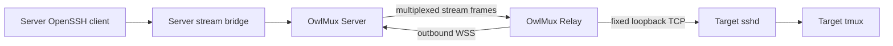

# Connectivity And Relay

## Decision

OwlMux supports two routes to the same target SSH boundary:

- **direct**: the Server's OpenSSH client reaches target sshd through ordinary
  networking, dedicated Server SSH config, VPN, or `ProxyJump`;
- **relay**: a target-side OwlMux Relay opens an authenticated outbound
  tunnel to the Server and relays logical byte streams to a fixed loopback sshd
  endpoint.

Both routes carry a normal SSH handshake. Target sshd remains the SSH endpoint,
the target host key remains authoritative, and tmux remains the session owner.
Relay is the primary first-delivered route; direct SSH is added later through the
same transport boundary.

OwlMux does not implement P2P NAT hole punching. Relay traffic is relayed by
Server.

## Unified Route Boundary

Above connectivity, the SSH adapter receives one bidirectional ordered byte
stream plus route diagnostics:

```text
MachineTransport {
    open(machine_id) -> ByteStream
}
```

The SSH, tmux, WebSocket, and browser layers do not know whether that stream came
from direct TCP, configured `ProxyJump`, or a Relay logical stream.

Each organization-owned machine has one explicit route policy. OwlMux does not
silently fail over to a different Relay, address, Unix account, or host key.
Changing route kind is an authorized machine-management action and does not
change the expected SSH host identity.

## Direct Route

A direct machine records an address reachable from Server. Registration produces
the same protected per-machine SSH key used by Relay machines. The user installs
the returned public key for the selected Unix account and confirms the observed
SSH host-key fingerprint before the machine becomes active.

The registered machine may define:

- hostname and port;
- Unix username;
- the generated per-machine identity reference;
- an explicit Server-side operator-owned `ProxyJump` profile;
- exact `known_hosts` source and host-key alias;
- connection and keepalive limits.

Browser input cannot override any of these values. OwlMux does not accept a
browser hostname, username, port, identity path, SSH option, environment value,
forwarding request, or remote command. OpenSSH does not read the Server account's
ambient user config or agent for target authentication. A selected operator
profile may supply separate bastion authentication, but it cannot replace the
registered target key, target account, or target host-key policy.

A direct connection may use an existing VPN, Tailscale, WireGuard, bastion, or
private network. Users should prefer direct registration when Server already has
a stable route; Relay is the default for machines without one.

## Relay Placement

The Relay runs on the target machine or inside the same trusted network
namespace as target sshd. Its initial configured destination is exactly one
loopback endpoint, normally `127.0.0.1:22` or `[::1]:22`.

It does not enable sshd, create a Unix user, install tmux, or modify shell
startup. During explicit enrollment it may install the Server-generated OwlMux
SSH public key into the current user's `authorized_keys` after showing the exact
path, fingerprint, and effect and receiving confirmation. It never edits sshd
configuration or another user's account.



The outer tunnel protects Relay authentication and stream routing. SSH
provides a second end-to-end encrypted and authenticated layer from the Server's
SSH client to target sshd.

## Relay Provisioning

An organization owner or admin creates one pending machine through the authenticated
Web/API surface. One PostgreSQL transaction:

- binds the machine to the selected organization and machine alias;
- generates a dedicated SSH key pair;
- protects the SSH private key through the configured secret-custody provider;
- stores only the encrypted envelope and public key;
- creates one high-entropy, short-lived, one-use Relay enrollment token and stores
  its domain-separated digest;
- records the actor and safe audit metadata.

The plaintext enrollment token is revealed exactly once. The user runs:

```text
owlmux-relay enroll --server https://owlmux.example --token <one-use-token>
```

Relay then:

1. establishes preconfigured TLS trust to Server;
2. generates its own Ed25519 Relay key pair with the operating-system CSPRNG;
3. atomically stores that private key in a permission-restricted local file;
4. submits the one-use token, Relay public key, loopback sshd endpoint, selected
   local account, and observed SSH host-key candidates;
5. receives the generated OwlMux SSH public key and displays the host/user binding;
6. explicitly installs or verifies that public key in the current account's
   `authorized_keys`;
7. proves a Server SSH connection through the tunnel reaches the enrolled host
   key and selected account before the machine becomes active;
8. removes the enrollment token from local process state and opens its normal
   signed outbound connection.

Token consumption, Relay public-key binding, expected SSH host identity, active
machine state, and audit commit atomically. Expiry, replay, wrong organization,
wrong machine, or changed request fails generically. There is no shared deployment
join key, and enrollment never accepts the deployment user API key or an OwlAuth
credential.

The Relay private key is not an SSH user key and cannot authenticate a browser.
The per-machine SSH private key exists only inside Server's secret-custody
boundary. The target SSH host key is independently verified inside the tunnel.

## Tunnel Handshake

The Relay opens one WebSocket-over-TLS connection, normally on TCP 443. TLS
uses normal WebPKI, an operator-installed private CA, or an explicitly provisioned
pin. Certificate verification is never disabled in production.

Before stream frames are accepted:

1. the Relay sends a bounded hello with relay ID, client nonce, protocol
   versions, software version, and safe platform metadata;
2. the Server returns deployment ID, server nonce, exact supported version, and
   negotiated limits;
3. the Relay signs a domain-separated canonical transcript containing both
   nonces, deployment ID, relay ID, protocol version, and limits;
4. Server validates the enrolled public key and current organization-owned
   machine binding;
5. both sides enter active stream mode or close with a generic rejection.

A new connection for an already healthy relay is rejected. After transport
loss, a later authenticated connection may replace it immediately because no
Relay-owned operation or target process survives the old stream. Old logical
streams are closed and their SSH clients observe transport loss.

## Stream Protocol

One active tunnel multiplexes bounded logical streams. Initial frame families
are:

- `stream.open` with a Server-assigned stream ID and bound machine ID;
- `stream.opened` or sanitized `stream.rejected`;
- `stream.data` with direction, stream ID, and nonempty bytes;
- `stream.half_close`;
- `stream.close` with safe reason class;
- `connection.ping` and `connection.pong`;
- `connection.drain` for controlled Relay shutdown.

The target endpoint is not carried in `stream.open`; it comes from the Relay's
provisioned fixed configuration. A compromised or confused Server therefore
cannot use the initial Relay as a generic internal-network proxy.

Frames have strict version, payload, stream-count, queue, memory, and timing
limits. Data ordering is preserved within one stream. Fair scheduling prevents a
verbose SSH stream from starving heartbeat, close, or another stream.

The protocol has no runtime start, input, resize, PTY, tmux, shell, process,
filesystem, or forwarding command.

## Liveness And Reconnection

Heartbeat detects unusable tunnels and updates advisory reachability. It is not a
lease for target execution. Expiry closes tunnel streams only and never runs a
local process-cleanup path.

The Relay reconnects with bounded exponential backoff and jitter. Target tmux
continues while the route is unavailable. A browser may retry after a new active
Relay appears; the resulting SSH and tmux attachment is fresh.

Controlled Relay shutdown drains or closes logical streams within a bounded
period, closes the tunnel, and exits. It does not inspect or terminate tmux.

## Backpressure

Both directions use byte-bounded per-stream queues, one connection-wide memory
ceiling, and fair scheduling. A stream exceeding its limit is closed. Connection
resource exhaustion rejects new streams before affecting established bounded
streams where possible.

Backpressure may stall or close SSH. It must not become unbounded memory and must
not trigger target process cleanup.

## Route And Identity Safety

A Relay route is accepted only when all identities agree:

```text
active membership organization_id
    == machine organization_id
machine_id
    == route machine_id
    == Relay binding machine_id
    == SSH credential and host-key policy machine_id
```

A mismatch closes the attempt before tmux discovery. Relay identity never
substitutes for SSH host identity. DNS, observed source address, hostname text,
and last connection address are not routing authority.

## Failure Semantics

- Server-to-Relay loss closes logical streams and leaves target tmux alone.
- Relay-to-sshd connection failure returns a generic route failure and runs
  no fallback shell.
- SSH host-key mismatch is terminal until an authorized machine administrator
  explicitly re-enrolls or replaces the machine trust; OwlMux
  never auto-accepts the presented key.
- A duplicate or stale stream frame cannot affect a later connection incarnation.
- A data frame with unknown delivery outcome is left to SSH transport failure;
  OwlMux never replays terminal input at the Relay layer.
- Relay key revocation blocks new tunnels and closes the current route. It
  does not terminate target tmux.

## Explicit Non-Goals

- direct browser-to-target connectivity;
- peer-to-peer NAT traversal or direct-path upgrade;
- general reverse TCP, SOCKS, VPN, SSH forwarding, or LAN access;
- Relay-owned SSH authentication;
- Relay-managed tmux or shell execution;
- process leases, cgroups, launchd PTY supervision, or target cleanup;
- preservation of an SSH byte stream across tunnel reconnect.

## Acceptance Criteria

- A target with no inbound route becomes SSH-reachable through only an outbound
  Relay connection.
- SSH sees and verifies the same target host key through direct and Relay
  routes.
- Tunnel or Relay restart drops attachments but leaves the target tmux
  process tree untouched.
- The Relay can open only its configured loopback sshd endpoint.
- Cross-target, stale-connection, unknown-stream, oversized, reordered-control,
  and backpressure tests fail closed without unbounded allocation.
- No Relay frame can express a shell, tmux, PTY, process, or arbitrary TCP
  operation.
