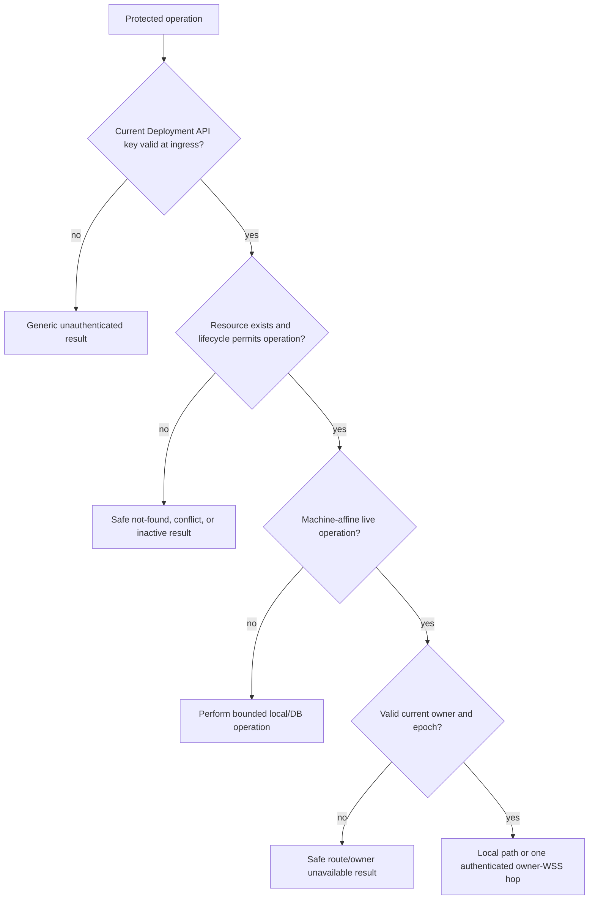

# Deployment access and authentication

## 1. Access model

Each OwlMux Deployment has exactly one human/API access credential:

```text
OWLMUX_API_KEY=owlmux_sk_v1_<canonical-unpadded-base64url-of-32-random-bytes>
```

The same current key is configured on every Server node and grants complete access to every OwlMux HTTP API, Browser workspace, Machine, SSH credential, enrollment workflow, and typed target operation in that Deployment. Deployment is the sole human/API trust boundary; OwlMux does not subdivide it into identities, delegated grants, resource ACLs, node-scoped grants, or Server-issued Browser sessions.

A public request may reach any Serving Server node at the one Deployment origin. The accepting node performs the external API-key boundary. It either executes non-Machine-affine work locally or, after authentication, routes Machine-affine work to the current fenced Machine owner over at most one cluster-authenticated internal WSS hop. The raw API key is never forwarded to another node.

Operators who require separate access groups run independently configured OwlMux Deployments. Multiple nodes inside one Deployment improve capacity/availability but do not create security isolation or separate access groups.

## 2. API-key configuration

The operator MUST generate the payload from exactly 32 cryptographically random bytes. Every Server node requires the exact `owlmux_sk_v1_` prefix, canonical unpadded base64url payload, and decoded 32-byte length; it rejects absent, empty, malformed, noncanonical, or wrong-length values. Format validation cannot prove how an operator generated otherwise well-formed bytes.

Each node loads that one key from protected startup configuration and MUST NOT:

- generate a production fallback;
- derive it from another secret;
- store it in PostgreSQL;
- persist a standalone verifier copy;
- accept a previous key;
- expose online create, reveal, recover, or rotate APIs;
- accept another human credential class;
- use the cluster key, node TLS identity, Relay identity, or SSH credential as human/API authority.

The decoded API-key bytes remain in each node's protected configuration holder for request verification. After strict prefix, encoding, and length checks, the accepting node compares the 32 decoded candidate bytes to that configured value with constant-time equality.

In clustered mode, the domain-separated Deployment configuration proof in [06](06-storage-consistency-and-private-key-encryption.md#31-deployment-identity-and-configuration-epoch) detects nodes configured with a different API-key value without storing a usable verifier. A proof match does not authenticate a public request or an internal connection.

Rotation means:

1. mark/drain and stop every Server node in the Deployment;
2. wait until no prior node lease remains valid;
3. replace the sole configured key on every node;
4. increment the explicit Deployment configuration epoch and establish its new exact proof;
5. restart only coherent nodes.

As specified in [06](06-storage-consistency-and-private-key-encryption.md#31-deployment-identity-and-configuration-epoch), configuration transition, node registration, and lease renewal each take an exclusive lock on the same `DEPLOYMENT` row and recheck epoch/proof while holding it. The no-valid-lease check therefore cannot race an old-epoch registration or renewal.

The old key and all old public/internal authenticated connections cease to work. A Browser may retain the old value in page memory or the fixed same-origin `localStorage` entry, but the value fails fresh HTTP/WebSocket authentication, both Browser copies are cleared on that failure, and it must be replaced by user input. There is no dual-key grace, hot rotation, key history, per-node transition, or session revocation table. A node with the old config epoch/proof cannot rejoin.

The same cold semantics apply in the single-node profile; only one process is drained.

## 3. HTTP authentication

Every protected HTTP request carries:

```http
Authorization: Bearer <OWLMUX_API_KEY>
```

The accepting Server node independently verifies the current key on every request before Machine/resource lookup, owner resolution, internal owner-WSS routing, or side effect. The key is forbidden in:

- URLs and query strings;
- cookies, `sessionStorage`, IndexedDB, Cache Storage, and service-worker state;
- form fields other than the dedicated Browser login input;
- WebSocket subprotocol values;
- HTML or frontend bundles;
- Browser persistence other than the one fixed versioned same-origin `localStorage` entry specified below;
- logs, telemetry, errors, audit, process arguments, internal authentication transcripts, or owner-WSS payloads.

A missing, malformed, or wrong key produces one generic bounded unauthenticated result and no resource-existence, owner-placement, node-membership, or internal-endpoint disclosure.

A protected HTTP operation that is not Machine-affine may run on the accepting node after its normal PostgreSQL transaction. An access-affecting Machine operation first resolves the actual owner after authentication. If remote, ingress opens WSS to the exact owner, completes the destination-challenge/HMAC exchange, sends one bounded typed request, receives one bounded typed result, and closes. The owner serializes the mutation with its live dispatch boundary. This uses the same WSS authentication/framing family as Browser owner routing; no separate internal HTTPS challenge mode exists. If the owner is unreachable while its lease remains valid, ingress returns `owner_unreachable` rather than bypassing it. The deployment operator fences/stops/isolates that node, waits for database-time lease expiry, and retries.

## 4. Browser handling

The Browser has one login screen with one masked API-key input bounded to the exact 56-character canonical key shape. It rejects malformed input before transport. On load it reads only the fixed versioned `owlmux.deployment_api_key.v1` `localStorage` entry; a malformed, empty, oversized, or noncanonical stored value is removed without becoming an Authorization header. A well-formed saved candidate enters a bounded restoring state and receives one fresh `GET /api/v1/deployment` verification with a ten-second deadline before any authenticated product data appears. Page exit or component teardown cancels the pending client, and a late result cannot write storage, navigation, or authenticated state.

After successful input verification, the Browser attempts to write the exact key to that one same-origin entry and retains one active-client copy in JavaScript page memory. A successful saved-key restore does not rewrite the existing entry. If local storage is blocked or an input-path write fails, verified current-page access continues, but the Browser cannot confirm that the current key was saved and a previous value may remain; the authenticated shell displays a persistent warning with manual site-data guidance. The `localStorage` entry, when present, is raw full-Deployment authority, not a Server-issued session, refresh token, encrypted envelope, or lesser grant. The Browser MUST NOT copy the key to `sessionStorage`, IndexedDB, Cache Storage, cookies, service-worker state, URL/history, clipboard, logs, analytics, crash reporting, another storage key, or serialized application state.

Explicit logout, an HTTP `401`, or attachment-WebSocket authentication failure always closes and clears page-local clients, pending authentication, input candidates, and workspaces, then attempts to remove the one `localStorage` entry. A failed initial restore caused by wrong/replaced authority does the same and presents the login input. If Browser storage removal throws, OwlMux MUST NOT claim that persistent cleanup succeeded: it ends the page session, displays a warning that the operator must clear site data for the origin, and leaves no in-memory client usable. A transport, validation-timeout, Deployment-unavailable, or other non-authentication failure keeps any saved candidate and returns to a masked retryable login state. Page reload, navigation away, tab close, or renderer crash clears page-local clients, workspace tabs, projections, terminal buffers, and pending operations but retains a valid saved key; the next load must freshly verify it before authenticated use.

Logout is entirely Browser-local and does not mutate Server authority because no Browser session exists. The Server neither knows nor trusts whether a request key came from input, page memory, or local storage.

A same-origin XSS or compromise of the Browser profile can read the persisted key and obtains full Deployment authority after fresh Server verification. Restrictive CSP, no third-party scripts, safe rendering, HTTPS, and protection of the Browser/OS profile are therefore part of the bastion boundary. Persisting the key favors operator convenience and is not equivalent to a revocable or scoped login session.

Browser uses only the Deployment origin. It MUST NOT receive, persist, select, or retry against internal Server-node endpoints. Public load-balancer stickiness is an optional performance optimization, not Browser state or authority.

## 5. Browser WebSocket authentication and owner WSS routing

Browser WebSocket APIs cannot reliably set an arbitrary Authorization header. Attachment WebSocket authentication therefore uses one external first-frame rule followed, when necessary, by one internal owner WSS hop:

1. Browser opens the same-origin attachment WebSocket with exact allowed `Origin` and no credential in URL, query, cookie, or subprotocol.
2. The ingress node allocates only fixed, small handshake state and starts a short authentication deadline.
3. The first and only accepted pre-authentication message is a size-bounded `auth.api_key` frame carrying the current API key.
4. Ingress verifies the key, clears candidate/frame bytes, and marks only that external connection authenticated.
5. Only then may ingress resolve the Machine and its current owner. It still MUST NOT open a route, decrypt an SSH credential, allocate tmux/projection/writer state, or emit target data.
6. If ingress is owner, it invokes the owner application boundary through a local fast path. Otherwise it opens one bounded WSS connection to the exact registered owner endpoint. The destination owner sends a fresh one-use challenge and starts a short `CLOCK_BOOTTIME` deadline; ingress answers once with the domain-separated cluster HMAC transcript over the challenge, source nonce, verified connection class, and exact source/destination/config/Machine/owner epoch context. It never sends the API key or a reusable API-key verifier/assertion.
7. The owner verifies the one-use challenge/HMAC, source/destination node leases/config proof, its actual-owner record/connection epoch, Machine lifecycle/route revision, destination-local deadline, and budgets before allocating Attachment resources.
8. Any invalid external or internal step closes generically and performs no target side effect.

```mermaid
sequenceDiagram
    participant Browser
    participant Ingress as Any Server ingress node
    participant DB as PostgreSQL
    participant Owner as Current Machine owner

    Browser->>Ingress: WebSocket upgrade with exact Origin
    Ingress-->>Browser: Fixed pre-auth state only
    Browser->>Ingress: auth.api_key(current key)
    Ingress->>Ingress: Strict parse and constant-time verify; clear candidate
    alt Invalid or timeout
        Ingress-->>Browser: Generic close
    else Valid
        Ingress->>DB: Resolve requested Machine and actual owner
        DB-->>Ingress: Owner node/incarnation/connection epoch or safe denial
        alt Owner is ingress
            Ingress->>Owner: Local authenticated context
        else Owner is remote
            Ingress->>Owner: WSS to exact registered owner
            Owner-->>Ingress: Fresh one-use destination challenge
            Ingress->>Owner: Bounded HMAC response and verified context
        end
        Owner->>Owner: Verify lease, owner epoch, lifecycle, and budgets
        Owner-->>Browser: Attachment lifecycle begins
    end
```

The API-key frame and internal WSS challenge/HMAC/context buffers are never logged, audited, traced, retained for reconnect, echoed, or automatically replayed. A replacement WebSocket, including after an ordinary node/ingress loss with an unchanged key, may repeat external first-frame authentication with the still-open Browser page's current in-memory key and begin a fresh owner resolution/Attachment. No external or internal authenticated state transfers between connections.

Loss of a non-owner ingress drops only connections passing through it; owner-local Machine state may remain. Loss/fence of the owner drops all of that Machine epoch's OwlMux live state. In both cases Browser reconnects through the unchanged Deployment origin and never receives a node redirect.

## 6. Authorization and fencing semantics

Successful API-key verification grants full Deployment access. Authorization checks after authentication are resource, owner, and lifecycle validation only:



Authorization requires only the current Deployment key. Node lease and Machine-owner checks do not create a second human permission; they fence which trusted Server process may perform Machine-affine work. Resource lifecycle checks still prevent invalid operations such as using an inactive Machine, retiring a referenced credential, or replaying an enrollment token.

External key verification occurs:

- before every protected HTTP operation;
- once in the first Browser WebSocket frame before Machine/owner resolution;
- before credential, Machine, enrollment, route, and trust mutations.

After successful WebSocket verification, ingress clears the raw frame/key candidate and retains only a connection-authenticated flag. After a remote owner-WSS hop, the owner retains only cluster-authenticated connection state bound to exact source/destination node incarnations, config epoch, Machine ID, route revision, and connection epoch. Neither node retains or compares another API/cluster-key copy per terminal frame.

Before pane input, resize, session creation, or target selection, the owner reads Linux `CLOCK_BOOTTIME` and validates the local hard deadline, current owner/connection epoch, connection-authenticated state, Machine lifecycle/route revision, attachment/workspace identity, and the exact current writer attachment. Node/owner/configuration change closes the connection instead of transferring authenticated state.

## 7. Credential-class separation

| Credential                     | Created/owned by                                                  | Accepted surface                                                                                     | Must never substitute for                                               |
| ------------------------------ | ----------------------------------------------------------------- | ---------------------------------------------------------------------------------------------------- | ----------------------------------------------------------------------- |
| Deployment API key             | Deployment operator; same value on all nodes                      | Protected HTTP Bearer and first Browser WebSocket auth frame                                         | Cluster, enrollment, Relay, SSH, or private-key encryption              |
| Cluster key                    | Deployment operator; clustered mode only                          | Fixed internal config proof and fresh Server-to-Server owner-WSS authentication transcripts over TLS | Deployment access, enrollment, Relay, SSH, or private-key encryption    |
| Server internal TLS identity   | Deployment operator/platform                                      | Clustered-mode internal transport peer verification                                                  | Public API, Relay, SSH, or cluster application authentication by itself |
| Relay enrollment token         | OwlMux Server                                                     | One Machine enrollment endpoint/frame at Deployment origin                                           | Deployment/cluster access, Relay tunnel, or SSH                         |
| Relay Machine key              | Target Relay                                                      | Signed tunnel authentication at Deployment origin                                                    | Deployment/cluster access, enrollment token, or SSH user auth           |
| SSH credential                 | OwlMux encrypted storage; API-key holder manages metadata/binding | Target sshd authentication for a configured Machine                                                  | Deployment/cluster access, Relay, enrollment, or private-key encryption |
| SSH private-key encryption key | Deployment operator; same value on all nodes                      | Fixed local private-key envelope only                                                                | Any network authentication surface                                      |

Prefixes, domain-separated transcripts, parsers, accepted endpoints, storage, owner-WSS routing, and redaction paths MUST make credential confusion structurally difficult.

A Server node is trusted internally only when internal TLS, cluster authentication, exact source/destination node incarnations, each node's registered `server_build_id` equal to the persistent Deployment value, configuration epoch/proof, exact initial Relay protocol version, and current leases all succeed. Possession of one stored configuration proof or Deployment ID is insufficient.

## 8. Separate Deployments

Multiple OwlMux Deployments are separate access domains. An external system may use its own inventory to choose one, but one Deployment never trusts another Deployment's API/cluster key, Deployment ID, database, Server node, Relay, credential, or Attachment.

Moving a Machine between Deployments is an external migration workflow:

1. generate the needed Ed25519 credential in the destination Deployment;
2. target administrator installs its public key;
3. create and enroll a new destination Machine;
4. verify target access;
5. remove old target authorization and disable the source Machine when ready.

OwlMux provides no automatic cross-Deployment migration, shared key authority, forwarding, or uninterrupted Attachment transfer. Target tmux may continue throughout because it remains target-owned.

## 9. Acceptance criteria

- API-key configuration accepts only the versioned canonical encoding of exactly 32 random bytes, with generation quality remaining an operator responsibility.
- Only the exact one configured Deployment API key grants human/API access, and every Serving node has a matching configuration proof.
- Deployment is the only human/API authorization aggregate; node leases/owner epochs fence trusted processes but do not create per-node permissions.
- HTTP verifies Bearer on every protected request before resource/owner lookup or internal owner-WSS routing.
- Browser WebSocket permits only one bounded external first auth frame under a short deadline and allocates no Machine, owner-WSS, or Attachment resources before success.
- A remote owner receives one destination-challenged cluster-HMAC result/context over WSS under its own suspend-aware deadline, never raw API-key bytes, sender timestamps, or a reusable verifier/assertion; one-shot API requests use the same WSS mode rather than internal HTTPS.
- Stale source/destination node incarnations, config epochs, owner epochs, challenge responses, and connections fail closed; a valid but unreachable owner yields `owner_unreachable` until the operator fences that node and its lease expires.
- Browser attempts to persist only the successfully verified key in one fixed versioned same-origin `localStorage` entry; reload restores and freshly verifies a valid candidate, while logout or authentication failure always ends page authority, attempts saved-key removal, visibly reports storage failure, and requires re-entry.
- Ordinary ingress/owner restart with an unchanged key permits a still-open page to perform fresh origin authentication; replacement-key cluster restart rejects the old Browser candidate and triggers removal without dual-key grace.
- Separate Deployments share no authority and make no migration or failover continuity claim.
