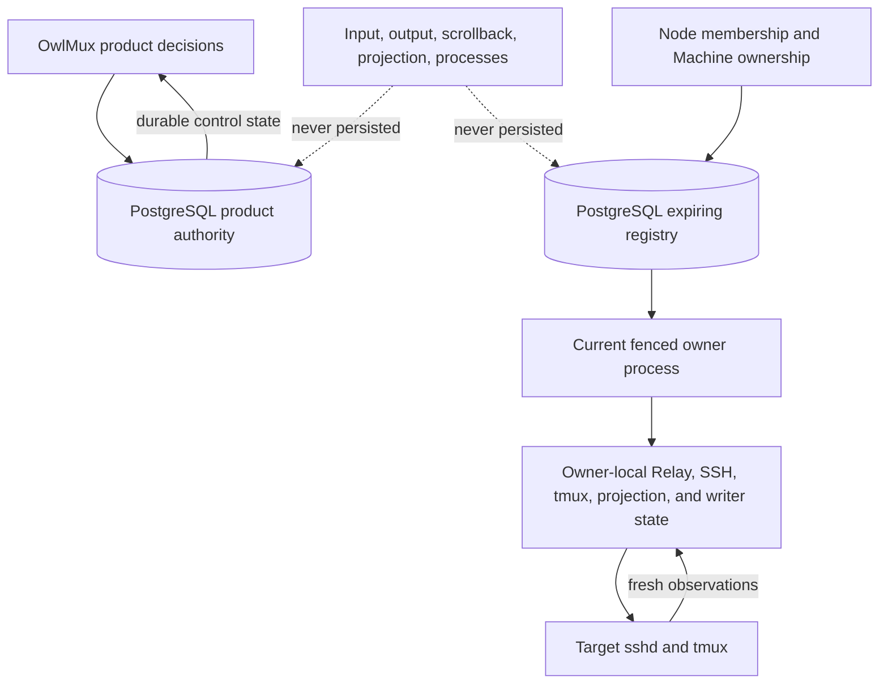
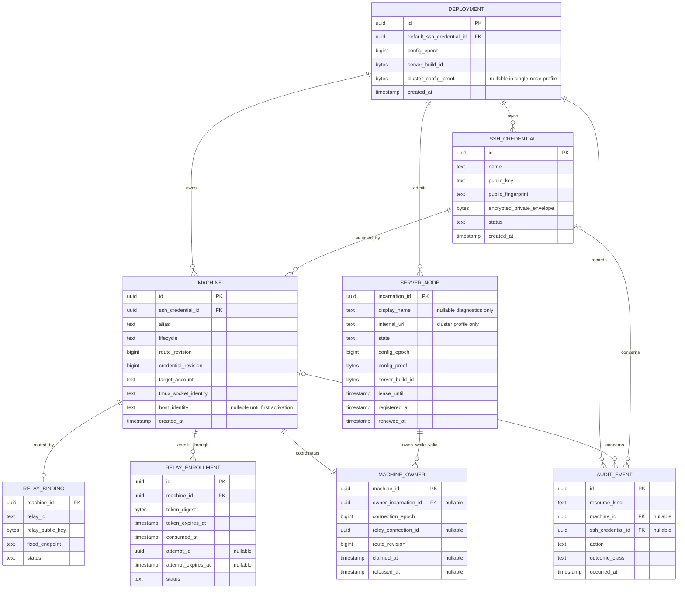

# Storage, consistency, and private-key encryption

## 1. Storage and coordination authority

PostgreSQL is the only durable OwlMux product authority. It also holds low-churn, expiring cluster coordination for Server-node leases and actual Machine owners. The current fenced Machine owner process holds bounded disposable Relay reachability, attachments, projections, Browser writer coordination, and target adapters. Each Relay process holds tunnel-local state. Target tmux owns all terminal and process state.



A durable product row can establish OwlMux control state or recoverability. An unexpired registry row can temporarily authorize one exact Server-node incarnation to serve or own a Machine. Neither can establish that target work still exists. Process-memory state may reject, order, fence, or require refresh but cannot create durable product authority.

Node leases and Machine-owner rows are not terminal state, target-process leases, or a live-state recovery mechanism. Their authority exists only within the configured PostgreSQL endpoint's current non-rolled-back history and expires by database time.

## 2. State classes

| Class                              | Examples                                                                                                                                                        | Authority and recovery                                                                                                               |
| ---------------------------------- | --------------------------------------------------------------------------------------------------------------------------------------------------------------- | ------------------------------------------------------------------------------------------------------------------------------------ |
| Durable product authority          | Deployment identity/default credential/config epoch, Machines, Relay bindings, first-enrollment-pinned hosts, SSH credential envelopes, audit                   | Current committed state in the configured PostgreSQL endpoint's one non-rolled-back history                                          |
| Expiring PostgreSQL coordination   | Server incarnation/Serving state/internal endpoint/lease, Machine owner/connection epoch/current Relay connection identity                                      | Current rows plus database time in that same history                                                                                 |
| Non-recoverable proof              | Enrollment token                                                                                                                                                | Plaintext exists only at issuance/client; PostgreSQL stores a domain-separated digest                                                |
| Recoverable secret                 | Generated Ed25519 SSH credential private key                                                                                                                    | Fixed XChaCha20-Poly1305 envelope in PostgreSQL; plaintext only during generation/encryption or owner-local OpenSSH handoff          |
| Protected runtime configuration    | Deployment API key, SSH private-key encryption key, and clustered-mode cluster key/TLS private identity                                                         | Operator configuration only; never PostgreSQL                                                                                        |
| Node-local disposable coordination | Rate limits, concurrency gates, negative hints, source budgets                                                                                                  | Bounded process memory; discarded on node restart                                                                                    |
| Owner-local live state             | Relay tunnel/streams, internal owner-WSS endpoints, OpenSSH children, tmux clients, projections, current Browser writer pointer, ordered dispatch state, queues | Current fenced owner process; discarded on owner loss/change                                                                         |
| Live Relay state                   | Tunnel, logical streams, local TCP sockets, queues                                                                                                              | Relay memory; discarded on Relay restart                                                                                             |
| Target execution state             | tmux sessions, panes, PTYs, scrollback, child processes                                                                                                         | Target tmux and OS only                                                                                                              |
| Browser state                      | Same-origin `localStorage` API-key candidate; page-memory active client, workspace tabs, renderers, focus, reconnect, and local preferences                     | Browser profile/page only; raw key remains Server-verified full authority, while all other state is disposable and non-authoritative |

Terminal input/output, scrollback, projection, target environment, process tree, raw target diagnostics, and live internal owner-WSS payloads MUST NOT be written to PostgreSQL, audit, tracing, telemetry, a message queue, a cache, or a replay log.

## 3. Conceptual data model

The diagram is logical, not a frozen SQL schema.



The durable product model remains closed to one Deployment, SSH credentials, Machines, Relay bindings/enrollments, and audit. `SERVER_NODE` and `MACHINE_OWNER` are a closed expiring coordination model in the same PostgreSQL database. API/cluster/encryption-key material remains runtime configuration; terminal state remains owner-process-local or target-owned.

### 3.1 Deployment identity and configuration epoch

Initialization creates exactly one random immutable Deployment ID and one default Ed25519 SSH credential in one transaction. Deployment ID binds Relay transcripts, cluster transcripts, and private-key encryption context; it does not authenticate a caller.

A Deployment assumes its configured PostgreSQL endpoint exposes one linearizable, single-writer, non-rollback history and never loses an acknowledged commit. PostgreSQL replication, promotion, fencing, HA topology validation, backup, and restore are deployment-operator responsibilities outside OwlMux. OwlMux neither discovers nor repairs database history. If the endpoint rolls back to an older history, lease, revocation, enrollment-token, owner-epoch, configuration, and credential-lifecycle guarantees are unsupported. An independently active database copy with the same Deployment identity is unsupported. A separate Deployment initializes a new identity and separate secrets, credentials, Machines, Relays, membership, and owner registry.

The Deployment API key, private-key encryption key, and cluster key stay outside PostgreSQL. Every node validates their canonical startup forms before membership or readiness.

Every Server binary embeds one opaque `server_build_id`; official builds use the release version plus source revision. It is an equality identity, not a compatibility range: a changed Server release or custom source build uses a different ID. The single `DEPLOYMENT.server_build_id` is the persistent expected value, and every `SERVER_NODE` records the local embedded value. No build-manifest generator, dependency/toolchain fingerprint, or Server mixed-version compatibility layer is required.

`config_epoch` is an explicit monotonically increasing operator-supplied Deployment configuration generation. In clustered mode, every node computes one fixed domain-separated HMAC-SHA-256 configuration proof keyed by the 32-byte `OWLMUX_CLUSTER_KEY` over:

- the immutable Deployment ID;
- the numeric configuration epoch and exact `server_build_id`;
- one-way digests of the decoded Deployment API key and SSH encryption key;
- the exact public origin and Origin policy;
- the schema, public protocol, exact Relay protocol version, internal owner-WSS authentication/framing generation, and credential-envelope version;
- the small canonical set of Deployment-wide security settings whose mismatch changes authentication or shared protocol semantics.

Incarnation ID, display name, advertised internal URL, TLS certificate bytes, host-local paths, and non-security operational tuning are not in the shared proof. The canonical proof input MUST be a reviewed versioned artifact before clustered mode is implemented; ad hoc map/JSON serialization is forbidden.

The proof is a consistency check, not a network bearer credential. Internal connections still require TLS and a fresh domain-separated cluster authentication transcript. Stored proofs, public configuration, or Deployment ID cannot authenticate a node.

At the same epoch, a proof or exact build-ID mismatch fails startup before node registration. Node registration, lease renewal, enrollment token acceptance, Relay activation, Machine owner claim, and configuration transition share one linearization root: each transaction first acquires `SELECT ... FOR UPDATE` or an equivalent exclusive row lock on the single `DEPLOYMENT` row, then rechecks epoch, proof, exact `server_build_id`, and the exact protocol values relevant to that operation before acquiring its more specific rows. A higher epoch may replace the Deployment proof and expected `server_build_id` only while holding that lock, after proving no prior Server-node lease remains valid, and only when the supplied epoch is exactly the permitted next generation. Lower/stale epochs fail. Thus an old-epoch transaction cannot grant new node membership, durable Relay trust, or Machine owner authority after a configuration transition. All such transactions use the shared lock order `DEPLOYMENT` before `SERVER_NODE`, enrollment, Machine, credential, Relay binding, or owner rows. API-key, Server build, or shared security configuration change is an all-node cold transition, not a partial rollout.

A single-node profile may omit cluster key, internal URL, and internal TLS configuration and stores no cluster proof. It still stores and checks the exact `server_build_id` and uses one node incarnation, lease, and local Machine-owner path. Transition between single-node and clustered profiles is a cold configuration-epoch transition with no valid prior node lease.

### 3.2 SSH credentials

The Deployment owns one or more reusable generated Ed25519 SSH credentials. Initialization creates the default pair. Credential creation accepts only a bounded name; Server generates the key in memory, derives its public key and SHA-256 fingerprint, encrypts the private bytes before persistence, clears plaintext buffers, and returns only public metadata. Creation is not Machine-affine and requires no owner hop.

OwlMux accepts no private-key upload, imported key, passphrase, ECDSA/RSA profile, algorithm selector, or generic key parser. This removes a sensitive request-body ingress and keeps every private key generated inside Server.

Credential key material is immutable. Rename changes metadata only. Rotation creates another generated Ed25519 credential. Reset creates a new Ed25519 credential and atomically makes it default without rebinding Machines, retiring old credentials, or mutating target authorization. An unknown creation outcome is handled by refreshing public credential metadata and requiring an explicit user decision; Server does not automatically retry.

Each Machine binds exactly one active credential. Machine creation uses the default unless another active credential is selected. Pending/verifying binding is immutable for that enrollment attempt. Active rebind is a pure control-plane switch with no SSH preflight; incomplete external public-key installation may make attachment fail, and the holder may explicitly switch back to a previous active credential.

An active Machine rebind is an ordinary PostgreSQL control-plane transaction: it selects the credential for future SSH children and increments `credential_revision`. Existing authenticated OpenSSH children pin the credential snapshot with which they were created and may continue until their attachment ends; rebind is not revocation and does not tear down the Relay owner. Before opening any new SSH child, the owner reads and pins the current credential ID/revision. `route_revision` is independent and changes only when Relay route trust or another owner-fencing route property changes. The UI states this non-revoking behavior explicitly. Urgent access removal uses Machine disablement plus target-admin public-key removal, which retains the strong owner barrier in Section 3.4.

A referenced or default credential cannot retire/delete. Reuse count is non-secret presentation because compromise/revocation scope follows every bound Machine.

### 3.3 Server node leases

For every lease/owner/enrollment predicate, `database_now` means PostgreSQL `clock_timestamp()` (or an exactly equivalent value) sampled after all required row locks are acquired and immediately before the guarded mutation. Transaction-start `now()`/`CURRENT_TIMESTAMP`, a statement timestamp captured before lock wait, application wall time, and a previously cached database timestamp are forbidden for expiry decisions.

Each process start generates a fresh random authority-bearing `incarnation_id`; an optional display name is non-unique diagnostics only. Registration is a short PostgreSQL transaction that:

1. acquires `SELECT ... FOR UPDATE` or an equivalent exclusive row lock on the single `DEPLOYMENT` row and rechecks the exact configuration epoch/proof, local embedded `server_build_id`, and exact Relay protocol version against the Deployment values;
2. records the fresh incarnation, exact `server_build_id`, optional display name, Serving state, and clustered-mode internal WSS URL;
3. sets `lease_until` from PostgreSQL time plus the fixed configured lease TTL;
4. returns the accepted identity and lease duration.

Lease renewal is one short transaction per node, not per Relay or Machine. It acquires the same exclusive `DEPLOYMENT` row lock and rechecks epoch/proof and exact `server_build_id`, then compare-and-sets the exact incarnation/configuration/build identity and extends the database-time deadline only while the node remains valid. A configuration transition therefore serializes against every registration and renewal.

Cluster correctness uses Linux `CLOCK_BOOTTIME` as the lease elapsed clock because it is monotonic and continues across host suspend. `CLOCK_MONOTONIC`, Tokio timer behavior, and host wall time alone are insufficient. A detected read failure or backward movement immediately fences the incarnation.

The Deployment configures lease TTL `L` and one conservative lease safety margin `S`, with `0 < S < L`. The node samples `CLOCK_BOOTTIME` value `b0` before each registration or renewal request. PostgreSQL sets `lease_until = database_now + L`; after an exact successful response received before the current local deadline, the node sets:

```text
local_hard_deadline = b0 + L - S
```

The pre-request sample conservatively includes request delay. `S` covers the supported maximum PostgreSQL forward clock adjustment plus bounded local clock-read, scheduling, queue handoff, dispatch, and fence-reaction overhead. Startup validates only Linux `CLOCK_BOOTTIME` availability and `0 < S < L`; it does not attempt to measure or prove those operating bounds. Operators MUST keep PostgreSQL forward adjustments and platform behavior within the documented margin and MUST NOT resume, clone, or live-migrate the same process snapshot. Such an event requires terminating it and starting a fresh incarnation. No database timestamp is compared directly with a host clock.

Every public/internal-WSS acceptance and every owner target dispatch reads `CLOCK_BOOTTIME` and checks the local hard deadline directly; a Tokio timer or watchdog is only a wakeup optimization. At the deadline the node becomes unready, rejects new input and mutations, and closes every owned Relay, internal owner-WSS connection, Browser attachment, OpenSSH child, tmux client, writer pointer, and queue. After any scheduling, suspend, or resume gap, the fence check runs before socket, database-mutation, or target I/O. Narrow protocol deadlines may use the same clock but do not create cluster authority.

A late or failed renewal cannot extend the local deadline by assumption. Reaching the hard deadline irreversibly fences that process incarnation: it MUST NOT renew, return to Serving, reclaim an owner, or accept a late successful response. Recovery exits/restarts with a fresh random incarnation after the old database lease is invalid. Another node cannot claim a Machine from that incarnation until PostgreSQL itself observes the referenced lease as invalid. This may create a short availability gap and cannot create two valid OwlMux dispatch authorities. It cannot revoke bytes already dispatched to target sshd/tmux, whose late outcome remains ambiguous rather than replayable.

`Serving` nodes may accept new public connections and claim only Relay connections they themselves accepted. `Draining` nodes retain authority for existing owners only while their lease remains valid and are excluded from new claims or enrollment. During drain each owner first closes its local dispatch barrier, rejects new writes, closes/fences old-epoch routes and children, and only then compare-and-set releases its exact owner row when PostgreSQL is available. Crash or partition recovery relies on lease expiry, never another process's liveness guess.

#### 3.3.1 Enrollment finalization

Token acceptance atomically consumes the token and creates one durable deadline-bounded `Verifying` attempt. That transaction first locks `DEPLOYMENT`, rechecks exact current configuration/build/protocol, then locks the pending Machine/enrollment and executing `SERVER_NODE` before using post-lock database time to require the exact node to remain `Serving`, lease-valid, and current for configuration/build/protocol. The accepting Relay WSS retains the setup state, fresh challenge, and verified proof only in bounded process memory. The attempt stores no coordinator, challenge, proof, or resumable transcript; another connection or node cannot resume it.

The final activation transaction first locks `DEPLOYMENT` and rechecks exact current configuration/build/protocol, then locks the exact attempt, Machine, selected credential, and executing `SERVER_NODE`. Under that still-held Deployment lock and database partial unique constraints, a post-lock `clock_timestamp()` sample requires the attempt to be unexpired, the Machine and binding context to remain valid, the exact executing incarnation to remain `Serving` with a valid lease and current configuration/build, the Relay to use the exact initial protocol version, and the candidate Relay ID and Ed25519 public key to be absent from every other active binding. Only after the connection-local Relay challenge and closed strict `VerifySshAccess` proof have succeeded may that transaction create the Relay binding and activate the Machine. If the Machine host identity is absent, the same transaction also requires a connection-local first-use confirmation and writes exactly the confirmed Ed25519 public key; if it is present, the transaction requires exact equality and cannot change or clear it. A transaction delayed across attempt or node lease expiry, drain, fence, incarnation replacement, active-identity conflict, or configuration transition cannot activate durable Relay trust or pin a host key.

Local `CLOCK_BOOTTIME` fence checks remain mandatory before setup, optional first-use host-key preflight/confirmation, strict proof, and database dispatch, but they do not replace the final database-time predicate. Failure or expiry invalidates the attempt and returns the Machine to tokenless `Pending`; it neither pins nor changes a host key, and retry requires explicit token issuance.

### 3.4 Machine owner and connection epoch

`MACHINE_OWNER` has one retained row per Machine so `connection_epoch` never decreases or resets during ordinary operation. Owner claim is a serialized PostgreSQL transaction run by the node that accepted the authenticated Relay. It first locks `DEPLOYMENT` and rechecks exact current configuration/build/Relay protocol, then locks the Machine, Relay binding, current owner row, and accepting incarnation membership needed to establish:

- the Machine and exact Relay binding are active;
- external Relay authentication already succeeded for that binding;
- the accepting incarnation is exact, Serving, config/build compatible, and non-expired;
- no current owner references a non-expired Serving/Draining node incarnation;
- current Machine `route_revision` matches the authenticated Relay claim context;
- the new random connection identity is unused.

On success, the transaction increments `connection_epoch`, stores the accepting incarnation, Relay connection identity, route revision, timestamps, and safe audit, then returns the new epoch. No network or target I/O occurs inside the transaction. Only that accepting ingress may claim itself; it cannot claim on behalf of, or forward the Relay to, another node.

The public load balancer determines which node accepts a new connection. PostgreSQL owner state is the sole authority after claim. OwlMux has no node-ranking policy or placement hash, weight, bucket, scheduler, owner migration, or rebalance transaction.

A healthy valid owner causes a duplicate Relay tunnel at any ingress to be rejected with a capped retry-after. Ordinary tunnel loss, same-owner reconnect, drain, mutation invalidation, and graceful shutdown all use one relinquish order: close the local dispatch barrier; reject new writes; close/fence old-epoch routes, internal owner-WSS connections, Attachments, children, writers, queues, and result publication; then compare-and-set release the exact owner incarnation/connection epoch; only afterward report or finish cleanup. Database owner authority is never released while stale local dispatch remains open. A stale release cannot clear a newer owner. If release cannot reach PostgreSQL, the process remains constrained by its node hard deadline and no other node claims until database-time expiry.

All owner-local route streams, internal owner-WSS connections, Attachments, OpenSSH children, tmux clients, projections, writer attachment pointers, dispatch items, and externally visible operation epochs carry the exact Machine `connection_epoch`. A mismatch or absent valid owner closes/rejects them inside OwlMux. Target sshd/tmux does not understand OwlMux epochs, so an input or mutation already dispatched while the old owner was valid may still arrive or resolve after owner loss. That outcome remains exact, failed, or ambiguous under [04]; a new owner hydrates current target state and never replays or compensates automatically. Connection epoch fences new stale dispatch and stale OwlMux results; it is not a target-side transaction or data-resume token.

Access-affecting Machine mutations are serialized by the valid owner with its local ordered dispatch barrier. After already accepted operations reach a known result or bounded ambiguity, the owner closes the barrier, rejects new writes, and closes/fences all routes, children, writers, queues, and old-epoch result publication before its transaction commits the durable mutation and compare-and-set clears the exact owner binding. The old epoch never reopens.

On exact commit, the owner row is already clear. On exact rollback, the durable mutation and owner clear both rolled back; the still-fenced process immediately runs a separate short compare-and-set release for its exact old owner epoch. On an ambiguous response, it first performs protected durable observation without replaying the mutation, then CAS-releases only if that exact owner epoch still references itself. If this release cannot commit, the process stays locally fenced and the row remains unavailable until a later exact release or its node lease expires. Only afterward may it report and finish cleanup. If no valid owner exists, any Serving node may perform the durable mutation directly under the same Machine row locks. If a valid owner is unreachable, ingress returns `owner_unreachable`; the operator fences/stops/isolates that node, waits until PostgreSQL observes its lease invalid, and retries.

The registry receives no per-Relay heartbeat and no terminal-frame write. Its normal write rate is node lease renewal plus Machine connect, disconnect, drain, and access-affecting control changes.

Each node uses one small bounded PostgreSQL pool for lease, `DEPLOYMENT`-row configuration, and fencing-critical owner work, plus one ordinary bounded pool for enrollment and public work. Unauthenticated enrollment digest lookups and ordinary public load cannot consume the critical pool. This is two bounded pools against the same PostgreSQL endpoint, not a second datastore or queue.

### 3.5 Relational invariants

Constraints and transactions MUST enforce:

- exactly one immutable Deployment row and one active default SSH credential;
- monotonically increasing configuration epoch, one exact persistent Deployment `server_build_id`, and exact cluster proof rules that include that ID;
- unique authority-bearing Server incarnation IDs, exact registered `server_build_id` values equal to the Deployment value, optional non-authoritative display names, closed Serving/Draining states, bounded lease deadlines, and `0 < S < L` for the Deployment-wide lease safety margin;
- one retained owner row per Machine, monotonically increasing connection epoch, nullable owner fields as one coherent shape, and an exact incarnation reference;
- generated Ed25519 credentials with immutable key material and derived public metadata;
- exactly one active credential binding per Machine, monotonically increasing credential revision, and a separate monotonically increasing route revision used for owner/Relay fencing;
- prevention of credential retirement/deletion while referenced or default;
- pending/verifying Machine credential binding immutable for one enrollment attempt;
- one fixed account/tmux-socket scope per Machine, plus a nullable host identity only while the Machine has never activated;
- exactly one permitted host-identity transition from absent to a confirmed canonical Ed25519 public key while the Machine is `Verifying`, with every later update, replacement, or clearing rejected; `Active` requires a non-null host identity;
- at most one active Relay binding per Machine, with partial unique constraints ensuring a Relay ID or Relay Ed25519 public key appears in at most one active Machine binding; invalidated bindings need not form a permanent identity-history registry;
- unique enrollment-token digests, at most one unconsumed token or one deadline-bounded `Verifying` attempt per Machine, no persisted coordinator/challenge/proof, and no transition that resurrects a consumed token;
- audit resource-shape constraints;
- lifecycle and status values constrained to reviewed sets.

A foreign key alone cannot express lease validity or actual-owner exclusivity; those are transaction predicates evaluated with PostgreSQL time and row locks.

## 4. PostgreSQL transaction boundaries

| Use case                             | Required atomic changes                                                                                                                                                                                                                                                                                                                                                                                                                                                                                                                                                                               |
| ------------------------------------ | ----------------------------------------------------------------------------------------------------------------------------------------------------------------------------------------------------------------------------------------------------------------------------------------------------------------------------------------------------------------------------------------------------------------------------------------------------------------------------------------------------------------------------------------------------------------------------------------------------- |
| Deployment initialization            | Deployment ID/config generation, generated sealed default Ed25519 credential, default reference, and audit                                                                                                                                                                                                                                                                                                                                                                                                                                                                                            |
| Cluster configuration transition     | Lock `DEPLOYMENT`, recheck current epoch/proof, prove no valid prior lease, and store exact next epoch/proof; no live-state preservation                                                                                                                                                                                                                                                                                                                                                                                                                                                              |
| Node registration/renewal/drain      | Lock `DEPLOYMENT`, recheck epoch/proof, then update exact incarnation/config/build/state and database-time lease                                                                                                                                                                                                                                                                                                                                                                                                                                                                                      |
| Machine owner claim                  | Lock `DEPLOYMENT` first; recheck exact config/build/protocol; validate active Machine/Relay and accepting incarnation, no valid current owner; increment connection epoch, bind owner, and append safe audit                                                                                                                                                                                                                                                                                                                                                                                          |
| Machine owner release                | Only after local barrier and old-epoch live dispatch are fenced, exact current incarnation/connection epoch cleared; counter retained                                                                                                                                                                                                                                                                                                                                                                                                                                                                 |
| Generated credential creation        | Derived Ed25519 public metadata, encrypted immutable envelope, and safe audit                                                                                                                                                                                                                                                                                                                                                                                                                                                                                                                         |
| Credential rename                    | Current record, bounded name, and safe audit only                                                                                                                                                                                                                                                                                                                                                                                                                                                                                                                                                     |
| Reset/default change                 | New or selected active credential, exactly one default reference, and audit; no Machine rebind                                                                                                                                                                                                                                                                                                                                                                                                                                                                                                        |
| Machine creation/enrollment issuance | Pending Machine with absent host identity plus owner-counter row, selected credential, enrollment digest, and audit                                                                                                                                                                                                                                                                                                                                                                                                                                                                                   |
| Active Machine credential rebind     | Active Machine/credential validation, credential revision increment, and audit; applies to future SSH children, leaves route revision unchanged, and does not invalidate the current owner                                                                                                                                                                                                                                                                                                                                                                                                            |
| Enrollment token acceptance          | Lock `DEPLOYMENT` first, then one pending Machine/enrollment and executing `SERVER_NODE`; recheck exact config/build/protocol and post-lock time, consume the token, create a fresh attempt identity/deadline, enter `Verifying`, and audit; no setup/route activation or persisted coordinator/challenge/proof                                                                                                                                                                                                                                                                                       |
| Enrollment failure/expiry recovery   | Invalidate the exact attempt, return the Machine to `Pending` without a token, and audit; retry requires explicit issuance                                                                                                                                                                                                                                                                                                                                                                                                                                                                            |
| Enrollment completion                | Lock `DEPLOYMENT` first, then exact attempt, Machine/credential, and executing `SERVER_NODE`; under the Deployment lock plus partial unique constraints and using post-lock `clock_timestamp()`, require an unexpired attempt, no other active binding for the Relay ID/public key, exact Serving/non-expired node/config/build/protocol/route context, exact strict SSH proof, and either equality with the existing host pin or first-use confirmation of an absent key; atomically perform the sole absent-to-confirmed pin when needed, create the Relay binding, activate the Machine, and audit |
| Machine metadata update              | Bounded alias only; fixed target scope and owner unchanged                                                                                                                                                                                                                                                                                                                                                                                                                                                                                                                                            |
| Active Machine re-enrollment         | Serialized owner barrier or no-valid-owner proof, invalidate old Relay binding, increment route revision, clear exact owner, move to tokenless `Pending`, and audit; pinned host/account/socket retained and new token issued only by a following explicit action                                                                                                                                                                                                                                                                                                                                     |
| Disabled Machine re-enrollment       | Move to tokenless `Pending` with pinned host/account/socket and audit; new token issued only by a following explicit action                                                                                                                                                                                                                                                                                                                                                                                                                                                                           |
| Machine disable/Relay revoke         | Serialized owner barrier or no-valid-owner proof, lifecycle/Relay-trust invalidation, route revision increment, owner invalidation, and audit; pinned host/account/socket remain fixed                                                                                                                                                                                                                                                                                                                                                                                                                |

```mermaid
sequenceDiagram
    participant Ingress as Accepting Server node
    participant Owner as Current Machine owner
    participant Live as Owner-local dispatch
    participant DB as PostgreSQL transaction

    Ingress->>Owner: Route access-affecting mutation to exact owner epoch
    Owner->>Live: Close barrier; reject writes; fence routes and children
    Owner->>DB: Lock Machine and owner; recheck lifecycle and epoch
    Owner->>DB: Apply state, clear exact owner, and append safe audit
    DB-->>Owner: Commit, rollback, or ambiguous result
    alt Rollback or observation still shows exact old owner
        Owner->>DB: CAS release exact old epoch; never retry mutation
    end
    Owner->>Live: Keep old epoch fenced; report only after release or lease expiry
```

No database transaction remains open during authorization-readiness confirmation, first-use host-key discovery/confirmation, internal owner-WSS transfer, SSH proof, target I/O, or tmux operations. External effects never become active before final durable commit. Serialization retry is allowed only when the whole operation is safe to repeat and does not replay ambiguous external mutation. An ambiguous Machine-affecting commit never reopens its owner-local dispatch barrier; old-epoch access closes, protected observation determines durable outcome, and exact owner release follows Section 3.4.

## 5. Consistency classes

### 5.1 Strong durable product state

Machine lifecycle, credential association, absent-or-first-enrollment-pinned host identity, enrollment consumption, Relay binding, credential lifecycle, Deployment configuration epoch, and audit are PostgreSQL-authoritative. Protected operations read a current bounded snapshot/transaction after API-key or machine-to-machine authentication.

### 5.2 Leased coordination state

Server membership and Machine ownership are PostgreSQL-authoritative only until their database-time deadlines and exact incarnation/epoch predicates fail. Nodes derive one conservative `CLOCK_BOOTTIME` hard deadline from the Deployment-wide safety margin and self-fence. These guarantees assume the same non-rolled-back PostgreSQL history; OwlMux makes no guarantee after operator-induced history rollback.

### 5.3 Process-local hints

A node may keep negative lookup, invalidation, and safe presentation hints in bounded memory. Hints may reject or require PostgreSQL refresh but cannot establish resource, node, or owner state. PostgreSQL notifications MAY wake an owner or invalidate a cache but are never the correctness mechanism.

### 5.4 Owner-local live state

Relay tunnel, logical stream, internal owner WSS, OpenSSH child, tmux client, projection, Browser writer attachment pointer, ordered dispatch state, queue, and reachability are valid only inside the exact owner process, node incarnation, Machine connection epoch, and their narrower attachment epochs. Owner change invalidates all. None is reconstructed from PostgreSQL or transferred to a new node.

### 5.5 External target state

Target tmux may change independently through native clients. OwlMux observes and refreshes it; no PostgreSQL lock or lease owns target state.

## 6. Process-local coordination boundary

Each Server node owns bounded:

- API-key and enrollment attempt rate limits for traffic it accepts;
- source/global concurrency gates for HTTP, credential mutation, Machine/enrollment, external authentication, and internal owner-WSS setup;
- PostgreSQL pool reservations/priority for lease/config/fencing work over unauthenticated enrollment and ordinary public load;
- negative lookup and invalidation hints;
- internal owner-WSS connections for which it is Browser/API ingress or owner.

Each current Machine owner additionally owns bounded:

- one current Browser writer attachment pointer and ordered dispatch state per active Machine connection epoch/socket incarnation;
- advisory Relay presence and reachability backed by its accepted tunnel;
- live routes, streams, OpenSSH children, parsers, projections, and queues.

Every collection/queue has explicit cardinality and payload bounds; temporal entries expire. Exhaustion rejects new work before side effects and never evicts durable state or target work.

Process-local state MUST NOT contain durable resources, terminal history, raw credentials beyond current bounded verification/materialization, or a target-process owner. Node restart or ownership loss clears it all. Optional ingress throttling is additional operator defense, not OwlMux authority.

There is no cross-node writer coordinator or writer TTL. All Browser connections for one Machine route to its single fenced owner, which stores only the current writer attachment pointer. A higher Machine connection epoch invalidates every earlier attachment.

## 7. Fixed SSH private-key encryption

`OWLMUX_SSH_KEY_ENCRYPTION_KEY` is canonical unpadded base64url for exactly 32 random bytes and directly keys XChaCha20-Poly1305. Every Server node rejects missing, malformed, noncanonical, or wrong-length values and never creates a fallback.

Envelope layout:

```text
envelope_v1 = 0x01 || 24_byte_random_nonce || ciphertext_and_tag
```

The leading byte is the sole version authority. No separate version column exists.

Fixed associated data:

```text
aad_v1 =
    "owlmux:ssh-private-key:v1\0"
    || deployment_uuid_16_bytes
    || credential_uuid_16_bytes
```

Machine ID, Server node identity, connection epoch, and mutable credential name are absent because credentials are reusable and metadata may change. There is no Organization UUID because Organization is not a product entity.

Each encryption uses a fresh random 24-byte nonce. There is no generic serializer, KDF, provider, remote protocol, plugin, KMS/HSM integration, multiple-key fallback, online rotation, rewrap, or encryption-key UI.

Open fails closed on unknown version, malformed length, nonce/ciphertext error, context mismatch, or authentication failure. Failure is a bounded operation diagnostic and never mutates durable credential/default/Machine/owner state.

### 7.1 Owner-local OpenSSH identity materialization

Every Server node has its own configured private runtime root on node-local storage; clustered nodes MUST NOT share this root or place it on a network filesystem. Before public readiness, the process exclusively creates one unpredictable startup-instance directory beneath its root. For each constrained OpenSSH child, the current Machine owner decrypts the selected key into bounded memory and exclusively creates one unpredictable child-instance directory beneath that startup directory. The identity file exists only inside that child directory, is created with exclusive semantics and mode `0600`, and all root/startup/child path components are Server-owned private directories opened without following symlinks; type, owner, and mode are revalidated before use.

The configured runtime root SHOULD be an explicitly memory-backed mount. The owner starts OpenSSH with that exact identity path and `IdentitiesOnly`. The pathname MUST remain present until the owner observes the first authenticated remote-protocol bytes expected for that child: the exact fixed `VerifySshAccess` marker, the bounded probe/create response, or the initial tmux control-mode protocol record for an attach child. Merely spawning OpenSSH, establishing TCP, accepting the SSH host key, reading an SSH banner, or seeing a verification child exit without the exact marker is insufficient. At that milestone target sshd has accepted user authentication and OpenSSH has necessarily loaded the selected identity; Server immediately unlinks the pathname and clears remaining plaintext buffers. Verification still requires the following clean zero exit before activation succeeds.

A timeout, node/owner fence, owner-WSS/route loss, early exit, authentication failure, or unexpected stdout before the milestone removes that child's file and child directory only while reporting the bounded attachment failure. Normal child cleanup removes only its own child directory; graceful node shutdown removes the empty startup-instance directory after all children are reaped. Owner change never asks another node to clean the prior node's directory.

`SIGKILL`, abort, process crash, or host crash cannot run in-process cleanup. The supported contract is bounded plaintext residue until private tmpfs/container mount teardown or the same node-local root's next startup scavenging. Before creating its new startup directory or becoming ready, a node opens only its configured private runtime root without symlink following, rejects unsafe ownership/type/mode, and removes only old startup directories whose names match the private OwlMux format and whose complete contents pass the same owner/type/mode/no-link validation. Ambiguous or unsafe entries fail that node's startup rather than being removed. It never scans arbitrary temporary paths, a shared cluster path, another node's root, or lets one child's cleanup remove a sibling/startup root.

OwlMux does not use ambient ssh-agent, `/proc` file-descriptor paths, patched OpenSSH, persistent identity files, or a key handoff plugin.

Changing or losing the encryption key makes existing envelopes unreadable. Disclosure of the key plus envelopes exposes every stored private key. Recovery restores the matching key or creates replacement credentials, externally installs their public keys, and rebinds Machines. After suspected disclosure, target administrators remove the compromised credentials' public keys.

## 8. Digest-only and network credentials

Enrollment tokens are non-recoverable. PostgreSQL stores one versioned domain-separated digest, not encrypted plaintext. Prefix, canonical decoding, entropy, maximum length, and accepted surface are validated before comparison.

The Deployment API key, SSH private-key encryption key, and cluster key remain only in protected startup configuration. Relay private keys remain only on targets.

`OWLMUX_CLUSTER_KEY` in clustered mode is canonical unpadded base64url for exactly 32 operator-generated random bytes. It is used only for the fixed cluster configuration proof and domain-separated fresh internal owner-WSS authentication transcripts. It never encrypts SSH keys, authenticates public clients or Relays, or appears in PostgreSQL. Internal TLS protects stream confidentiality and peer transport identity; the cluster key does not permit plaintext internal transport.

Raw API keys, enrollment tokens, Relay authentication responses/private material, SSH private keys, and encryption keys are never included in internal owner-WSS transcripts. Relay enrollment and tunnels never cross this boundary. After WSS establishment, the destination supplies a fresh random challenge and a short first-auth deadline on `CLOCK_BOOTTIME`; Browser/API ingress answers once with a domain-separated HMAC over that challenge, a fresh source nonce, exact source/destination incarnations, Machine connection/route revision, configuration epoch, connection class, and bounded verified context. No cross-node wall clock or reusable assertion is trusted. A new connection receives a new challenge and a restarted destination has a new incarnation.

## 9. Migrations and compatibility

Migrations are append-only reviewed artifacts that:

- create constraints matching product and coordination invariants;
- fail incompatible startup before node registration/readiness;
- avoid destructive/long-lock changes without an explicit staged plan;
- never infer target tmux state;
- support one exact cluster-wide Server build through the persistent Deployment `server_build_id`, schema/public/internal protocol generation, and Deployment-critical configuration at a time;
- support exactly the initial Relay protocol version.

Mixed-build or mixed-config Serving nodes are unsupported. Upgrade drains/stops all Server nodes, proves no node lease remains valid, applies one schema/configuration generation, and starts exact coherent nodes. The first implementation accepts only its exact Relay protocol version; compatibility policy is deferred until a second protocol version actually exists. Separate Deployments upgrade independently.

## 10. PostgreSQL operator contract and key custody

PostgreSQL HA, replica selection, promotion, fencing, backup, restore, and point-in-time recovery are deployment-operator responsibilities. OwlMux talks to one configured endpoint and assumes it presents one linearizable single-writer history, preserves every acknowledged commit, and never rolls that history back while the Deployment identity continues. OwlMux does not inspect topology, coordinate failover, clear restored coordination rows, compare histories, or repair rollback.

The operator MUST stop or isolate every Server node before any database restore or history replacement and start only fresh process incarnations afterward. This prevents old processes from continuing local work, but it does not make rollback safe. If a restored history omits an acknowledged commit or revives earlier rows, OwlMux provides no one-use-token, revocation, owner/lease/epoch, configuration-transition, audit, or credential-lifecycle guarantee. The operator must treat that condition as an unsupported Deployment integrity incident rather than an OwlMux recovery workflow.

The matching `OWLMUX_SSH_KEY_ENCRYPTION_KEY` is separately protected operator configuration and must be backed up if stored credential envelopes are expected to remain usable. API/cluster key custody is likewise operator-owned. Losing the encryption key requires creating replacement credentials, externally installing their public keys, and rebinding Machines; OwlMux cannot recover private material.

Database operations do not restore target tmux, Relay sockets, Attachments, projections, writer authority, or Browser page memory. A database copy MUST NOT run concurrently as the same Deployment. To create a separate Deployment, initialize it independently instead of cloning Deployment identity and Relay trust.

## 11. Failure semantics

| Failure                                                     | Required behavior                                                                                                                                                                                              |
| ----------------------------------------------------------- | -------------------------------------------------------------------------------------------------------------------------------------------------------------------------------------------------------------- |
| PostgreSQL unavailable                                      | Every node stops authority-dependent work and self-fences at its conservative local hard deadline; never use stale-positive state or clean target work                                                         |
| Node renewal failure or lease-clock anomaly                 | Do not extend authority by assumption; reject new ownership/work and close owned state by the hard deadline; a clock anomaly fences immediately, and a hard-fenced incarnation must restart fresh              |
| Owner node loss                                             | Existing Relay/Browser/SSH/tmux live state drops; after database lease expiry Relay reconnects and a new owner claims a higher epoch                                                                           |
| Non-owner Browser/API ingress loss                          | Only one-hop connections through that ingress drop; owner and target remain; clients reconnect through Deployment origin                                                                                       |
| Internal owner WSS loss                                     | Close that Browser/API connection; never replay bytes or move the live stream transparently                                                                                                                    |
| Valid owner unreachable                                     | Return `owner_unreachable`; operator fences/stops/isolates that node, waits for database-time lease expiry, then retries; no remote eviction or bypass                                                         |
| Transaction conflict or lost commit response                | Retry only a whole known-safe operation; an ambiguous Machine-affecting commit keeps its barrier closed, tears down old-epoch access, and resolves by protected observation, never duplicate external mutation |
| Stale incarnation/connection epoch                          | Reject or close without target action; stale release/result cannot affect the current owner                                                                                                                    |
| API-key/configuration replacement                           | Controlled all-node drain/stop, exact next config epoch/proof, restart; old nodes/connections cannot rejoin                                                                                                    |
| API key missing/malformed at startup                        | Exit before node registration/public bind; no fallback                                                                                                                                                         |
| Cluster key/TLS config missing in clustered mode            | Exit before node registration/public bind; no fallback or plaintext internal path                                                                                                                              |
| Encryption key missing/malformed at startup                 | Exit before node registration/public bind; no fallback                                                                                                                                                         |
| Envelope open failure                                       | Fail affected credential operation; do not mutate lifecycle/default/binding/owner                                                                                                                              |
| PostgreSQL history rollback or lost acknowledged commit     | Unsupported Deployment integrity incident; OwlMux does not repair or preserve lease/revocation/enrollment guarantees across histories                                                                          |
| Encryption key unavailable after operator database recovery | Stored envelopes are unusable; replace credentials/install/rebind as needed                                                                                                                                    |
| Encryption key and envelope disclosure                      | Treat all stored SSH credentials as compromised and replace/revoke externally                                                                                                                                  |
| Target tmux loss                                            | Database remains but cannot recreate sessions/processes                                                                                                                                                        |

## 12. Required evidence

Conformance proves:

- schema contains exactly the closed product entities and expiring coordination rows defined in this specification, with API/cluster/encryption keys, Browser state, live payloads, and terminal state outside PostgreSQL;
- initialization creates exactly one Deployment and default Ed25519 credential;
- same-epoch configuration mismatch, stale epoch, incompatible Server build/generation, duplicate incarnation, and invalid internal endpoint all fail before membership/readiness;
- node registration, lease renewal, enrollment token acceptance, Relay activation, Machine owner claim, and configuration transition lock the same `DEPLOYMENT` row first and recheck exact epoch/proof/build/protocol there; a transaction paused after beginning cannot grant old-epoch membership, durable Relay trust, or owner authority after a configuration transition, no transition commits while any prior node lease remains valid, the shared lock order is deadlock-safe, and stored configuration proof cannot authenticate an internal connection;
- database-time lease fixtures prove the pre-request `CLOCK_BOOTTIME` formula `b0 + L - S`, `0 < S < L`, and self-fencing under request delay, partition, scheduling stall, container freeze, and host suspend; startup validates only clock availability and that numeric relationship, operating documentation assigns PostgreSQL forward adjustment and bounded local overhead to the single conservative margin, documented platform rules forbid resuming/cloning/live-migrating the same process snapshot, every resumed I/O path checks the fence first, the hard-deadline incarnation fence is irrevocable, late renewal responses are ignored, and no owner claim occurs before old database-lease invalidity; already-dispatched target bytes remain possible late ambiguous effects rather than falsely fenced or replayed;
- concurrent owner claims yield exactly one accepting incarnation and one monotonic connection epoch; a Relay ingress can claim only itself, and stale claim/release/internal stream/result cannot mutate or clear a newer owner;
- node join receives only later external load-balancer traffic, never remaps an owner, and no placement/rebalance transaction exists;
- owner loss, same-owner reconnect, drain, access-affecting mutation, and ambiguous mutation commit response close the local dispatch barrier and fence routes/children/results before owner CAS release, without terminal replay or target cleanup;
- one small bounded critical PostgreSQL pool remains available for lease/config/fencing work while a separate ordinary bounded pool is saturated by unauthenticated enrollment or public load; no per-Relay heartbeat or terminal-frame database write exists;
- concurrent credential/default/Machine/enrollment transactions preserve all relationships, and competing activations cannot place one Relay ID or public key in two active Machine bindings;
- token consume-response ambiguity and crash/restart fixtures prove one durable deadline-bounded `Verifying` attempt, no persisted coordinator/challenge/proof or cross-node resume, no token resurrection/replay, and recovery of expired attempts to tokenless `Pending`;
- enrollment-finalization fixtures begin the transaction before expiry, hold row-lock wait across attempt or executing-node lease expiry, fence/drain/change configuration/incarnation, and prove a post-lock PostgreSQL `clock_timestamp()` plus exact `SERVER_NODE` Serving lease/config/build/protocol is rechecked before any durable Relay activation;
- generated credentials are Ed25519 only, derive their public metadata, never accept private-key input, never return persisted private material, and never cross internal owner WSS;
- unknown creation results are never automatically replayed/deduplicated;
- envelope tampering, wrong key, context substitution, malformed version/length, and nonce failures fail closed;
- AAD uses only its fixed domain, Deployment UUID, and credential UUID and excludes mutable metadata, Machine, node, and epoch;
- identity-file tests prove node-local exclusive root/startup/child hierarchy, child-isolated concurrent cleanup, private modes/ownership, `0600` file creation, no symlink/hard-link/path substitution, no unlink on TCP/banner/host-key milestones, unlink after the first valid authenticated remote-protocol record, cleanup on every earlier failure/fence, bounded tmpfs residue, and fail-closed node-local startup orphan scavenging;
- documentation and tests make PostgreSQL HA/backup/restore an operator boundary, assume one non-rolled-back acknowledged-commit-preserving history, and make no lease/revocation/enrollment guarantee across rollback;
- encryption-key loss leaves stored envelopes unusable, while an independently initialized Deployment shares no authority.
