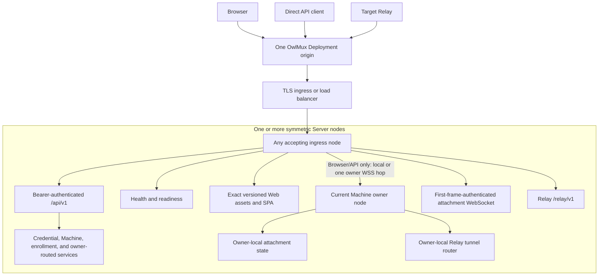
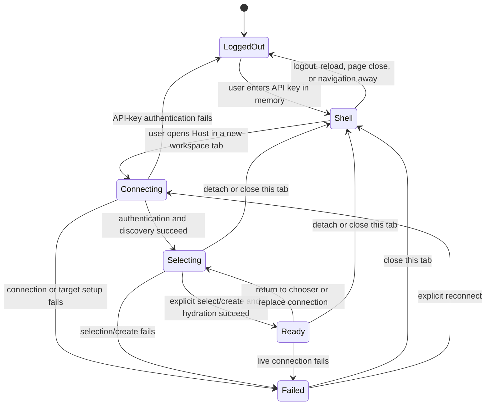
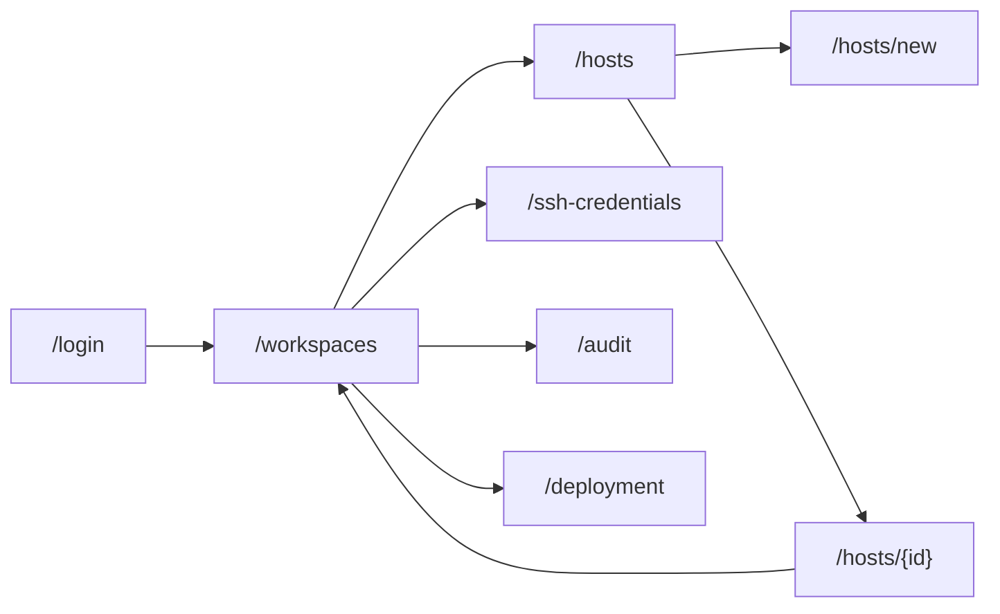

# HTTP, WebSocket, and product UI

## 1. Surface model

One Deployment origin in front of one or more symmetric Server nodes serves:

1. minimal unauthenticated per-node liveness/readiness through ingress;
2. one exact immutable Web build and SPA routes, including the API-key input screen;
3. Deployment-API-key-authenticated Machine, SSH-credential, enrollment, and management APIs;
4. a Browser attachment WebSocket authenticated by its first bounded external frame;
5. machine-to-machine Relay enrollment/proof and tunnel ingress.



External clients use only the Deployment origin. They neither receive nor select internal node endpoints. The load balancer uses ordinary connection-level policy; its choice places each new Relay connection on the accepting Relay claimant, with no OwlMux balance guarantee. Stickiness may reduce Browser/API owner hops but is not required for correctness.

API, health, attachment, and Relay failures MUST NOT fall through to SPA HTML. Static handling MUST NOT interpret machine-to-machine, internal-cluster, or API paths. Internal owner-WSS endpoints are on the separately protected internal listener and never part of the public route namespace.

Reviewed Server types and generated artifacts own exact JSON schemas, error/status mappings, and WebSocket close codes. The implementation change that first introduces or changes a surface MUST commit and review those versioned artifacts before the capability is considered implemented; Browser, Server, and tests consume the same contract. This document owns public separation and behavior rather than duplicating that registry.

## 2. Route families

| Surface                 | Representative route                                                                                        | Authentication                                               |
| ----------------------- | ----------------------------------------------------------------------------------------------------------- | ------------------------------------------------------------ |
| Liveness                | `GET /health`                                                                                               | None; process liveness only                                  |
| Readiness               | `GET /ready`                                                                                                | None; bounded dependency status                              |
| Deployment presentation | `GET /api/v1/deployment`                                                                                    | Bearer API key                                               |
| SSH credentials         | `/api/v1/ssh-credentials/...`                                                                               | Bearer API key                                               |
| Machines/enrollment     | `/api/v1/machines/...`                                                                                      | Bearer API key                                               |
| Attachment              | `/api/v1/machines/{machine_id}/attachment` WebSocket                                                        | Exact Origin, then first `auth.api_key` frame                |
| Relay enrollment/proof  | `/relay/v1/enroll` WebSocket                                                                                | One-use enrollment token first frame, then provisional proof |
| Relay tunnel            | `/relay/v1/tunnel` WebSocket                                                                                | Active Machine-bound Relay signature transcript              |
| SPA                     | `/login`, `/workspaces`, `/hosts`, `/hosts/new`, `/hosts/{id}`, `/ssh-credentials`, `/audit`, `/deployment` | Assets public; all data remains authenticated                |

Every protected HTTP request independently validates `Authorization: Bearer` at the accepting node before resource or owner lookup. Route IDs are bounded typed values and never authorization evidence.

Non-Machine-affine operations execute on the accepting node. A Machine-affecting operation that can invalidate live access resolves the actual owner and uses one typed cluster-authenticated WSS request when remote; the current owner serializes it with dispatch. If that valid owner is unreachable, the public result is `owner_unreachable`; the operator fences/stops/isolates the owner, waits for lease expiry, and retries. There is no bypass, remote eviction, or separate internal HTTPS mode. Raw Bearer bytes never cross this hop.

The public access contract is closed to direct Bearer verification and first-frame attachment authentication. It exposes no internal node selection, credential exchange, durable Browser-authentication state, delegated authority, or alternate human-authentication route.

### 2.1 Relay surfaces

Relay WebSockets do not accept Deployment Bearer credentials, Browser API-key frames, cluster credentials, cookies, CSRF tokens, Browser Origin semantics, or credential fallback. Enrollment accepts only a dedicated token-only `enroll.token` first bounded frame, never URL/query/subprotocol; after successful bounded digest resolution and candidate clearing, that same accepting connection retains bounded setup/challenge state in memory and accepts one bounded `enroll.setup` frame as specified by [03](03-relay-enrollment-and-transport.md#4-enrollment-issuance). Tunnel ingress accepts only the signed transcript and active binding from [03](03-relay-enrollment-and-transport.md#7-tunnel-authentication-and-ingress-local-owner-claim). Raw token/signature candidate material is cleared at public ingress and never becomes internal cluster authority; enrollment and Relay tunnels never cross an internal Server hop.

## 3. HTTP API-key transport

The Browser keeps the key only in page memory and sends it on every protected HTTP request. Direct clients use the same Bearer surface.

Protected responses use explicit no-store policy where they contain sensitive control metadata. The raw key is never echoed. Browser authentication has no Server-side persistence, expiry/refresh protocol, or logout request; logout is local key/state clearing. CORS is disabled by default; if explicitly enabled for a trusted integration origin, that policy does not weaken Bearer verification.

A Browser logout action closes every public/one-hop attachment in the page, clears the in-memory key, workspace tabs, resource data, pending operations, terminal renderers, and local authenticated navigation state, then returns to `/login`. Reload, page close, and navigation away have the same page-lifetime effect. Internal SPA navigation among OwlMux routes retains the key and workspace tabs. None of these actions needs to know which node owns a Machine.

## 4. Public contract rules

All public HTTP results use:

- versioned API and Relay namespaces;
- bounded bodies, strings, arrays, and cardinality;
- stable machine-readable error codes;
- safe request IDs;
- sanitized messages;
- explicit cache policy;
- exact method and content-type enforcement;
- no credential fallback.

Unknown fields may be rejected on security-sensitive inputs. Additive presentation fields are compatible only where clients ignore unknown fields. Changed command or security meaning requires a new version.

An unauthenticated request receives a generic response and no Machine/credential existence signal. After API-key authentication, there is no per-resource concealment policy because the key grants full deployment access.

Machine-affine transient outcomes use a small closed vocabulary. `temporarily_unavailable` may include one capped `retry_after` only when no valid owner-side mutation was dispatched and retry is safe. `owner_unreachable` means PostgreSQL still names a valid owner that ingress cannot reach and requires operator fencing plus lease expiry rather than automatic takeover. `operation_ambiguous` means a target mutation may have occurred and MUST NOT be replayed automatically.

## 5. Safe resource presentations

Deployment presentation contains only safe identity/build information and the default credential ID. It never includes API-key or encryption-key material/fingerprints.

```text
SshCredentialSummary {
    ssh_credential_id,
    name,
    public_key,
    public_fingerprint_sha256,
    is_default,
    bound_machine_count,
    status,
}
```

```text
MachineSummary {
    machine_id,
    ssh_credential_id,
    alias,
    lifecycle,
    reachability: unknown | connecting | reachable | temporarily_unavailable | owner_unreachable,
    retry_after?,
    last_safe_diagnostic?,
}

MachineDetail {
    MachineSummary,
    target_account,
    tmux_path,
    tmux_socket_identity,
    host_identity,
}
```

The authenticated detail presentation returns the fixed public target identity and tmux scope needed to review one saved Host. These values are immutable after creation; a target account, expected host public key, tmux path, or socket-identity change requires a new Machine. Private keys, envelopes, encryption context/key operations, identity-file paths, complete SSH config, unverified host-key diagnostics, Relay/internal network endpoints, node leases/config proofs, internal challenge/HMAC transcripts, stream IDs, token digests, and unsafe target diagnostics are never ordinary presentation fields. Reachability is advisory and exposes no node identity or address.

### 5.1 Credential mutations

Credential creation accepts only a bounded name. Server generates Ed25519 key material, encrypts it before persistence, and returns only public metadata. Rename changes only the bounded name. Reset creates a new generated Ed25519 credential and makes it default without Machine rebind. Rotation is ordinary replacement creation. Rebind is explicit and has no SSH preflight or revocation semantics. No endpoint accepts or downloads a private key or asks OwlMux/Relay to mutate target authorization.

An unknown create/reset outcome remains visibly unknown. Browser refreshes summaries and never automatically retries the mutation.

## 6. WebSocket authentication, owner routing, and establishment

```mermaid
sequenceDiagram
    participant Browser
    participant Ingress as Public WebSocket ingress
    participant DB as PostgreSQL
    participant Owner as Current Machine owner
    participant Route as Owner-local Machine route
    participant SSH as Owner-local OpenSSH adapter
    participant Tmux as Owner-local tmux adapter

    Browser->>Ingress: Upgrade with exact allowed Origin
    Ingress-->>Browser: Fixed pre-auth state; short deadline
    Browser->>Ingress: auth.api_key(current in-memory key)
    Ingress->>Ingress: Strict parse, verify, clear frame bytes
    Ingress->>DB: Resolve active Machine and actual owner after auth
    DB-->>Ingress: Owner node/incarnation/connection epoch or safe denial
    alt Owner is ingress
        Ingress->>Owner: Local authenticated context
    else Owner is remote
        Ingress->>Owner: WSS to exact registered owner
        Owner-->>Ingress: Fresh one-use destination challenge
        Ingress->>Owner: Bounded cluster-HMAC response and verified context
    end
    Owner->>Owner: Verify node lease, owner/connection epoch, route revision, and budgets
    Owner->>DB: Read current Machine/credential/route snapshot
    Owner->>Route: Open exact route under connection epoch
    Route-->>Owner: Ordered byte stream
    Owner->>SSH: Verify target and authenticate account
    SSH-->>Owner: Fresh probe channel
    Owner->>Tmux: Discover compatible tmux and sessions without creation
    Tmux-->>Owner: Bounded session list, possibly empty
    Owner->>SSH: Close probe
    Owner-->>Browser: attachment.session_selection(connection_epoch, attachment_epoch, sessions, writer_state)
    alt Explicit select
        Browser->>Owner: session.select(connection_epoch, attachment_epoch, exact observed identity)
        Owner->>Owner: Recheck lease, owner epoch, authenticated context, and Machine/credential lifecycle
        Owner->>Route: Open fresh route
        Owner->>SSH: Verify and start exact control path
        Owner->>Tmux: Revalidate, attach, and hydrate
        Tmux-->>Owner: Projection and live events
        Owner-->>Browser: attachment.ready(connection_epoch, new_attachment_epoch, projection)
    else Explicit create by writer
        Browser->>Owner: session.create(connection_epoch, attachment_epoch, name)
        Owner->>Owner: Recheck lease, owner epoch, authenticated context, lifecycle, and current writer pointer
        Owner->>Route: Open fresh route
        Owner->>Tmux: Fixed create; determine exact success/failure or unknown outcome
        Owner-->>Browser: Ready after exact hydration or fresh selection
    end
```

Before successful first-frame authentication the ingress node may allocate only fixed handshake bytes and timer state. It MUST NOT parse a Machine ID into a database query, resolve an owner, open an internal owner-WSS/route, decrypt a credential, create an Attachment or writer pointer, or send target data.

The first frame must be `auth.api_key`. Any different, duplicate, oversized, malformed, late, or invalid pre-auth frame causes generic closure. The key frame is excluded from logs/audit/telemetry and cleared after comparison.

After auth, a remote owner-WSS hop carries no API-key bytes or sender timestamp. Before accepting it, the owner issues a fresh destination challenge, starts a short `CLOCK_BOOTTIME` deadline, and validates the one-use cluster-HMAC response, source/destination incarnations/configuration epoch, its own lease deadline, actual owner/connection epoch, Machine route revision/lifecycle, and owner-WSS budgets. Failure allocates no route/SSH/tmux/projection/writer state.

A replacement WebSocket repeats external authentication at the Deployment origin and starts fresh owner resolution/discovery. Authentication success is scoped to one external connection and, after owner-WSS routing, one internal connection with exact node/owner epochs. Ingress loss, owner loss, owner change, node fence, configuration change, or key replacement closes affected connections rather than transferring authenticated state.

A successful Machine open always stops at session selection, including zero or one discovered session. Selection retains no SSH/control client or terminal output. No automatic attach/create occurs.

## 7. Message envelope

After authentication, attachment protocol uses bounded tagged JSON. Arbitrary pane bytes are base64 encoded initially.

```json
{
  "version": 1,
  "type": "pane.input",
  "request_id": "...",
  "machine_connection_epoch": "...",
  "attachment_epoch": "...",
  "payload": {}
}
```

The pre-auth `auth.api_key` frame and internal owner-WSS destination-challenge/HMAC exchange use separate smaller dedicated schemas and are not normal Browser operation envelopes. Browser never sees or sends node identity, internal endpoint, cluster transcript, or cluster credential.

`request_id` is correlation, not idempotency. `machine_connection_epoch` rejects every operation from a previous owner/tunnel incarnation. `attachment_epoch` rejects stale workspace/selection operations within the current Machine epoch. For each write, the owner also verifies that the authenticated connection is the current writer attachment. Epoch values are opaque Browser echoes, not owner selection or authorization. Unknown/malformed/oversized/stale input closes or rejects the bounded attachment scope without target cleanup.

## 8. Message semantics

Server messages cover:

- attachment lifecycle and session selection;
- observer/writer state and takeover result;
- complete/replacement projection;
- pane output;
- exact success/failure result or `operation_ambiguous`;
- slow-client warning and closure.

Client messages after authentication cover:

- writer claim or takeover;
- exact session selection or creation;
- return to chooser, projection refresh, and detach;
- observed window/pane selection and Browser resize;
- literal bounded pane input.

The product UI labels the protocol writer as control: a free pointer exposes `Take control`, an occupied pointer exposes `Take over`, and the current holder shows `You have control` and `Writable`. It provides no rows/columns form. Only the current visible ready writer workspace measures its pane surface and xterm cell size, then sends bounded, debounced, deduplicated resize intent; observer and hidden workspace tabs never request target geometry changes. Claim and takeover use the best currently measured dimensions or the bounded default until a renderer is available. Target-authoritative replacement projection remains final.

There is no generic execute, raw command, SSH option, destination, shell, tmux format, Relay endpoint, or broader tmux-management message. Target/control/WebSocket/internal-owner-WSS/owner replacement discards the workspace and returns through fresh origin authentication, owner resolution, probe, and chooser, never automatic session selection, input replay, or mutation replay. `temporarily_unavailable` may retry only under the Server's capped `retry_after` and a bounded Browser budget. A valid-but-WSS-unreachable owner returns `owner_unreachable`; Browser shows the operator fence/isolate-and-wait action and does not silently retry into takeover.

Writer semantics, takeover ordering, epochs, rehydration, and ambiguity are owned by [04](04-ssh-tmux-attachment-and-roaming.md).

## 9. Browser state



The shell owns at most 16 page-memory workspace tabs. Each tab has one independent Attachment phase, session-title hint, projection, renderer set, and close/detach lifecycle. Switching tabs or navigating among internal SPA management pages preserves every tab and connection; only the active workspace is visible, and only a visible ready writer may generate automatic resize intent. Closing one tab disposes only its Attachment. Logout, reload, page close, or navigation away disposes all tabs and the shared API client. The Browser never persists a tab, API key, node/owner placement, terminal bytes, projection, writer authority, or pending operation.

Browser discards old projection, pending mutation assumptions, and renderers before installing any new Machine connection or Attachment epoch within a tab. Writer status is orthogonal and limited to observer or writer; multiple tabs for one Machine remain separate attachments but still compete for the single owner-local writer pointer. A claim/takeover is a pending request until its result. Current owner-process memory is authoritative. A higher Machine connection epoch invalidates every prior attachment. Native tmux clients remain outside Browser writer coordination.

## 10. Information architecture



### 10.1 Login

- one masked deployment API-key field and one `Open OwlMux` action;
- key retained only in current page memory;
- successful authentication enters `/workspaces`;
- no alternate authentication mode, credential exchange, persistent login, or external redirect;
- authentication failure clears entered key and resource state;
- page refresh requires re-entry.

### 10.2 Hosts

`Host` is the product-UI name for one Machine API/domain resource. The Browser:

- lists every Deployment Machine as a saved Host;
- separates `/hosts`, `/hosts/new`, and `/hosts/{id}` list, creation, and detail journeys;
- distinguishes durable lifecycle from advisory owner/Relay reachability without exposing node identity or endpoints;
- creates one fixed target identity, edits alias, enrolls, disables, re-enrolls, and rebinds credential;
- presents target account, expected host public key, tmux path, and socket identity as immutable detail fields;
- presents active re-enrollment as an access-closing transition to tokenless `Pending`, followed by explicit one-use token issuance for the same fixed target scope;
- shows a one-use enrollment token only at issuance;
- shows exact target public-key installation guidance and the durable enrollment outcome, never connection-local readiness or proof progress.

### 10.3 SSH credentials

- list all Deployment credentials;
- show public key, fingerprint, default, status, and reuse count;
- generate, rename, reset/select default, retire unreferenced credentials, and rotate by creating a replacement;
- never accept, reveal, or download private keys or mutate target authorization stores;
- explain that rebind affects future SSH authentication while an existing authenticated connection may continue.

### 10.4 Workspaces

- `/workspaces` begins with a searchable saved-Host launcher when no workspace tab is active;
- opening a Host creates a new page-memory tab and independent Attachment, even when another tab already targets that Host;
- each new or replacement Attachment begins at the explicit session chooser and never auto-selects a remembered session;
- list all sessions within the bounded limit without auto-attach and provide one closed new-session action;
- show control/view-only state, `Take control`, and explicit `Take over` without implying that each tab has an independent writer;
- keep input disabled until ready/replacement hydration completes;
- render tmux-authoritative layout and one xterm.js renderer per visible pane;
- derive current visible writer size automatically without a rows/columns form;
- retain tabs across internal navigation, close only the selected Attachment on tab close/detach, and clear all tabs at page-lifetime end;
- distinguish safe route, SSH, host, tmux, shell-entry, and resource failures;
- never label OwlMux as owner of target work.

### 10.5 Audit and Deployment

- `/audit` presents only safe durable control events and never terminal data or internal payloads;
- `/deployment` presents safe identity/build/profile and current page workspace count;
- both surfaces remain under the same origin, API key, trust domain, and application shell rather than creating an administration endpoint or login realm.

## 11. Frontend state boundaries

| State                       | Browser treatment                                                                              |
| --------------------------- | ---------------------------------------------------------------------------------------------- |
| Deployment API key          | Current page memory only; clear on failure/logout/reload/page close/navigation away            |
| Internal SPA route          | Page-memory navigation only; changing it retains the key and workspace tabs                    |
| Workspace tabs/active tab   | At most 16 in page memory; each owns one Attachment; never serialized or restored              |
| Machine/credential metadata | Server-authoritative API data                                                                  |
| Owner/Relay reachability    | Advisory presentation with no node identity/endpoint                                           |
| Machine owner route         | Never Browser state; always resolved at Deployment origin                                      |
| Selection/projection        | Tab-local Machine-connection-epoch and attachment-epoch-scoped memory with atomic replacement  |
| Writer state                | Current owner message only; shared pointer semantics across same-Machine tabs; never persisted |
| Terminal bytes/scrollback   | Tab-local xterm.js memory; never Web storage/cache                                             |
| Pending operation           | Tab-local correlation only; no replay                                                          |
| UI display preferences      | Local, non-authoritative, and contain no credentials/terminal content                          |

Service workers MUST NOT cache protected API responses, terminal data, or API keys.

## 12. Browser security

Production requires:

- restrictive CSP with no third-party scripts;
- framing, MIME-sniffing, referrer, permissions, and cache protections;
- exact allowed Origin on attachment WebSocket upgrades;
- safe rendering of Machine names, paths, titles, commands, and diagnostics;
- terminal bytes only through terminal renderer, never HTML;
- deny-by-default OSC/DCS/custom browser side effects;
- explicit gesture for clipboard and safe hyperlink navigation;
- size-aware paste confirmation;
- no raw target content or API key in logs, analytics, DOM attributes, URLs, or persistent storage;
- exact SPA fallback exclusions.

Same-origin XSS can steal the in-memory API key and obtains complete deployment authority. Browser security is therefore a bastion boundary.

## 13. Failure and backpressure

- Invalid/unauthenticated HTTP input fails before database/target side effects.
- Invalid or late WebSocket auth closes before Attachment allocation.
- WebSocket/internal-owner-WSS protocol fault or slow Browser closes only that one-hop Attachment and leaves sibling page-memory workspace tabs independent.
- Closing one workspace tab disposes only that Attachment; Browser reload, logout, page close, or navigation away clears the API key and every page-local tab but leaves target tmux.
- Internal SPA navigation retains the key and workspace tabs and does not reconnect or reauthenticate them.
- Non-owner Browser/API ingress loss closes only connections through it; current owner and target remain; a still-open page reconnects through the Deployment origin.
- Owner loss/fence closes its Relay/Attachment/SSH/tmux/writer state; after node-lease invalidity Relay claims a higher connection epoch and Browser performs fresh origin authentication/probe/selection.
- A valid owner unreachable from Browser/API ingress returns `owner_unreachable`; no automatic retry steals it, and the operator fences/stops/isolates the owner and waits for lease expiry.
- Ordinary node restart with an unchanged key closes affected attachments, but a still-open page may use its in-memory key for fresh WebSocket authentication; cluster-wide key replacement makes that candidate fail and clear, while reload/logout/page close/navigation away always requires re-entry.
- Node join does not move existing owners or Attachments, exposes no node selection to Browser, and creates no rebalance.
- Machine/credential invalidation is serialized through the current owner or delayed until lease invalidity, then closes affected live access without target cleanup.
- Ambiguous target or internal owner-WSS operations are never replayed.
- Static failure cannot convert API/internal failure into successful HTML.

## 14. Required evidence

Conformance proves:

- the only human/API credential paths are per-request Bearer and the attachment WebSocket first frame, with no credential exchange, persistence, node redirect, or fallback;
- Relay enrollment parses only a token-only first frame before bounded digest resolution, then exactly one setup frame on the same accepting connection, with no pre-token setup allocation, persisted coordinator/challenge/proof, remote placement, or token forwarding;
- each implemented/changed public and internal owner-WSS surface commits one reviewed versioned schema/error/status/close-code artifact consumed by Browser/Server/tests as applicable;
- every protected HTTP request independently validates Bearer before resource/owner lookup, and raw Bearer never crosses internal owner-WSS routing;
- first-frame WebSocket tests allocate no Machine/owner/owner-WSS/route/SSH/tmux/writer state before auth, reject every other pre-auth sequence, clear key bytes, and never log them;
- owner-WSS tests require TLS plus cluster authentication and exact incarnation/config/connection epochs before allocation; both streamed Browser traffic and one-shot typed API requests use that same WSS challenge mode, while local-owner tests prove the same application semantics without a network hop;
- Browser key never enters Web storage, URL, cookie, service worker, internal challenge/HMAC transcript, logs, analytics, or serialized state;
- Browser never stores or selects a Server node; load-balancer stickiness is optional; ingress/owner loss reconnects through the same origin;
- generated credential APIs accept no private-key body or algorithm selector and never return private material or proxy it to an owner;
- malformed, oversized, stale incarnation/connection/attachment epoch, unknown-version, owner-WSS loss, and slow-client cases fail boundedly;
- focused Web unit/type/build checks cover the login boundary, generated attachment parsing, stale connection-attempt rejection, close diagnostics, and page-memory-only state declarations; real target operations use versioned attachment-WebSocket clients without browser automation;
- safe transient retry obeys capped `retry_after`, every replacement returns to a fresh chooser, and no writer/input/mutation is restored or replayed;
- writer/takeover/rehydration/connection-epoch/no-replay behavior matches [04];
- reload/logout/page close/navigation away requires API-key re-entry; internal SPA navigation does not; ordinary unchanged-key node restart may reuse only the still-open page-memory candidate; coordinated key replacement rejects it; target work survives every case.
