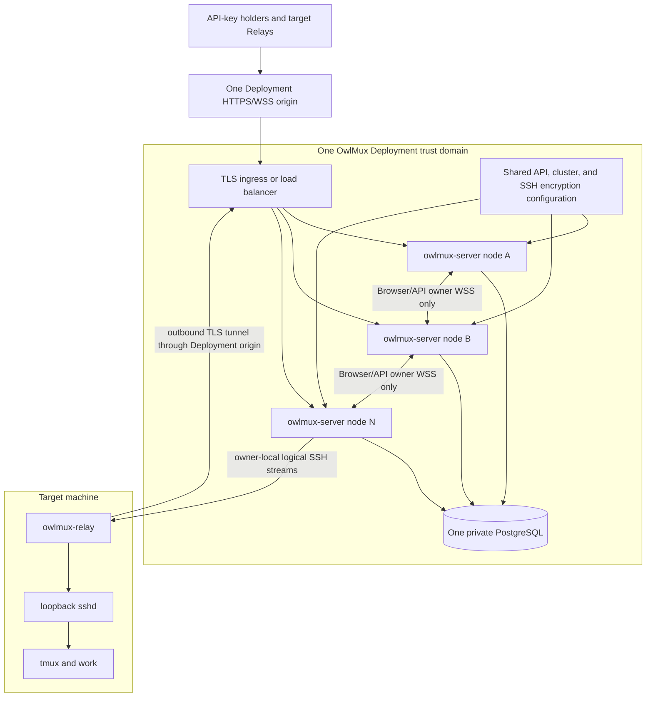
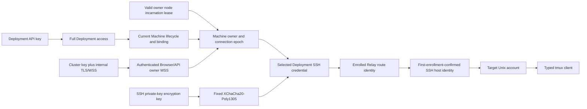

# Operations, security, and resilience

## 1. Deployment topology

One OwlMux Deployment is one trust domain with one public origin, one private PostgreSQL database, one coherent protected configuration, one or more symmetric `owlmux-server` nodes, and any number of target Relays.



Every Server node runs the exact same Server build and Deployment-critical configuration and may accept public HTTP, Browser WebSocket, and Relay ingress. The load balancer uses ordinary connection-level policy such as least-connections or round-robin. Its choice places each new Relay connection on an ingress that may claim itself; OwlMux makes no even-distribution guarantee. Stickiness MAY reduce Browser/API owner hops but correctness does not depend on it.

One Machine has at most one valid owner incarnation and connection epoch. The node that accepted and authenticated its Relay is the only permitted claimant and holds all live Relay/SSH/tmux/projection/writer state locally. Non-owner Browser/API ingress holds only bounded authentication and at most one owner-WSS hop. Relay/enrollment never crosses an internal hop. No live payload passes through PostgreSQL or durable middleware.

### 1.1 Single-node profile

A one-node Deployment is a supported profile of the same ownership model:

- one node incarnation registers and leases itself;
- every valid Machine owner is local;
- the internal owner-WSS listener, cluster key, and internal TLS configuration MAY be omitted;
- PostgreSQL still holds durable product state and the local owner/connection epoch;
- later transition to clustered mode is a controlled cold configuration-epoch change.

The implementation SHOULD avoid a network serialization hop on this path. Single-node mode is not a separate product architecture and does not weaken fencing or target-ownership invariants.

### 1.2 Clustered profile

A clustered Deployment additionally requires:

- a random authority-bearing `incarnation_id` per process start and an optional operator-facing display name;
- one TLS-protected internal WSS endpoint per node, reachable only by Deployment nodes;
- one distinct shared 32-byte `OWLMUX_CLUSTER_KEY` and internal TLS trust policy;
- one exact Server build, coherent Deployment config epoch/proof, and exact schema/public/internal generation;
- the exact initial Relay protocol version;
- node lease renewal, ingress-local actual owner claim, and bounded Browser/API owner-WSS budgets.

This design targets small and medium self-hosted Deployments that need horizontal capacity, not hyperscale placement. There is no Gateway/Worker role split, scheduler service, owner weight, virtual-bucket table, automatic or manual rebalance/migration API, Redis, message queue, terminal broker, live migration, or replicated terminal state.

### 1.3 Separate Deployments

Operators MAY additionally use multiple independent Deployments for trust isolation or capacity sharding. Every Deployment has independent:

- public origin and TLS routing;
- Deployment ID and configuration epoch;
- `OWLMUX_API_KEY`, `OWLMUX_CLUSTER_KEY`, and `OWLMUX_SSH_KEY_ENCRYPTION_KEY`;
- PostgreSQL endpoint and operator-managed HA/backup policy;
- Server membership and owner registry;
- SSH credentials, Machines, Relay enrollments, audit, and live attachments.

No database, key, credential registry, Relay identity, node lease, owner epoch, writer state, or terminal stream is shared. OwlMux provides no cross-Deployment coordinator, global UI, query, placement, migration, failover, or continuity.

### 1.4 TLS boundaries

Public TLS may terminate at a trusted reverse proxy or Server TLS adapter. The trusted hop is protected by Deployment network policy. Proxy headers are accepted only from configured ingress.

Clustered-mode internal owner-WSS traffic is TLS on every hop even on a private network. The operator supplies one exact trust model: direct node certificates under a private Deployment CA or a mutually authenticated trusted service-mesh/proxy boundary qualified by the release. Internal endpoints are not public redirects and SHOULD be network-restricted to Server nodes. Application-level cluster authentication remains mandatory and distinct from TLS.

## 2. Server process composition

Every Server node composes:

- one exact Deployment API-key verifier;
- PostgreSQL durable authority, database-time membership/owner registry, and migrations;
- random authority-bearing process incarnation, optional display name, lease renewal, Linux `CLOCK_BOOTTIME`, one conservative lease safety margin, self-fence, and drain state;
- actual-owner resolution and local-only owner claim for Relays accepted by this node;
- in clustered mode, fixed cluster configuration proof, internal TLS/cluster authentication, and bounded Browser/API owner-WSS client/server;
- bounded node-local admission, hints, and connection budgets;
- owner-local Browser writer coordination, Relay routing, and attachments for Machines it owns;
- one fixed private-key encryption module and required 32-byte key;
- HTTP, WebSocket, Relay, and static asset delivery;
- constrained OpenSSH/tmux adapters;
- observability, audit, shutdown, and resource budgets.

There is no runtime role flag that turns the binary into only a public Gateway or only a Machine Worker. A node may be ingress for one connection and owner for another.

Relay composes one enrolled identity/Machine binding, Deployment origin/TLS policy, fixed loopback endpoint, exact protocol version, and bounded reconnect/stream/queue/shutdown behavior. Relay never receives a Server-node address or cluster credential.

## 3. Startup and configuration boundaries

Configuration is parsed once into typed immutable startup state.

| Group                      | Examples                                                                                                                                           | Failure policy                                                                                                                 |
| -------------------------- | -------------------------------------------------------------------------------------------------------------------------------------------------- | ------------------------------------------------------------------------------------------------------------------------------ |
| Deployment profile         | single-node or clustered, explicit numeric config epoch                                                                                            | Missing/invalid/unsupported transition fails before registration                                                               |
| Public listener/proxy      | bind address, public origin, allowed Origin, trusted proxy ranges                                                                                  | Invalid/ambiguous values fail startup                                                                                          |
| Deployment access          | `owlmux_sk_v1_` plus canonical unpadded base64url of 32 operator-generated random bytes                                                            | Missing/malformed/noncanonical/wrong-length fails startup; no fallback or previous key                                         |
| PostgreSQL                 | One endpoint/secret reference, one small lease/config/fencing pool, one ordinary pool, and bounded query/transaction time                          | Missing/malformed bounds fail startup; runtime loss makes unready then self-fence; HA/backup/restore topology is not inspected |
| Node membership            | fresh random incarnation, optional display name, lease TTL `L`, lease safety margin `S`, renewal/drain bounds, Linux `CLOCK_BOOTTIME` availability | Missing clock support or invalid `0 < S < L` fails startup; platform and PostgreSQL clock behavior remain an operator contract |
| Cluster transport          | canonical 32-byte cluster key, internal advertised WSS URL, certificate/private identity/trust roots, challenge/HMAC/WSS limits                    | Required in clustered mode; missing/ambiguous/plaintext fails startup                                                          |
| Shared protocol            | persistent exact `server_build_id`, schema/public/internal generations, exact Relay protocol version, and canonical configuration proof inputs     | Same-epoch proof/build-ID mismatch or incompatible generation fails startup                                                    |
| Runtime budgets            | admission, concurrency, queues, child count, and memory                                                                                            | Invalid/unbounded fails startup                                                                                                |
| SSH private-key encryption | one canonical 32-byte key                                                                                                                          | Missing/malformed fails startup; no provider settings                                                                          |
| SSH identity runtime       | node-local private root, one exclusive startup directory, and one exclusive child directory per OpenSSH child, preferably on tmpfs                 | Shared/network root, unsafe ownership/type/mode/path, or incomplete own-root orphan cleanup fails startup                      |
| SSH/tmux                   | executable/config paths and time/queue bounds                                                                                                      | Browser cannot override                                                                                                        |
| Relay                      | exact protocol version, heartbeat, streams, and memory                                                                                             | Invalid policy fails startup                                                                                                   |
| HTTP/Browser               | body/frame/auth-first deadline/CSP/assets                                                                                                          | Security-sensitive invalid values fail startup                                                                                 |
| Observability              | log/metric/audit settings                                                                                                                          | Must never enable credentials/terminal capture                                                                                 |

Secrets never appear in argv, startup summaries, crash reports, metrics, diagnostics, registry endpoints, configuration proofs, or internal challenge/HMAC/context transcripts. Server may report whether required secrets are syntactically configured, never values or reversible fingerprints.

### 3.1 Startup sequence

A Server node starts in this order:

01. parse and validate all local configuration without binding public/internal listeners;
02. validate the node-local private SSH runtime root and scavenge only safe residue from that root;
03. verify Linux `CLOCK_BOOTTIME` availability and `0 < S < L`; document that the operator must never resume/clone/live-migrate the same process snapshot;
04. connect to PostgreSQL and verify the one Deployment identity;
05. verify/apply schema compatibility under the controlled cluster upgrade rules;
06. verify the local embedded `server_build_id`, exact configuration epoch/proof, and exact Relay protocol version against persistent Deployment values;
07. bind and validate the internal TLS listener in clustered mode, without advertising readiness;
08. lock/recheck the `DEPLOYMENT` configuration row and register the fresh node incarnation with its internal WSS URL and database-time lease;
09. derive `local_hard_deadline = b0 + L - S` from the pre-request `CLOCK_BOOTTIME` sample;
10. bind public delivery and report health;
11. enter Serving/readiness only after all prior steps and renewal machinery are active.

If required composition is absent, malformed, ambiguous, unsafe, or incompatible, the process reports only a redacted startup diagnostic, releases what it can, and exits nonzero. It never registers a partial node or serves a plaintext internal fallback.

Every start uses a new incarnation; display-name reuse has no authority. Operators never force takeover of a valid owner incarnation: they stop/fence/isolate that process and wait for database-time lease invalidity.

## 4. Relay ingress ownership and internal owner routing

### 4.1 External connection placement

The Deployment's existing public load balancer distributes connections using an ordinary connection-level policy such as least-connections or round-robin. The Server node that accepts and authenticates a Relay or enrollment connection is the only node allowed to coordinate that enrollment or claim that Machine. OwlMux performs no node-ranking or internal fallback and promises no even distribution.

A node join begins serving only new or naturally reconnecting clients that the load balancer sends to it. It never moves an existing owner. There is no background, manual, or API-driven owner rebalance, migration, weight, bucket, or scheduler. Operators that care about cold-start distribution SHOULD make all intended nodes ready before opening the public origin; after that, observed distribution is an ingress property rather than an OwlMux guarantee.

### 4.2 Actual owner and reconnect

Owner claim requires an externally authenticated active Relay binding accepted by this exact non-expired Serving incarnation, no valid current owner, and a matching Machine route revision. PostgreSQL increments the Machine connection epoch and records that accepting incarnation. The owner keeps the Relay tunnel, stream router, SSH/tmux children, projection, writer, queues, and all Machine-affine live state local.

If another valid owner exists, the new Relay ingress returns a bounded duplicate/recovering result with capped retry-after; it never proxies to, steals from, or remotely evicts that owner. A reconnect may claim only after the old owner safely releases or PostgreSQL observes its node lease invalid. If the same owner knows its old tunnel is closed, it first closes the dispatch barrier, rejects new writes, fences routes/children/writers/queues/results, compare-and-set releases the exact old epoch, and only then makes a fresh claim.

### 4.3 Browser and API owner WSS

After external authentication, a non-owner Browser or Machine-affine API ingress may open one direct WSS connection to the exact owner endpoint read from the valid registry. Relay and enrollment traffic never uses this path. Before any request/stream context, the destination sends one fresh random challenge bound to its incarnation/configuration epoch and starts a short `CLOCK_BOOTTIME` deadline. Ingress answers once with a domain-separated HMAC transcript containing only:

- protocol version and connection class;
- Deployment/configuration epoch;
- exact source ingress and destination owner incarnations;
- Machine ID, route revision, and current connection epoch where applicable;
- verified external-authentication context, never raw credential bytes;
- the destination challenge, a fresh source nonce, and bounded trace correlation.

The destination verifies TLS/WSS policy, the one-use challenge, cluster HMAC, source/destination leases/config proof, own owner record/epoch, connection class, deadline, and budgets before allocating owner-local state. One-shot control operations use typed request/result frames over this same WSS mode and then close; no separate internal HTTPS challenge mode exists. The path permits at most one Server-to-Server hop.

WSS framing has explicit frame/queue/deadline/close semantics and propagates backpressure. It does not persist, duplicate, reorder, compress, inspect terminal payload for authorization, or transparently reconnect. Once semantic Browser/API bytes may have been accepted, hop failure closes the external operation/connection and relies on safe client recovery without replay. The owner-local path invokes the same typed application boundary without network serialization.

### 4.4 Valid owner unreachable

If a valid owner renews its database lease but cannot be reached over internal WSS, ingress returns `owner_unreachable`. OwlMux adds no per-Machine Evicting state, remote node-eviction transaction, desired fence, or owner bypass. The deployment operator fences/stops/isolates that whole owner node, waits until PostgreSQL observes its lease expired, and retries. This intentionally favors a small, auditable failure boundary over automated split-brain recovery.

## 5. Health, readiness, and self-fencing

`/health` reports only that the process event loop answers. It does not query targets or expose dependency details.

`/ready` indicates whether this node may accept new public work or ownership safely. The public response is generic; protected internal diagnostics identify cause.

| Condition                                                 | Health                             | Ready                              |
| --------------------------------------------------------- | ---------------------------------- | ---------------------------------- |
| Validating startup before public bind                     | Not served                         | Not served                         |
| Invalid/missing/unsafe startup configuration              | Process exits                      | Process exits                      |
| Registered, Serving, before local hard deadline           | Yes                                | Yes                                |
| Required dependency unavailable or renewal cannot proceed | Yes until exit/fence               | No                                 |
| Local hard lease deadline reached                         | May answer during bounded teardown | No; all authority fenced           |
| PostgreSQL lost after readiness                           | Healthy until bounded fence/exit   | No                                 |
| Internal owner-WSS listener unavailable in clustered mode | Healthy during bounded drain       | No                                 |
| No Relay connected                                        | Yes                                | Yes; Machines advisory unavailable |
| One target unavailable                                    | Yes                                | Yes; that attachment fails safely  |
| Controlled drain                                          | Yes until exit                     | No                                 |

A successful lease registration/renewal uses the `CLOCK_BOOTTIME` sample `b0` taken before the database request and sets `local_hard_deadline = b0 + L - S` as defined by [06](06-storage-consistency-and-private-key-encryption.md#33-server-node-leases). The one Deployment-wide margin `S` covers the supported PostgreSQL forward adjustment and bounded local clock-read, scheduling, dispatch, and fence overhead. Startup checks only clock availability and `0 < S < L`; operators keep the platform within the documented bound. `CLOCK_MONOTONIC`, wall time, and Tokio timers alone are not authority.

Every public/internal acceptance and target dispatch checks `CLOCK_BOOTTIME` directly. A timer is only a wakeup optimization. Only another exact renewal response received before the current deadline advances it. At the deadline the incarnation becomes unready and irreversibly fenced, rejects all owner-local input and mutation dispatch, closes its live connections/children, ignores late renewal/results, and proceeds to bounded exit rather than returning to Serving. Another node still waits for PostgreSQL to observe expiry before claim. Availability may pause; two valid OwlMux dispatch authorities may not coexist. Target sshd/tmux does not validate OwlMux epochs, so bytes already dispatched while the old owner was valid may still resolve late and remain ambiguous; a new owner hydrates current target state and never replays or compensates them automatically.

Readiness never depends on a target tmux session. Orchestrator restart action MUST NOT initiate target cleanup.

## 6. Node join, drain, shutdown, and failure

### 6.1 Join

A coherent new node registers Serving and begins receiving whatever new public connections the load balancer sends to it. It may claim only Relays it accepts after no valid owner remains. No current owner is recalculated, disconnected, migrated, or rebalanced, and no distribution guarantee is made.

### 6.2 Controlled drain

```mermaid
sequenceDiagram
    participant Operator
    participant Node as Draining Server node
    participant DB as PostgreSQL
    participant Clients as Relay and Browser connections
    participant SSH as Owner-local OpenSSH children
    participant Tmux as Target tmux

    Operator->>Node: Begin drain or SIGTERM
    Node->>DB: CAS exact incarnation to Draining
    Node->>Node: Mark unready; reject new ingress/claims/owner-WSS hops
    loop Bounded rate-limited owner batches
        Node->>Node: Close dispatch barrier; reject new writes
        Node-->>Clients: Close/fence Relay, Browser, routes, writers, queues, and results
        Node->>SSH: Close/fence local attachment processes
        Node->>DB: CAS release exact owner epoch only after local fencing
    end
    Node->>DB: CAS exact Draining lease deadline to database-now when possible
    Node->>Node: Remove own private identity files/directories
    Note over Clients: Reconnect through unchanged Deployment origin
    Note over Tmux: No kill-session, signal, or target cleanup
```

Draining removes the node from public readiness immediately while retaining authority to close existing owners under its lease. Closure is rate-limited to avoid a reconnect storm. After every local owner is fenced and released, graceful shutdown may compare-and-set only its exact `Draining` incarnation's `lease_until` to a post-lock PostgreSQL `clock_timestamp()` value; the retained row remains `Draining` but is immediately lease-invalid. There is no persistent `Stopped` state. If this short release cannot commit, the existing lease expires normally. Relay and Browser reconnect independently; there is no handoff of live sockets or terminal state.

### 6.3 Crash or partition

A crashed node cannot clean its registry rows or runtime files. Its owners remain unavailable until the database-time node lease expires. Relays reconnect through the Deployment origin; owner claim fails while the old lease is still valid and may succeed only at the node accepting a later reconnect after expiry. Browsers see bounded route unavailable/reconnect behavior.

A node isolated from PostgreSQL but still connected to clients self-fences by its conservative local hard deadline. After process stall, container freeze, or host suspend, every resumed path reads `CLOCK_BOOTTIME` and fences before any socket/database/target I/O if the deadline passed. Resuming, cloning, or live-migrating the same process snapshot is unsupported; restoration starts a fresh incarnation. A node isolated from peers/ingress but connected to PostgreSQL may remain valid. Browser/API ingress returns `owner_unreachable`; the operator must fence/stop/isolate that owner and wait for lease expiry. No peer bypasses ownership.

### 6.4 Forced shutdown

Forced local teardown still leaves target tmux outside the shutdown boundary. It may leave bounded private-key-file residue only in that node's validated local runtime root, handled by [06](06-storage-consistency-and-private-key-encryption.md#71-owner-local-openssh-identity-materialization).

## 7. Threat model

### 7.1 Server-node or cluster-key compromise

Every Server node is inside the same Deployment trust boundary. A compromised node or cluster key plus internal network access can impersonate Browser/API owner-WSS hops and may obtain full Deployment control through node capabilities. A compromised owner can observe terminal data, decrypt stored SSH credentials, and act with configured target accounts. The cluster key is not intended to isolate mutually hostile nodes.

Mitigations include restricted node membership, internal TLS/mTLS, network allowlists, one distinct cluster key, configuration proof, least-privilege database access scoped to the Deployment, unprivileged process identity, minimal image, strict filesystem policy, constrained OpenSSH, node-local private tmpfs runtime roots, safe observability, and incident-wide credential replacement.

A suspected node or cluster-key compromise is a Deployment incident. Drain/isolate all nodes, replace the cluster and API keys through a new configuration epoch, assess SSH credential exposure, replace affected credentials, and remove old target public keys as required. Target work is not automatically cleaned up.

### 7.2 API-key compromise

The Deployment API key grants complete Deployment authority. Its compromise exposes all Machine/credential management and terminal attachments in that Deployment; UI confirmations are usability safeguards, not a smaller security boundary.

Response performs a coordinated all-node drain/stop, replaces the sole key, increments configuration epoch/proof, restarts coherent nodes, and investigates target/credential exposure. Old public and internal authenticated connections end. Any still-open page's compromised old candidate fails fresh authentication and is cleared. Target work is not cleaned up.

### 7.3 Browser compromise

Same-origin XSS or a compromised Browser/OS profile can steal the saved or in-memory API key, observe terminal data, take over Browser writer coordination, and perform any Deployment operation. CSP, no third-party scripts, safe rendering, Origin checks, HTTPS, exact same-origin storage, authentication-failure/logout clearing, and Browser-profile protection reduce but do not remove this trust. Persistence increases exposure compared with page-memory-only handling and must be explicit in operator guidance.

### 7.4 Target compromise

A compromised pinned target controls sshd, tmux, shell behavior, terminal bytes, and Relay. First-use confirmation and later strict host verification detect a different key, not malicious behavior by the accepted host.

### 7.5 Relay compromise

Relay has no authorization-store mutation adapter and is confined by protocol to its fixed endpoint. Arbitrary code execution in Relay may probe its local network namespace. Expected-host verification and Server-held SSH key prevent another destination silently becoming the enrolled target, but do not prevent probing; operators may add sandbox/egress policy.

### 7.6 Database or operator backup compromise

Disclosure reveals Deployment metadata, Machine/host/audit, Relay public keys, node/owner coordination, and encrypted SSH material but not separately configured API/cluster/encryption keys or terminal data. Database write compromise can corrupt product/owner state and is a full Deployment integrity incident. Backups remain sensitive.

### 7.7 Separate Deployment compromise

One Deployment has no authority over another. Compromise containment exists only because origins, IDs, databases, all three startup secret classes, credentials, Relay trust, and node membership are separate. Reusing secrets or cloning an active database identity across Deployments defeats this boundary and is unsupported.

## 8. Security boundaries



No arrow may be skipped. API key cannot substitute for cluster/enrollment/Relay/SSH; cluster key cannot authenticate public clients, Relays, or SSH; Relay key cannot become SSH identity; SSH key cannot authenticate Web/API; encryption key cannot authenticate any network caller.

## 9. Command and data safety

- Public and internal inputs are bounded and parsed before use.
- Browser WebSocket allocates no Machine/owner/internal-owner-WSS/attachment state before first-frame API-key authentication.
- Relay ingress allocates no setup/owner state before its required bounded authentication transition and is never forwarded to another Server node.
- Raw external credential material is cleared and never forwarded internally; Browser/API owner-WSS authentication is destination-challenged, HMAC-bound to exact incarnation/config/Machine epochs, destination-deadlined, and single-connection, with no sender timestamp or reusable assertion.
- Browser tmux actions are closed typed operations; pane input is the sole literal byte path.
- Every Browser write checks owner-process authenticated state, the local node-lease deadline, exact owner incarnation/connection epoch, Machine route revision/lifecycle, attachment epoch, and current writer attachment pointer before ordered dispatch.
- Machine-affecting durable invalidation is routed to and serialized by the current owner or waits for owner-lease invalidity.
- Native tmux clients remain outside Browser writer coordination.
- OpenSSH arguments use no local shell and remote entry uses one closed typed renderer.
- Identity key files exist only in each owner node's private bounded-lifetime materialization path.
- OwlMux detects target tmux compatibility but never invokes a package manager or repairs it.
- Relay destination comes only from enrolled local state.
- Raw terminal/internal-owner-WSS payload data and credentials are excluded from PostgreSQL, queues, audit, log, metric, trace, crash, and analytics.

## 10. Resource budgets and backpressure

| Boundary                     | Required budgets                                                                                                                           | Overload response                                                                                           |
| ---------------------------- | ------------------------------------------------------------------------------------------------------------------------------------------ | ----------------------------------------------------------------------------------------------------------- |
| Public HTTP                  | body/header/time/connection/mutation concurrency                                                                                           | Reject before side effect                                                                                   |
| API-key auth/enrollment      | attempts per source/token and per-node/global concurrency                                                                                  | Bounded node-local rejection                                                                                |
| Browser WebSocket pre-auth   | connection count, first-frame bytes, deadline                                                                                              | Generic close before owner resolution/allocation                                                            |
| Relay pre-auth               | connection/frame/time/global concurrency                                                                                                   | Generic rejection before local setup/claim                                                                  |
| Owner resolution/local claim | query time and claim retries                                                                                                               | `temporarily_unavailable` with capped `retry_after`, or `owner_unreachable`; no node-ranking/scheduler loop |
| Internal owner WSS           | connections per peer/node/Machine, auth bytes/time, frames, queues, total memory, idle/lifetime, dial attempts                             | Reject Browser/API hop or close connection; never forward Relay, second-hop, durable-buffer, or replay      |
| WebSocket attachment         | frame/message/rate/pending/queued bytes/writer operations                                                                                  | Reject stale or close attachment                                                                            |
| Relay owner tunnel           | frame/stream/queues/total memory/heartbeat/auth time                                                                                       | Reject stream or close tunnel                                                                               |
| OpenSSH                      | owner-local child count/time/stderr/file handles/key lifetime/runtime dirs                                                                 | Reject attachment or terminate local child                                                                  |
| tmux parser                  | lines/blocks/pending/resources/output/parse time                                                                                           | Close attachment                                                                                            |
| Browser                      | at most 16 page-memory workspace tabs plus per-tab Attachment, visible-pane renderer, terminal buffer, pending/input, and reconnect bounds | Reject a new tab, reset, warn, or detach locally                                                            |
| PostgreSQL                   | reserved lease/config/fencing capacity plus bounded public/enrollment pools, query/transaction/retry/registry cardinality                  | Reject lower-priority public/enrollment work first; fail bounded, become unready, self-fence conservatively |
| Drain/reconnect              | owners closed per interval, total drain deadline, client backoff/jitter                                                                    | Extend bounded drain or force local close; never migrate state                                              |

Overload rejects new work and never cleans up target tmux. Retry is allowed only for known-safe idempotent operations before semantic live bytes. Terminal input, mutating tmux operations, internal owner-WSS bytes with unknown delivery, late effects already dispatched by a valid old owner, and ambiguous external effects are never replayed or automatically compensated.

## 11. System failure matrix

| Failure                                  | New work                                          | Existing OwlMux access                                             | Target effect                                  | Recovery                                                                                                                  |
| ---------------------------------------- | ------------------------------------------------- | ------------------------------------------------------------------ | ---------------------------------------------- | ------------------------------------------------------------------------------------------------------------------------- |
| Browser workspace-tab close              | Sibling tabs and other work unaffected            | Only that tab's Attachment/owner-WSS hop drops                     | None                                           | Reopen the Host explicitly; fresh origin connection/auth/probe/chooser                                                    |
| Browser page/WebSocket loss              | Other work unaffected                             | One failed Attachment drops, or page loss clears all of its tabs   | None                                           | Restore/revalidate saved key or re-enter if cleared; fresh origin connection/auth/probe/chooser                           |
| Non-owner ingress node loss              | Other nodes serve                                 | Connections through that ingress drop; owners remain               | None                                           | External clients reconnect through origin and resolve same/new owner                                                      |
| Owner node process/host loss             | Blocked for its Machines until lease invalid      | Owned Relay/Browser/SSH/tmux/writer state drops                    | None                                           | Relay reconnect; after lease expiry one node claims higher epoch; Browser hydrates fresh                                  |
| Node database partition                  | Node becomes unready then fences by hard deadline | Its owned access closes by deadline                                | None                                           | Operator restores endpoint access under the non-rollback history contract; fresh incarnation/lease or reconnect elsewhere |
| One ingress/owner-WSS connection loss    | Local-owner work unaffected                       | That Browser/API connection closes                                 | None                                           | External reconnect through origin; no transparent byte replay                                                             |
| Valid owner unreachable from other nodes | No Machine-affine work bypasses it                | Browser/API receives `owner_unreachable` while lease remains valid | None                                           | Operator fences/stops/isolates owner, waits lease expiry, then retries                                                    |
| Node join                                | New public connections may land on it             | Existing owners unchanged                                          | None                                           | No rebalance exists and no balance is promised                                                                            |
| Controlled node drain                    | Node rejects new work                             | Owned connections close in bounded batches                         | None                                           | Relay/Browser reconnect and claim/route elsewhere                                                                         |
| Writer takeover                          | Observers remain readable                         | Former writer becomes observer                                     | Only an already-dispatched mutation may remain | Atomic pointer replacement and fresh hydration before input                                                               |
| API/cluster/config replacement           | Blocked during all-node cold transition           | Old authority/connections end                                      | None                                           | Increment config epoch, start coherent nodes, enter new API key                                                           |
| PostgreSQL endpoint loss                 | Nodes become unready                              | All owners self-fence no later than hard deadlines                 | None                                           | Operator restores the same non-rolled-back history; fresh incarnations register; Relays reconnect                         |
| Relay/tunnel loss                        | Machine route unavailable                         | Routed SSH drops                                                   | None                                           | Owner releases; new tunnel/epoch and fresh attachment                                                                     |
| Target sshd loss                         | Target unavailable                                | SSH drops                                                          | tmux may continue                              | sshd returns, fresh SSH                                                                                                   |
| tmux incompatible/missing                | Workspace denied                                  | No workspace opens                                                 | None                                           | Target administrator supplies qualified tmux                                                                              |
| Control-client loss                      | New attachment may retry                          | Projection/workspace ends                                          | tmux continues                                 | Fresh chooser and explicit selection                                                                                      |
| Target tmux loss                         | Cannot attach                                     | Target work ends                                                   | Target-local loss                              | No OwlMux recovery claim                                                                                                  |
| Encryption-key loss                      | Credentials unusable                              | Existing children may end naturally                                | None                                           | Restore key or replace/install/rebind                                                                                     |
| Encryption-key/envelope disclosure       | Deny affected access during response              | Existing children unsafe boundary                                  | Stored keys compromised                        | Replace credentials and remove old public keys                                                                            |
| One separate Deployment loss             | Other Deployments unaffected                      | Only that trust domain loses OwlMux access                         | None                                           | Operator restores service under that Deployment's PostgreSQL continuity contract                                          |

## 12. Observability

Safe dimensions include build/version, Deployment-local operation class, node Serving/Draining state, owner/non-owner path, status class, and coarse latency/resource buckets. High-cardinality Deployment/Machine/session/pane/tunnel/stream/request/node-incarnation identifiers are not metric labels and appear in protected logs only when necessary.

Observability excludes API key, cluster key, configuration secret digests/proof inputs, internal challenge/HMAC/nonces where unsafe, enrollment token, Relay signature/private key, SSH private/envelope/encryption key, terminal/internal-owner-WSS payload data, unsafe target diagnostics, key-file paths, and database secrets.

Operators need request/error, bounded aggregate auth-rejection, node lease/renewal/deadline, config mismatch, owner claim/release/stale-epoch, internal owner-WSS, dependency health, Relay/stream, SSH child, attachment, queue, parser, host-verification, orphan-cleanup, drain/reconnect, and audit signals. Missing/failed Deployment API-key and Relay enrollment-token attempts never create durable audit rows or source-identifying logs.

## 13. Audit

Durable safe events begin only after successful Deployment API-key authentication or an authenticated machine-to-machine boundary and include:

- node registration/configuration mismatch/drain/fence and owner claim/release/stale-epoch outcome classes;
- credential generate/rename/default/reset/retire;
- Machine create/rename/enrollment/activation/disable/re-enrollment/rebind;
- Relay connection/rejection/revocation;
- attachment start/end and local/one-hop path class;
- writer takeover intent/outcome;
- SSH verification/authentication class;
- typed tmux mutation and exact/failed/ambiguous result.

Audit has Deployment, Machine, credential, and bounded node/epoch context where operationally necessary. Internal URLs, raw credentials/challenge-HMAC transcripts, terminal/internal-owner-WSS payload data, unsafe target diagnostics, and pane input are excluded.

Security-critical durable mutations should fail if required audit cannot commit. Failed Deployment API-key/Browser-WebSocket authentication performs no resource PostgreSQL lookup/write. Relay enrollment is the narrow exception: after a token-only first frame it may perform one bounded digest/lifecycle lookup needed to reject an invalid/expired/replayed token, but rejection performs no durable mutation or audit; only successful validation enters the atomic consume/`Verifying`/audit transaction in [03]. High-volume terminal activity and node lease renewals are never individually audited.

## 14. PostgreSQL and operator recovery boundary

The authoritative contract is [06](06-storage-consistency-and-private-key-encryption.md#10-postgresql-operator-contract-and-key-custody). PostgreSQL HA, failover, backup, restore, and replica fencing are operator workflows, not OwlMux features. The configured endpoint must expose one linearizable single-writer, non-rollback history and preserve acknowledged commits. OwlMux does not discover topology, promote a replica, validate a restore, or invalidate rows to make a rolled-back history safe.

Before any operator restore/history replacement, every Server node MUST be stopped or isolated, and only fresh process incarnations may start afterward. This prevents an old process from continuing, but does not preserve one-use, revocation, lease/owner epoch, configuration, audit, or credential-lifecycle guarantees if the database history itself went backward. Such rollback is an unsupported Deployment integrity incident.

The operator separately protects the matching SSH encryption key and all startup configuration. Database state never restores target tmux, Relay sockets, ownership, Attachments, writer authority, or Browser memory. A copied database must not run concurrently as the same Deployment; a separate Deployment initializes independently.

## 15. Upgrade and rollback

- CI-qualified commits build releases.
- The cluster permits one exact Server build, schema/public/internal protocol generation, and Deployment-critical configuration at a time.
- Upgrade first marks/drains all Server nodes, closes OwlMux live access without target cleanup, waits until no old node lease is valid, applies migrations/configuration epoch, then starts exact coherent nodes.
- If post-upgrade owner distribution matters, keep the public origin gated until every intended node is ready; after opening it, ordinary load balancing places only new/reconnecting Relays and no rebalance follows.
- The first release accepts only its exact Relay protocol version. A compatibility policy is deferred until a second protocol version actually exists.
- Browser attaches fresh and an old page may receive an upgrade-required/refresh result when its public protocol is unsupported.
- Node join with a mismatched Server build, same-epoch proof, or generation fails before Serving.
- Mixed-build rolling Server upgrade and owner migration are unsupported.
- Binary rollback requires compatibility with the current non-rolled-back database history, schema, envelope, Deployment config epoch, and exact public/internal/Relay protocols; it does not roll back acknowledged database commits.
- Separate Deployments upgrade independently.

## 16. Required evidence

Conformance proves:

- startup rejects missing/contradictory API key, clustered-mode cluster/TLS identity, PostgreSQL, node lease, encryption key, compatibility proof, or private runtime-root configuration;
- every node runs symmetric capabilities, and local owner routing avoids an unnecessary internal network hop;
- ordinary load-balancer choice determines new Relay ingress, stickiness is optional, balance is not promised, and clients never receive/select internal node endpoints;
- Relay/enrollment stay on accepting ingress, node join does not move existing owners, and no node-ranking or automatic/manual rebalance mechanism exists;
- database-time leases plus `CLOCK_BOOTTIME`, the single conservative safety margin `S`, direct pre-I/O deadline checks, and an irrevocable hard-deadline fence prevent a partitioned, stalled, frozen, or suspended process and a new claimant from both holding valid OwlMux owner authority under the supported platform contract; startup validates only clock availability and `0 < S < L`, operators keep PostgreSQL forward adjustment and bounded local overhead within `S` and never resume/clone/live-migrate the same process snapshot, late renewal responses are ignored, and already-dispatched target effects remain ambiguous;
- actual-owner claims/connection epochs are serialized and local to the accepting Relay node; relinquish closes the dispatch barrier and fences routes/children/results before owner CAS release, stale internal connections/results/releases fail closed, and no per-Relay database heartbeat exists;
- internal owner WSS is Browser/API-only, at most one hop, uses TLS plus distinct cluster authentication, forwards no raw external secret, applies complete bounds/backpressure, and never persists/replays semantic live bytes; one-shot API control uses the same WSS mode, not HTTPS;
- controlled drain rate-limits reconnects, and node/Relay/database/ingress failures never clean up target tmux;
- Machine-affecting invalidation is serialized through the current owner; a valid unreachable owner yields `owner_unreachable` until the operator fences/stops/isolates it and its lease expires, with no remote eviction/bypass;
- all limits fail boundedly and no observability path captures credentials/terminal content;
- API-key replacement rejects old key and old config nodes after coordinated restart without cookie/session/verifier state;
- credential creation generates Ed25519 inside Server, accepts no private-key body or algorithm selector, and returns no private material;
- identity-file materialization and node-local scavenging satisfy [06];
- Relay token-only first frame permits only bounded digest/lifecycle lookup on rejection and atomically consumes one token before setup; setup/challenge/proof remain on the same live accepting connection without persisted coordinator state, final activation rechecks the executing `SERVER_NODE` with post-lock PostgreSQL time, and invalid/expired attempts recover without token resurrection or target authorization mutation;
- writer coordination, replacement hydration, connection-epoch fencing, and no-replay behavior remain bounded across owner change;
- PostgreSQL HA/backup/restore remains an operator boundary; OwlMux assumes a non-rolled-back acknowledged-commit-preserving history, makes no safety claim across rollback, and requires separate protection of the SSH encryption key;
- bounded runtime tmux capability probing, known-bad denylisting, representative target evidence, and the closed remote-entry renderer satisfy [04].
